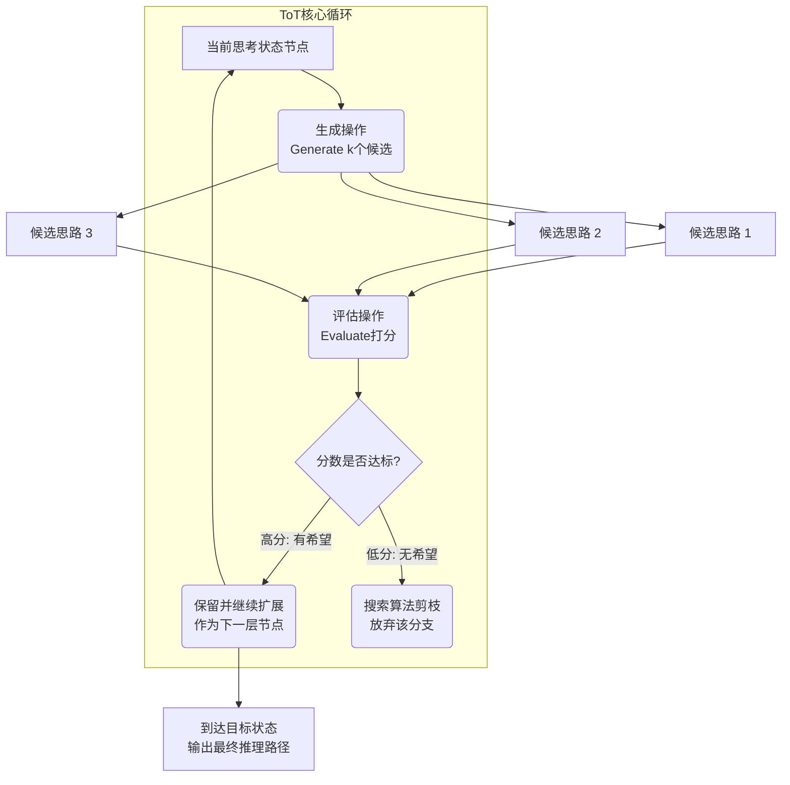

# 思维树（Tree-of-Thoughts, ToT）相比思维链在解决复杂规划问题上有何改进？其“搜索”和“评估”过程是如何工作的？

思维树是对思维链的扩展，旨在解决需要深度规划或回溯的复杂问题。CoT 生成的是单一的线性推理链，一旦某一步出错，后续推理往往会失败，且无法探索不同的可能性。ToT 将问题解决过程建模为一棵树，每个节点代表一个中间思考状态，边代表推理步骤。其工作流程包括两个核心过程：1. 生成与扩展：模型在每个节点生成多个可能的下一步思路，将线性链扩展为树状分支。2. 搜索与评估：模型（或外部启发式评估器）对每个节点状态进行评估，判断其是否通向最终目标。通过经典的搜索算法（如广度优先 BFS 或深度优先 DFS），系统可以探索多条路径，并主动回溯剪枝那些看起来没有希望的分支。这种机制赋予 LLM 类似“试错”和“前瞻”的能力，在解决迷宫、数学证明或创意写作等需要全局规划的任务上表现远优于 CoT。

## 边界情况
1. **指数级爆炸**：如果分支因子（每个节点生成的思路数）和搜索深度设置不当，思维树的生长会呈指数级爆炸，迅速耗尽上下文窗口或计算预算。必须设置最大宽度（Beam Search）和最大深度。
2. **状态评估失效**：对于没有明确中间状态标准（如诗歌创作、哲学辩论）的任务，价值模型很难准确评判哪个节点“更有希望”，导致搜索算法随机游走或陷入局部最优。
3. **长程依赖丢失**：在极深的树结构中，根节点的原始信息可能在多层传递后被稀释，导致深层节点在进行推理时偏离了原始目标。

## 面试追问
1. **在进行“评估”时，你是使用同一个LLM来打分，还是训练一个专门的价值模型？各有何优劣？**
2. **相比BFS或DFS，Beam Search在ToT中通常表现更好，为什么？它有哪些潜在局限？**
3. **如何在实际工程中限制ToT的Token消耗，同时保持其规划能力？**

## 易错点
1. **混淆ToT与自我修正**：认为ToT就是生成错了改一遍。ToT的核心是“并行探索”多种可能性并选择最优路径，而简单的自我修正通常是串行的、线性的，缺乏对不同分支的全局比较。
2. **低估提示工程难度**：认为只要把CoT的Prompt换成树形结构就行。实际上，要让LLM输出结构化的“候选项”而非单一文本，并能在特定节点暂停等待评估指令，对Prompt设计和系统控制逻辑要求极高。

## 技术原理

ToT 把推理建模为**状态空间搜索问题**，借鉴经典 AI 的搜索算法（A*、Minimax）思想，把"一次性生成答案"升级为"在思维状态树上搜索最优路径"：

- **状态（Thought）的定义**：每个节点是一个"中间思考状态"——一段连贯的、可作为下一步推理起点的文本（如"已排除 A、B 两个选项，剩下 C、D"）。状态需要可评估（能打分判断是否有希望）且可扩展（能从它生成下一步候选）。
- **三大核心操作的循环**：
  1. **生成（Generate）**：从当前状态用 LLM 生成 $k$ 个候选下一步思路（分支因子 $k$）。
  2. **评估（Evaluate）**：用 LLM 自评或外部价值函数给每个候选状态打分（如"有希望/不确定/无希望"三档，或 0~1 连续分）。
  3. **搜索（Search）**：按搜索算法（BFS 广度优先 / DFS 深度优先 / Beam Search 束搜索）选择下一个扩展节点，对低分节点剪枝，对走入死胡同的分支回溯。
- **为什么优于 CoT**：CoT 是贪心解码，一条路走到黑，某步出错无法挽回。ToT 把"推理"变成"搜索"，能在中间状态就发现并放弃错误分支，具备试错和前瞻能力。代价是计算量从 $O(1)$ 一次推理变成 $O(k^d)$（$k$ 分支因子、$d$ 深度）。

## 代码示例

ToT 的最小骨架（以 24 点游戏为例）：

```python
import heapq

class ThoughtNode:
    def __init__(self, state, parent=None, children=None, value=0.0):
        self.state = state          # 当前思考状态（文本）
        self.parent = parent
        self.children = children or []
        self.value = value          # 评估分值 0~1

def tot_search(llm, problem, max_depth=5, beam_width=3):
    """Beam Search 版 ToT"""
    root = ThoughtNode(state=problem)
    frontier = [root]   # 当前待扩展层
    for depth in range(max_depth):
        candidates = []
        for node in frontier:
            # 1. 生成：每个节点生成 k 个候选下一步
            next_states = llm.generate_thoughts(node.state, k=5)
            for s in next_states:
                child = ThoughtNode(state=s, parent=node)
                # 2. 评估：给每个候选打分
                child.value = llm.evaluate(s, problem)  # 0~1，越高越有希望
                node.children.append(child)
                candidates.append(child)
        if not candidates:
            break
        # 3. 搜索：Beam Search 只保留 top-beam_width 个高价值节点
        candidates.sort(key=lambda c: c.value, reverse=True)
        frontier = candidates[:beam_width]
        # 若已有节点达到目标状态（如解出 24 点），提前返回
        if any(llm.is_terminal(c.state) for c in frontier):
            break
    # 回溯最优路径
    best = max(frontier, key=lambda c: c.value)
    path = []
    while best:
        path.append(best.state)
        best = best.parent
    return list(reversed(path))
```

## 注意事项

- **分支因子和深度必须限死**：$k=5$、$d=5$ 的树有 $5^5=3125$ 个节点，再大就指数爆炸。Beam Search（只保留每层 top-N）是控制成本的关键剪枝手段，实际工程中几乎不用纯 BFS/DFS。
- **状态评估是 ToT 的瓶颈**：评估函数不准会导致搜索随机游走或陷入局部最优。用 LLM 自评简单但有噪声；训练专门的价值模型更准但成本高。折中方案是用 LLM 多次评估取平均，降低噪声。
- **长程依赖会丢失**：极深的树里，根节点的原始约束可能在多层传递后被稀释。每次扩展时把根节点的问题原文拼回 prompt，保持目标一致性。
- **适用边界**：ToT 适合有明确中间状态和目标的问题（迷宫、24 点、数学证明、代码生成）；对没有客观评估标准的问题（创意写作、开放式问答）评估函数难定义，收益有限。

## 流程图




## 记忆要点

- 改进点：将线性链变为树状结构，支持并行探索多种可能性，具备试错和前瞻能力。
- 核心流程：生成多个分支思路 -> 评估节点价值 -> 搜索算法（BFS/DFS）回溯剪枝。
- 对比CoT：CoT错了就错，ToT能主动放弃错误分支，在规划类任务上表现更优。
- 风险：分支因子和深度不当会导致指数级爆炸，需限制最大宽度和深度。

## 结构化回答

**30 秒电梯演讲：** CoT 像走迷宫只走一条路、撞墙就重来，ToT 像在地图上同时画几条路线、发现堵车能立刻换路。它把线性推理链变成树状结构，每个节点生成多个分支思路，用 BFS/DFS 等搜索算法评估节点价值并回溯剪枝。优势是具备试错和前瞻能力，能主动放弃错误分支，在规划类任务上远优于 CoT。风险是分支因子和深度不当会指数级爆炸。

**展开框架：**
1. **核心改进** — 将 CoT 的线性链扩展为树状结构，每个节点代表一个中间思考状态，支持并行探索多种可能性，具备试错和前瞻能力。
2. **搜索与评估流程** — 生成：每个节点生成多个下一步思路扩展分支；评估：用模型或启发式函数打分判断节点是否"有希望"；搜索：用 BFS/DFS/Beam Search 探索并回溯剪枝无望分支。
3. **对比 CoT 与风险** — CoT 一步错就全错、无法回溯，ToT 能主动放弃错误分支，在迷宫、规划类任务上更优；风险是分支因子和深度设置不当会导致指数级爆炸，必须限制最大宽度和深度。

**收尾：** 一句话，ToT 用搜索算法给 LLM 装上"试错能力"。您想深入聊聊 BFS 和 DFS 在 ToT 里怎么选，还是状态评估函数怎么设计？

## 视频脚本

> 预计时长：2 分钟 | 由浅入深

| 时间 | 画面/字幕 | 口播台词 | 讲解要点 |
|------|----------|----------|----------|
| 0:00 | 标题《思维树 ToT》+ 走迷宫 vs 地图画多路线漫画 | CoT 像走迷宫只走一条路撞墙就重来，ToT 像在地图上同时画几条路线，发现堵车能立刻换路。 | 类比开场 |
| 0:25 | 线性链 vs 树状结构对比图 | 核心改进是把线性推理链变成树状结构，每个节点是一个中间思考状态，支持并行探索。 | 核心改进 |
| 0:55 | 流程图：生成分支 → 评估节点 → 搜索剪枝 | 流程是：每个节点生成多个分支思路，用评估器打分，再用 BFS 或 DFS 搜索并回溯剪枝。 | 搜索评估 |
| 1:25 | 对比 CoT：无法回溯 vs 主动放弃错误分支 | CoT 一步错就全错、无法回溯，ToT 能主动放弃错误分支，在规划类任务上表现更优。 | 对比 CoT |
| 1:50 | 风险提示：指数级爆炸需限宽限深 | 风险是分支因子和深度不当会导致指数级爆炸，必须限制最大宽度和深度。 | 风险控制 |

