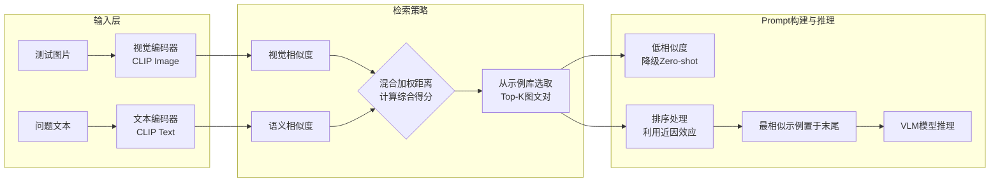

# 在多模态Prompt工程中，如何利用“Few-shot示例选择”策略提升VLM的视觉问答准确率？

在多模态 Prompt 工程中，Few-shot 示例选择对于提升视觉语言模型（VLM）的准确率至关重要。与纯文本不同，多模态示例包含图片和文本对。策略上，不能随机选择示例，而应遵循“相似性原则”：1. 语义相似：检索与当前问题在语义上相近的文本问答对作为示例。2. 视觉相似：利用视觉编码器提取测试图片的特征，在示例库中检索图像特征（如颜色、物体布局、风格）相似的图片。3. 混合检索：结合视觉和文本特征的加权距离来选择最佳示例。通过提供这些高度相关的示例，模型可以通过类比学习更好地理解特定的图像模式或细微的视觉指令（如“请描述左下角的细节”），从而显著减少幻觉，提升任务表现。此外，示例的多样性也很重要，避免模型过拟合于某种特定的单一模式。

## 边界情况
1. **模态不匹配**：有时文本查询相似，但视觉内容完全不同（反之亦然）。单纯依赖模态检索可能会选出误导性的示例。需要引入Cross-modal Check机制，确保选出的图文对在逻辑上是匹配的。
2. **示例库覆盖不足**：当测试样本属于长尾分布或未见过的场景时，检索到的Top-K示例相似度都极低。此时强行使用低质示例会引入噪声，不如使用Zero-shot或更通用的模板。
3. **Token预算限制**：图片通常占用大量Token（或经过压缩编码），放入过多或过大的示例图片会迅速挤占上下文窗口，导致模型输入截断。需在图片分辨率、数量和推理效果间做权衡。

## 面试追问
1. **如何量化视觉相似度？使用CLIP特征还是更细粒度的特征？**
2. **在动态检索场景下，每次推理都需要走一遍检索流程，这会增加延迟。你们是如何做缓存或优化的？**
3. **如果发现模型过拟合了Few-shot示例的格式（比如总是输出示例的句式），但内容不对，该如何调整？**

## 易错点
1. **示例顺序敏感性**：忽略了LLM对上下文中示例顺序的敏感性（Recency Bias）。通常最接近Query的示例影响最大，检索后的排序策略（如将最相似的放在最后）往往比检索本身更重要。
2. **忽略负面示例**：只给正面例子。在复杂场景下，引入“反例”（即类似的图但错误的答案）往往能帮助模型更好地理解边界，减少幻觉。

## 技术原理

多模态 Few-shot 的核心是把纯文本的 In-Context Learning 扩展到图文对（image-text pair），关键挑战是**如何度量"相似"**——因为模态不同，单一距离函数无法覆盖：

- **双路相似性**：
  - **语义相似**：用文本 Embedding 检索与当前问题文本语义相近的 QA 对。这解决"问法相近"的匹配，比如测试问题是"描述左下角的物体"，检索历史中"描述右上方物体"的示例。
  - **视觉相似**：用视觉编码器（CLIP 的图像分支）提取测试图像特征，检索图像特征相近的示例图。这解决"画面相近"的匹配，比如测试图是夜景，检索夜景示例比检索白天示例更有参考价值。
- **混合检索的加权**：纯语义或纯视觉都可能选偏（文本像但图完全不同）。混合策略是 `score = α·text_sim + (1-α)·image_sim`，$\alpha$ 按任务调（细节描述类偏视觉，推理问答类偏语义）。更进阶的做法是把图文对用 CLIP 映射到统一向量空间，用跨模态相似度一次检索。
- **排序利用近因效应**：LLM 对上下文中靠后的内容更敏感（recency bias）。把最相似的示例放在离 query 最近的位置（示例列表末尾），让它的影响最大，往往比检索本身更重要。

## 代码示例

```python
import numpy as np

class MultiModalFewShotSelector:
    def __init__(self, clip_model, text_embedder, example_pool):
        self.clip = clip_model               # 编码图文到统一空间
        self.text_emb = text_embedder
        self.pool = example_pool             # [{"image":..., "query":..., "answer":...}]

    def select(self, test_image, test_query, k=4, alpha=0.5):
        # 提取测试样本的双模态特征
        test_text_emb = self.text_emb.encode(test_query)
        test_img_emb = self.clip.encode_image(test_image)
        scored = []
        for ex in self.pool:
            # 语义相似度（文本对文本）
            ex_text_emb = self.text_emb.encode(ex["query"])
            text_sim = cosine(test_text_emb, ex_text_emb)
            # 视觉相似度（图像对图像）
            ex_img_emb = self.clip.encode_image(ex["image"])
            img_sim = cosine(test_img_emb, ex_img_emb)
            # 混合加权
            score = alpha * text_sim + (1 - alpha) * img_sim
            scored.append((score, ex))
        scored.sort(reverse=True, key=lambda x: x[0])
        top_k = [ex for _, ex in scored[:k]]
        # 近因效应：最相似的放最后（离 query 最近）
        return list(reversed(top_k))

    def build_prompt(self, test_image, test_query, examples):
        """示例按 相似度低->高 排列，最相似的在末尾影响最大"""
        messages = [{"role": "system", "content": "按示例格式描述图片。"}]
        for ex in examples:   # 已经是相似度升序
            messages.append({
                "role": "user",
                "content": [{"type": "image_url", "image_url": ex["image"]},
                            {"type": "text", "text": ex["query"]}],
            })
            messages.append({"role": "assistant", "content": ex["answer"]})
        messages.append({
            "role": "user",
            "content": [{"type": "image_url", "image_url": test_image},
                        {"type": "text", "text": test_query}],
        })
        return messages

def cosine(a, b):
    return float(np.dot(a, b) / (np.linalg.norm(a) * np.linalg.norm(b) + 1e-8))
```

## 注意事项

- **图片 Token 成本是硬约束**：一张图编码后通常占几百到几千 Token，示例图片很容易挤爆上下文窗口。必须权衡示例数量、图片分辨率（低分辨率先粗看）和推理质量，通常 $k=2\sim4$ 是上限。
- **低质示例要降级 Zero-shot**：当测试样本属于长尾场景，检索到的 Top-K 相似度都极低（如 <0.3）时，强行用低质示例会引入噪声误导模型，不如降级用 Zero-shot 配合强指令。
- **注意近因效应排序**：示例顺序对结果影响很大。把最相似的示例放在离 Query 最近处（列表末尾）利用近因效应，比随机排列效果好得多。
- **引入反例强化边界**：复杂场景下，光给正例不够，适当引入"相似图但错误答案"的反例，能帮模型理解判断边界、减少幻觉。例如给一张类似但有细微差异的图并标注"这个不是 X"。

## 流程图




## 记忆要点

- 策略核心：相似性原则，检索语义或视觉特征相近的示例，而非随机选择。
- 混合检索：结合文本语义和图像特征（布局、颜色）加权距离，选出最佳图文对。
- 注意顺序：LLM对示例顺序敏感，通常将最相似的示例放在Query最近处影响最大。
- 资源权衡：图片占Token多，需在示例数量、分辨率和上下文窗口间做平衡。

## 结构化回答

**30 秒电梯演讲：** 多模态 Few-shot 选示例，像教小孩认动物，先找几张跟眼前最像的图卡对比，学得最快。核心是相似性原则：不能随机选，要用文本语义加图像特征的混合检索找最相近的图文对。注意 LLM 对示例顺序敏感，最相似的放在离 query 最近处影响最大。还要权衡 token，图片很占上下文，得在数量、分辨率和窗口间找平衡。

**展开框架：**
1. **相似性原则** — 不随机选示例，而是检索与当前问题语义相近、视觉特征（颜色、布局、风格）相近的图文对，让模型通过类比学习特定的图像模式，减少幻觉。
2. **混合检索与排序** — 结合文本语义和图像特征做加权距离检索选最佳图文对；LLM 对示例顺序敏感，通常把最相似的示例放在离 Query 最近处（近因效应影响最大）。
3. **资源权衡与降级** — 图片占 token 多，需在示例数量、分辨率和上下文窗口间平衡；当检索到的示例相似度都极低时，不如降级用 Zero-shot，避免引入噪声。

**收尾：** 一句话，多模态 Few-shot 靠"找对相似示范"提升准确率。您想深入聊聊混合检索的权重怎么定，还是示例顺序为什么影响这么大？

## 视频脚本

> 预计时长：2 分钟 | 由浅入深

| 时间 | 画面/字幕 | 口播台词 | 讲解要点 |
|------|----------|----------|----------|
| 0:00 | 标题《多模态 Few-shot 示例选择》+ 认动物找相似图卡漫画 | 教小孩认动物，与其看随机图卡，不如先找几张跟眼前最像的图卡对比，学得最快，这就是示例选择的相似性原则。 | 类比开场 |
| 0:25 | 相似性原则：语义 + 视觉双重检索 | 核心是不能随机选，要检索语义相近、视觉特征相近的图文对，让模型通过类比学习图像模式。 | 相似性原则 |
| 0:55 | 混合检索：文本语义 + 图像特征加权 | 混合检索结合文本语义和图像特征做加权距离，选出最佳图文对。 | 混合检索 |
| 1:25 | 顺序敏感：最相似示例放 Query 最近处 | LLM 对示例顺序敏感，通常把最相似的放在离 Query 最近处，近因效应影响最大。 | 顺序敏感 |
| 1:50 | Token 权衡 + 低质降级 Zero-shot | 图片占 token 多，要平衡数量、分辨率和窗口；相似度都低时不如降级用 Zero-shot。 | 资源权衡 |

