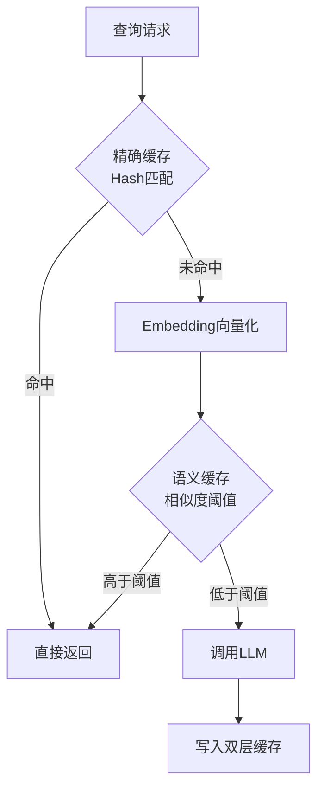

# 语义缓存和精确缓存怎么选

低成本、高 QPS 的重复咨询场景适合语义缓存；对强合规与强正确性场景要谨慎，需提高阈值、加业务校验或禁用缓存。精确缓存适合完全幂等的调用（如参数批处理）。

**深入解析**：
语义缓存基于向量相似度匹配，核心在于**Embedding模型**和**距离阈值**的权衡。

1.  **技术实现细节**：
    *   **精确缓存**：通常使用 Redis 或 Memcached，Key 为 Prompt 的 Hash 值（如 MD5/SHA256）。适用于参数高度敏感的场景，如 SQL 生成、代码执行。
    *   **语义缓存**：需将输入转为向量存储于向量数据库。匹配时计算 Cosine Similarity，若 `similarity >= threshold` 则命中。

2.  **关键参数与边界**：
    *   **阈值设置**：阈值过低导致“答非所问”（幻觉），阈值过高则缓存命中率低。建议动态调整或引入元数据过滤（如用户 ID、时间窗口）。
    *   **输入长度**：语义缓存对超长上下文（如 32k+）的 Embedding 成本较高，需考虑截断策略。

**实战案例**：
某智能客服系统上线语义缓存后，发现部分用户咨询“我的积分怎么少了”会返回错误答案。原因是因为“积分怎么少了”和“积分怎么兑换”在向量空间非常接近。解决方案是在命中语义缓存后，增加一层基于关键词或实体的硬匹配校验（如检测到关键词冲突则回源）。

**代码示例**：
```python
import redis
import numpy as np
from sentence_transformers import SentenceTransformer

# 伪代码：语义缓存拦截逻辑
model = SentenceTransformer('paraphrase-multilingual-MiniLM-L12-v2')
r = redis.Redis()

def get_semantic_cache(query, threshold=0.92):
    query_vector = model.encode(query)
    # 简化版：实际应使用 Redis Search 或 Vector DB
    cached = r.get(f"vec:{hash(query)}") 
    if cached:
        similarity = np.dot(query_vector, cached) / (np.linalg.norm(query_vector)*np.linalg.norm(cached))
        if similarity >= threshold:
            return "Cached Response"
    return None
```

**对比表格**：

| 特性 | 精确缓存 | 语义缓存 |
| :--- | :--- | :--- |
| **匹配原理** | Hash 值完全匹配 | 向量余弦相似度 / 欧氏距离 |
| **命中条件** | 文本必须完全一致 | 文本含义相近即可命中 |
| **适用场景** | 幂等查询、SQL生成、代码 | 闲聊、知识问答、多轮对话归纳 |
| **缓存成本** | 极低（KV存储） | 较高（需向量计算与存储） |
| **容错性** | 无（改一个字即失效） | 高（容忍错别字、句式差异） |
| **风险** | 命中率低，重复计算多 | 可能返回“似是而非”的错误答案 |

**架构对比图**：
```text
┌─────────────┐      ┌──────────────┐      ┌─────────────┐
│   用户请求   │ ───> │  缓存拦截层   │ ───> │   LLM 服务   │
└─────────────┘      └──────┬───────┘      └─────────────┘
                           │
           ┌───────────────┼───────────────┐
           ▼               ▼               ▼
    ┌──────────────┐ ┌──────────────┐ ┌──────────────┐
    │  精确缓存    │ │  语义缓存    │ │    未命中    │
    │ (Key: Hash)  │ │ (Key: Vector)│ │              │
    └



## 记忆要点

- 精确缓存用Hash匹配，适合幂等查询（SQL/代码）；语义缓存用向量相似度，适合闲聊。
- 语义缓存核心权衡：阈值过低导致答非所问，过高则命中率低，需动态调整。
- 风险控制：语义缓存可能返回似是而非的错误答案，需加关键词校验或禁用于强合规场景。
- 成本考量：语义缓存需向量计算与存储，成本高于KV存储，长文本需截断。

## 结构化回答

**30 秒电梯演讲：** 语义缓存像听懂"你好"和"嗨"是同一个意思，用同一句回复；精确缓存是死板的完全匹配。精确缓存用 Hash 匹配，适合幂等查询（SQL、代码）；语义缓存用向量相似度，适合高并发、意图重复的闲聊。语义缓存的核心权衡是阈值：过低答非所问、过高命中率低。强合规场景要加关键词校验或禁用。

**展开框架：**
1. **精确缓存** — 用 Prompt 的 Hash 值（MD5/SHA256）做 Key，完全幂等才命中，适合 SQL 生成、代码执行等参数敏感场景，零误差但命中率低。
2. **语义缓存** — 用 Embedding 向量相似度匹配，能识别"你好"和"嗨"是同一意图，适合高并发重复咨询；核心权衡是阈值：过低答非所问，过高命中率低，需动态调整。
3. **风险与成本** — 语义缓存可能返回似是而非的错误答案，强合规场景要加关键词校验或禁用；它还需要向量计算和存储，成本高于 KV 存储，长文本要先截断。

**收尾：** 一句话，幂等用精确，闲聊用语义，合规场景慎用。您想深入聊聊语义缓存的阈值怎么动态调，还是它和 RAG 怎么配合？

## 视频脚本

> 预计时长：2 分钟 | 由浅入深

| 时间 | 画面/字幕 | 口播台词 | 讲解要点 |
|------|----------|----------|----------|
| 0:00 | 标题《语义缓存 vs 精确缓存》+ 听懂同义词漫画 | 语义缓存像听懂"你好"和"嗨"是同一个意思，用同一句回复；精确缓存是死板的完全匹配。 | 类比开场 |
| 0:25 | 精确缓存：Hash 匹配 + 幂等场景 | 精确缓存用 Hash 做 Key，完全幂等才命中，适合 SQL 生成、代码执行这种参数敏感场景。 | 精确缓存 |
| 0:55 | 语义缓存：向量相似度 + 阈值权衡 | 语义缓存用向量相似度匹配，适合高并发重复咨询；核心权衡是阈值，过低答非所问，过高命中率低。 | 语义缓存 |
| 1:25 | 风险控制：关键词校验 + 强合规禁用 | 风险上语义缓存可能返回似是而非的答案，强合规场景要加关键词校验或直接禁用。 | 风险控制 |
| 1:50 | 成本考量：向量计算 + 存储成本 | 成本上语义缓存需要向量计算和存储，比 KV 存储贵，长文本还得先截断。 | 成本考量 |

