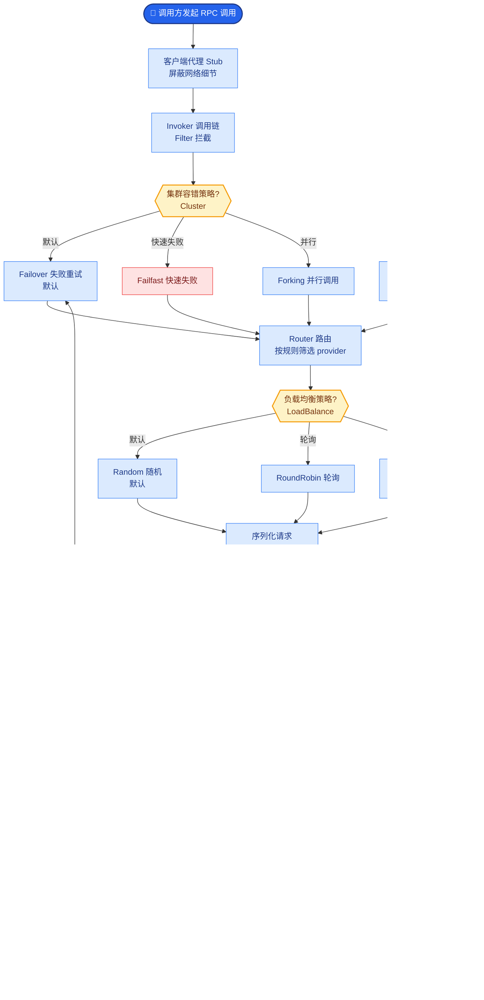

# Agent 系统为什么比传统服务更需要 Trace

传统服务调用链相对固定；Agent 路径依赖模型决策，分支多、偶现问题多。Trace 能把「哪一步选了哪个工具、参数是什么、返回多长」串起来，否则只能猜 Prompt。

**深入解析**：
Agent 系统具有**非确定性**和**多轮迭代**特征，传统的分布式追踪面临如下挑战与增强需求：

1.  **Span 的定义增强**：
    - 传统 Trace 关注 RPC 调用；Agent Trace 需覆盖 Thought（思维链）、Tool Call（工具调用）、Retrieval（检索）等内部步骤。
    - 每个 Span 应携带结构化的 Attributes：`model.name`、`prompt.tokens`、`tool.parameters`、`llm.response.finish_reason`。

2.  **根本原因分析**：
    - 如果 Agent 最终回答错误，通过 Trace 可以回溯是“检索阶段文档没找到”还是“模型理解错误”或“工具参数构造错误”。

**实战案例**：
在某 Code Assistant Agent 中，偶发性出现代码生成错误。通过 Trace 分析发现，并非 LLM 能力问题，而是 Retriever 阶段（向量检索）在某些情况下 Latency 过高触发了超时降级，返回了空文档，导致 LLM 产生幻觉。Trace 清晰展示了 `Retriever Span` 的 `status=timeout`，从而精准定位到检索服务瓶颈。

**代码示例**：
```python
from opentelemetry import trace

tracer = trace.get_tracer(__name__)

def agent_execution_loop(user_query):
    with tracer.start_as_current_span("Agent_Orchestrator") as parent_span:
        # 记录输入参数
        parent_span.set_attribute("input.query", user_query)
        
        # 步骤1：思维链推理
        with tracer.start_as_current_span("LLM_Thought_Generation"):
            thought = call_llm(user_query)
            parent_span.set_attribute("llm.thought", thought)
        
        # 步骤2：工具调用
        if needs_tool(thought):
            with tracer.start_as_current_span("Tool_Execution") as tool_span:
                result = execute_tool(thought.tool_name)
                tool_span.set_attribute("tool.name", thought.tool_name)
                tool_span.set_attribute("tool.result_len", len(result))
```

**调用链示意图**：
```text
[Root Span: User Query]
│
├─ [Span: LLM Orchestrator]
│  ├─ Event: System Prompt Injected
│  └─ Attributes: model=gpt-4, temperature=0.7
│
├─ [Span: Tool_Call_Weather_API]  (模型决定调用)
│  ├─ [Internal: Input Validation]
│  ├─ [Span: HTTP GET /api/weather] (外部依赖)
│  └─ Event: Parsed Result (Temp=25C)
│
├─ [Span: LLM_Refinement] (基于工具结果再次生成)
│  └─ [Span: Tool_Call_DB_Lookup] (并行/串行分支)
│
└─ [Span: Final Response]
   └─ Event: Stream Complete
```


## 核心流程图



## 记忆要点

- 核心痛点：Agent路径非确定性，分支多且偶现问题多，不靠Trace只能瞎猜Prompt。
- 增强定义：Span需覆盖思维链、工具调用、检索等步骤，记录模型参数和工具返回。
- 排查价值：能定位是检索文档没找到、模型理解错还是工具参数构造错。
- 实战案例：通过Trace发现偶发错误是检索超时降级导致，而非LLM能力问题。

## 结构化回答

**30 秒电梯演讲：** Agent 系统比传统服务更需要 Trace，因为它的执行路径不固定，像黑匣子记录飞机自动驾驶的每一步操作。传统服务调用链固定，Agent 路径依赖模型实时决策，分支多、偶现问题多，不靠 Trace 只能瞎猜 Prompt。Trace 要记录思维链、工具选择、参数和中间结果，才能定位是检索没找到、模型理解错还是工具参数构造错。

**展开框架：**
1. **核心痛点** — Agent 路径非确定性，依赖模型实时决策，分支多、偶现问题多；没有 Trace，排查问题只能瞎猜 Prompt，无法复现随机性故障。
2. **Trace 的增强定义** — Span 不能只记录 RPC 调用，必须覆盖 Thought（思维链）、Tool Call（工具调用）、Retrieval（检索）等步骤，记录模型参数、工具返回和中间结果。
3. **排查价值与实战** — Trace 能精确定位故障环节：是检索文档没找到、模型理解错、还是工具参数构造错；实战中曾靠 Trace 发现偶发错误是检索超时降级导致，而非 LLM 能力问题。

**收尾：** 一句话，Trace 是 Agent 系统的"黑匣子"。您想深入聊聊 Span 怎么设计，还是怎么低成本采集 Trace？

## 视频脚本

> 预计时长：1 分 30 秒 | 由浅入深

| 时间 | 画面/字幕 | 口播台词 | 讲解要点 |
|------|----------|----------|----------|
| 0:00 | 标题《Agent 为何需要 Trace》+ 飞机黑匣子漫画 | Agent 系统比传统服务更需要 Trace，像黑匣子记录飞机自动驾驶的每一个操作，因为它的执行路径不固定。 | 类比开场 |
| 0:20 | 传统服务固定路径 vs Agent 动态分支 | 传统服务调用链固定，Agent 路径依赖模型实时决策，分支多、偶现问题多，不靠 Trace 只能瞎猜 Prompt。 | 核心痛点 |
| 0:50 | Span 增强示意：Thought/Tool Call/Retrieval | Trace 的 Span 要覆盖思维链、工具调用、检索等步骤，记录模型参数和工具返回。 | 增强定义 |
| 1:15 | 排查价值：定位检索/模型/工具环节 | 排查价值是能精确定位：是检索没找到、模型理解错、还是工具参数构造错。 | 排查价值 |

