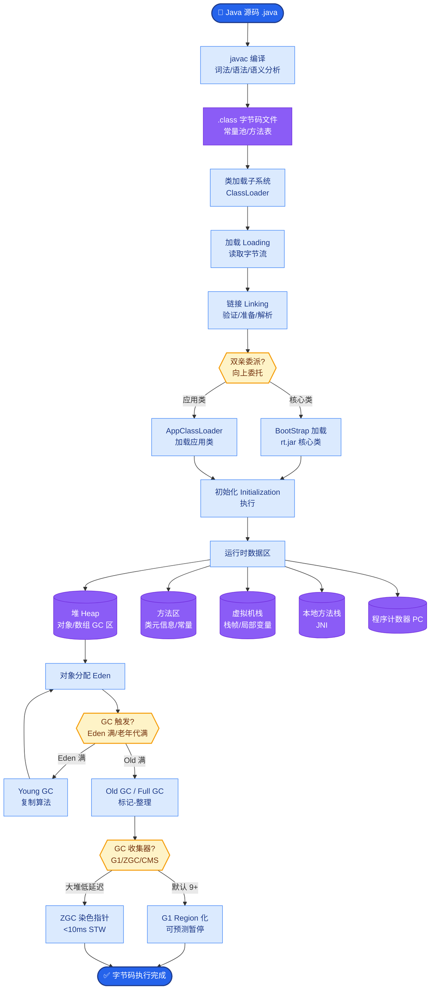
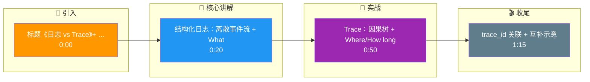

# 结构化日志和 Trace 有什么区别

结构化日志是事件流，适合检索与告警；Trace 是因果树，适合分析延迟与依赖。二者应通过 trace_id 关联，互补而非二选一。

**深入解析**：
在可观测性三大支柱中，Logs、Metrics、Traces 各司其职，而在 LLM/Agent 领域它们的界限更为重要：

1.  **结构化日志**：
    - **作用**：记录具体的**状态快照**和**错误堆栈**。例如：“LLM 返回了 Content Filter 错误”、“Prompt 长度超过限制”。
    - **格式**：JSON 格式，包含 `timestamp`, `level`, `msg`, `trace_id`, `span_id`。
    - **优势**：查询灵活，适合做“查找所有包含 SQL 语法错误的请求”。

2.  **Trace**：
    - **作用**：记录服务间的**拓扑关系**和**耗时分布**。例如：“工具调用耗时 2s，而 LLM 生成耗时 5s，整体延迟瓶颈在 LLM”。
    - **区别**：Trace 无法承载大量文本（如完整的 10k Prompt），只能通过 Links 关联日志。

**实战案例**：
排查一次偶发的 Agent 超时事故。Trace 显示总耗时 30s，但各 Span 之和仅 5s。此时单纯看 Trace 无法解释。查询关联的结构化日志，发现大量 `Waiting for available connection` 的 WARN 级别日志，最终定位到数据库连接池泄露导致的线程阻塞，而非 LLM 或 RPC 本身的问题。

**代码示例**：
```python
import logging
import json
from opentelemetry import trace

# 配置结构化日志输出 JSON 格式
class JsonFormatter(logging.Formatter):
    def format(self, record):
        log_record = {
            "time": self.formatTime(record),
            "level": record.levelname,
            "msg": record.getMessage(),
            # 关键：将 Trace ID 注入日志，实现关联
            "trace_id": trace.get_current_span().get_span_context().trace_id,
            "span_id": trace.get_current_span().get_span_context().span_id
        }
        return json.dumps(log_record)
```

**对比表格**：

| 维度 | 结构化日志 | Trace (链路追踪) |
| :--- | :--- | :--- |
| **数据结构** | 离散的事件记录 | 树状的调用关系图 |
| **关注点** | What happened (发生了什么) | Where & How long (在哪、多久) |
| **数据量级** | 极大（可能包含完整 Payload） | 较小（主要是 Metadata） |
| **查询场景** | 内容检索、异常排查、审计 | 性能瓶颈分析、依赖梳理 |
| **保留时间** | 通常较短（7-30天，成本高） | 通常较长（仅保留 Span 数据） |
| **核心价值** | 定位具体错误原因 | 发现系统短板与拓扑 |

**数据关系图**：
```text
┌─────────────────────────────────────────────────────────────┐
│                       观测存储后端                            │
├─────────────────────────────────────────────────────────────┤
│                                                               │
│  Trace Store (因果关系)        Log Store (详细内容)          │
│  ┌─────────────────┐           ┌─────────────────┐           │
│  │ Trace ID: A100  │───────────┤ Log: Prompt... │           │
│  │ [Span 1] 10ms   │  Link     │ (trace_id:A100)│           │
│  │ [Span 2] 5000ms │───────────┤ Log: Error...  │           │
│  │ [Span 3] 20ms   │  Link     │ (trace_id:A100)│           │
│  └─────────────────┘           └─────────────────┘           │
│           │                                                   │
└───────────┼───────────────────────────────────────────────────┘
            │ 关联键
            ▼
     统一查询界面
```

## 常见考点
1.  **关联开销**：在每一个 Log 行中都写入 `trace_id` 是否会带来性能损耗？（通常损耗极小，但需确保异步日志库不丢失上下文）。
2.  **排障流程**：遇到“用户反馈响应慢”时，先查 Trace 还是先查 Log？（先查 Trace 定位耗时节点，再查 Log 查看该节点的具体报错或参数）。
3.  **采样冲突**：如果 Trace 采样了 10%，Log 全量记录，会导致大量 Log 无法在 UI 中关联到 Trace 图，如何解决？（保证错误日志的 100% 采样，或者根据 Trace ID 进行反向索引）。

## 核心流程图



## 记忆要点

- 结构化日志是离散事件流，侧重记录 What（发生了什么），适合检索与排查错误。
- Trace 是因果树状图，侧重记录 Where & How long（在哪、多久），适合分析拓扑与延迟。
- 二者通过 trace_id 关联，互补而非二选一，Trace 无法承载大文本需链接日志。
- 日志关注内容详情与 Payload，Trace 关注 Metadata 与调用关系，数据量级差异大。

## 结构化回答

**30 秒电梯演讲：** 日志像日记写发生了什么，Trace 像地图画怎么走的。结构化日志是离散事件流，侧重记录 What，适合检索和排查错误；Trace 是因果树状图，侧重记录在哪、耗时多久，适合分析拓扑与延迟。两者通过 trace_id 关联，互补而非二选一——Trace 承载不了大文本，需要链接到日志看详情。

**展开框架：**
1. **结构化日志** — 离散事件流，侧重记录 What（发生了什么），包含内容详情和 Payload，适合检索、告警和错误排查。
2. **Trace** — 因果树状图，侧重记录 Where 和 How long（在哪、耗时多久），关注 Metadata 和调用关系，适合分析拓扑结构和延迟瓶颈。
3. **关联与互补** — 两者通过 trace_id 关联，互补而非二选一；Trace 无法承载大文本需链接日志，数据量级也差异大，日志存详情、Trace 存关系。

**收尾：** 一句话，日志管内容，Trace 管关系，靠 trace_id 串起来。您想深入聊聊结构化日志怎么设计字段，还是 Trace 的采样率怎么定？

## 视频脚本

> 预计时长：1 分 30 秒 | 由浅入深

| 时间 | 画面/字幕 | 口播台词 | 讲解要点 |
|------|----------|----------|----------|
| 0:00 | 标题《日志 vs Trace》+ 日记和地图漫画 | 日志像日记写发生了什么，Trace 像地图画怎么走的，两者各司其职。 | 类比开场 |
| 0:20 | 结构化日志：离散事件流 + What | 结构化日志是离散事件流，侧重记录 What，也就是发生了什么，适合检索和排查错误。 | 结构化日志 |
| 0:50 | Trace：因果树 + Where/How long | Trace 是因果树状图，侧重记录在哪、耗时多久，关注调用关系，适合分析拓扑和延迟。 | Trace |
| 1:15 | trace_id 关联 + 互补示意 | 两者通过 trace_id 关联，互补而非二选一；Trace 承载不了大文本，要链接到日志看详情。 | 关联互补 |

### 视频流程图




