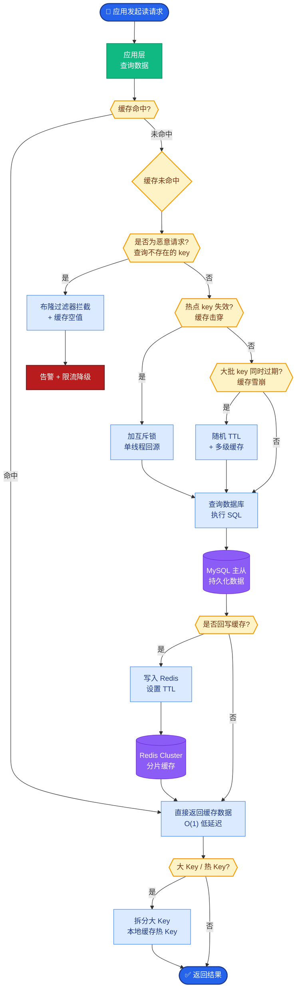

# Streaming 会影响计费或日志吗

Streaming 模式改变了数据的传输形态，但对后端计费和可观测性的逻辑产生了特殊影响。

1.  **计费逻辑**：
    *   必须等待流结束或通过 `usage` 字段（如果提供）统计总 Token 数。不能按 chunk 数量估算。
    *   注意：部分供应商在流结束时才返回 `prompt_tokens` 和 `completion_tokens`，此时必须更新计费状态。

2.  **日志与审计**：
    *   **聚合模式**：在内存或 Redis 中暂存 chunks，流结束后拼接成完整文本写入日志/DB。优点是查询友好；缺点是内存占用高，且如果流异常中断，可能丢失部分上下文。
    *   **增量模式**：每个 chunk 直接写入，附带 `index` 和 `trace_id`。查询时需按时间顺序重组。这对分析模型生成的“思考过程”非常有用。

3.  **实战案例**：在某高并发客服场景中，采用“聚合模式”记录日志，导致网关内存溢出（OOM）。因为大量长对话同时进行时，缓存所有未结束的流文本消耗了数 GB 内存。后改为“增量写入对象存储（S3）+ 异步回调聚合”的方案，内存占用降低了 90%，且保证了数据不丢失。

4.  **关键代码（Python FastAPI 流式处理与日志）**：
```python
import asyncio
from fastapi import Response

async def stream_generator():
    full_response = ""
    async for chunk in llm_client.stream():
        full_response += chunk
        yield chunk # 实时推给用户
    
    # 流结束后异步记录完整日志，不阻塞用户感知
    asyncio.create_task(log_completion.trace_id(full_response))

@app.get("/chat")
async def chat_endpoint():
    return Response(stream_generator(), media_type="text/event-stream")
```

**数据流与断点处理**：
```text
[Client] ──(Stream)──> [Gateway] ──(Stream)──> [LLM Provider]
    │                      │                           │
    │ <─ Chunk 1 ──────────┘                           │
    │ <─ Chunk 2                                      │
    │ ...                                             │
    │ <─ Chunk N (Usage: {total: 100})                │
    │                                                  │
    ▼                                                  │
[Log Strategy]                                       │
    ├─ Option A: Buffer All → Write Full Log          │
    │         (Risk: Crash = Data Loss)                │
    │                                                  │
    └─ Option B: Write Chunks → Async Aggregate        │
              (Safe for Analysis, High Write IOPS)     │
```

## 常见考点
1.  **早期取消**：用户在流输出到一半时关闭了浏览器窗口，网关如何感知并停止向 LLM 供应商计费？（网关需实现 Client Disconnect 检测，并主动中断上游 HTTP 连接，否则可能会被供应商计全费）。
2.  **Token 计数准确性**：服务端计费 vs 客户端计费哪个为准？（以服务端或供应商返回的 usage 为准，因为客户端的 tokenizer 版本可能与服务器不一致）。
3.  **实时性监控**：在流式输出中，如何实时监控敏感词？（需要流式缓冲一小段内容进行扫描，或使用低延迟的流式审核模型）。


## 核心流程图



## 记忆要点

- 计费必须等待流结束或 usage 字段，不能按 chunk 数量估算，注意流结束时才返回 Token 数。
- 日志聚合模式（内存暂存）查询友好但易 OOM；增量模式（直接写）更安全但需重组。
- 用户提前断开连接，网关需主动中断上游连接，否则可能被供应商计全费。
- 以服务端返回的 usage 为准，因为客户端 tokenizer 版本可能与服务器不一致。

## 结构化回答

**30 秒电梯演讲：** Streaming 只改变传输方式，不改变计费总量和日志归集，像看视频分片段加载，但看完才算一次完整点播、账单按总时长算。计费必须等流结束拿到 usage 字段，不能按 chunk 数估算；日志要么内存聚合（查询友好但易 OOM）要么增量直写（安全但需重组）。用户提前断开，网关要主动中断上游，否则可能被供应商计全费。

**展开框架：**
1. **计费逻辑** — 必须等流结束或通过 usage 字段统计总 token 数，不能按 chunk 数量估算；部分供应商只在流结束时才返回 prompt_tokens 和 completion_tokens，此时才能更新计费。
2. **日志与审计** — 聚合模式在内存暂存 chunks 拼完整文本再写入，查询友好但易 OOM；增量模式直接写更安全但查询时需重组，两者各有取舍。
3. **断连与对账** — 用户提前断开连接时，网关必须主动中断上游连接，否则可能被供应商计全费；严格以服务端返回的 usage 为准对账，因为客户端 tokenizer 版本可能不一致。

**收尾：** 一句话，Streaming 只换传输不换计费，断连要主动中断。您想深入聊聊日志的聚合和增量模式怎么选，还是流式 usage 怎么采集？

## 视频脚本

> 预计时长：2 分钟 | 由浅入深

| 时间 | 画面/字幕 | 口播台词 | 讲解要点 |
|------|----------|----------|----------|
| 0:00 | 标题《Streaming 与计费日志》+ 视频分段加载漫画 | Streaming 像看视频分片段加载，但看完才算一次完整点播，账单按总时长算，只改变传输不改变计费。 | 类比开场 |
| 0:25 | 计费流程：等待流结束 + usage 字段 | 计费必须等流结束拿到 usage 字段，不能按 chunk 数估算，部分供应商只在流结束才返回 token 数。 | 计费逻辑 |
| 0:55 | 日志两种模式对比：聚合 vs 增量 | 日志有聚合和增量两种模式：聚合在内存暂存查询友好但易 OOM，增量直接写更安全但需重组。 | 日志审计 |
| 1:25 | 断连示意：网关主动中断上游 | 用户提前断开时，网关必须主动中断上游连接，否则可能被供应商计全费。 | 断连处理 |
| 1:50 | 对账：以服务端 usage 为准 | 严格以服务端返回的 usage 为准对账，因为客户端 tokenizer 版本可能和服务器不一致。 | 对账原则 |

