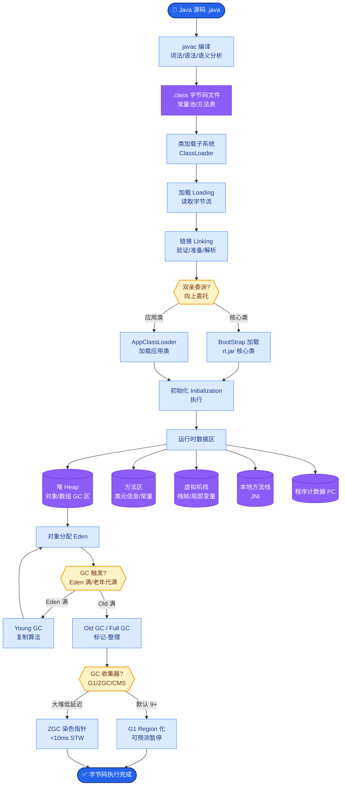
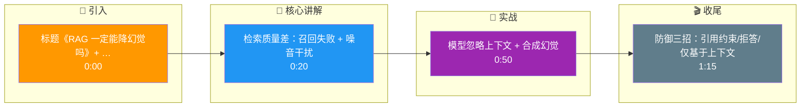

# RAG 一定能降幻觉吗

不一定。RAG 的核心在于引入外部知识库来约束模型生成，但在以下场景下仍可能产生幻觉：

1.  **检索质量差**：
    *   **召回失败**：文档切分不合理或 Embedding 召回能力不足，导致相关信息未被检索到。
    *   **噪音干扰**：检索到了错误或相关性低的内容，反而误导模型（「错误的上下文比没有上下文更糟糕」）。
2.  **重排序失败**：
    *   跨编码器未能将正确答案排在 Top-K 内，导致模型被非相关文档混淆。
3.  **模型忽略上下文**：
    *   模型的指令遵循能力较弱，或者预训练知识权重过大，导致其「自信」地忽略提供的检索内容而直接回答。
4.  **合成幻觉**：
    *   模型将多个检索片段中的信息错误拼接，生成了不存在的事实。

5.  **边界情况**：
    *   **反事实问题**：当用户提问与检索到的文档事实相反（例如文档说“A是好的”，用户问“A为什么不好”），模型可能试图强行解释检索内容而产生逻辑幻觉。
    *   **多实体冲突**：检索片段中包含多个实体的同类信息（如“张三赚了100元”，“李四亏了50元”），模型可能将其张冠李戴，合并为“张三亏了50元”。
    *   **指令冲突**：Prompt 中同时存在“基于上下文回答”和“发挥创意”的冲突指令，导致模型优先选择了创意生成而非事实检索。

** mitigation 策略**：
*   **检索评估**：使用 Answer Relevance、Context Recall 等指标监控检索链路。
*   **引用约束**：强制模型在回答中标注引用来源，并在后处理中校验引用的真实性。
*   **拒答策略**：设置置信度阈值，当检索内容相关性低于阈值时，引导模型拒答而非编造。

**实战案例**：
在某金融财报问答系统中，我们曾遇到模型将“2023年Q1”和“2022年Q1”的两个检索片段拼接，生成了一个不存在的“2022年Q1修正数据”的幻觉答案。解决方案是在 Prompt 中增加「时间线一致性」指令，并对涉及多个来源的数字进行二次比对校验。

**代码示例**：
```python
# 使用 LangChain 的 SelfCheck 实现
from langchain.chains import SelfCheckWithEmbeddings

# 构建基础 RAG
rag_chain = ...

# 叠加幻觉检测层
self_check_chain = SelfCheckWithEmbeddings.from_llm(
    llm=llm, 
    base_chain=rag_chain
)

result = self_check_chain.invoke({"query": "去年的营收是多少？"})
# 只有通过一致性检测的结果才会返回，否则触发 fallback
```

```text
      用户问题
         │
    ┌────▼─────┐
    │  检索增强 │
    └────┬─────┘
         │
    ┌────▼─────────────┐
    │  上下文    │
    └────┬─────────────┘
         │
    ┌────▼─────┐       
    │  模型生成 │───────┼──▶ 幻觉来源：
    └────┬─────┘       │    1. 上下文错误 (检索错)
         │             │    2. 上下文不足 (召回漏)
         ▼             │    3. 忽略上下文 (模型固执)
      最终答案          │    4. 拼接错误 (合成假)
```

## 面试追问
1.  **如果检索到的文档本身存在自相矛盾的信息（比如 KB 中有两个版本的手册），RAG 系统该如何处理？**
2.  **什么是“Negation RAG”（否定式 RAG）？它在什么场景下反而会增加幻觉？**
3.  **如何量化评估 RAG 系统中“检索”和“生成”两个环节各自对最终幻觉的贡献比例？**

## 易错点
1.  **迷信 RAG 的准确性**：认为只要有知识库，模型就不会胡说八道。实际上，如果检索内容是噪音，模型会“一本正经地胡说八道”，且这种幻觉更难被用户察觉。
2.  **忽视 Prompt 的引导作用**：只关注检索效果，却在 Prompt 中写“请根据你的知识...”，导致模型直接无视检索到的 Context。

## 核心流程图



## 记忆要点

- RAG 不一定能降幻觉：检索质量差（召回失败/噪音干扰）或模型忽略上下文仍会幻觉。
- 错误的上下文比没有上下文更糟糕，模型会“一本正经地胡说八道”。
- 合成幻觉：模型将多个检索片段错误拼接，生成不存在的事实。
- 防御策略：引用约束、拒答策略（低置信度时）、Prompt 中强调“仅基于上下文”。

## 结构化回答

**30 秒电梯演讲：** RAG 不一定能降幻觉，像开卷考试给了课本，但学生可能看错页或不信课本。检索质量差会引入噪音，错误的上下文比没有上下文更糟，模型会"一本正经地胡说"。还有合成幻觉——把多个片段错误拼接成不存在的事实。防御要靠引用约束、低置信度拒答、Prompt 强调"仅基于上下文"。

**展开框架：**
1. **检索质量差的陷阱** — 召回失败导致相关信息没检索到，或召回噪音误导模型；错误的上下文比没有上下文更糟糕，重排失败也会让正确答案落选 Top-K。
2. **模型忽略上下文与合成幻觉** — 模型可能忽略检索到的上下文，仍用自身参数知识作答；还会把多个检索片段错误拼接，生成不存在的事实（合成幻觉）。
3. **防御策略** — 引用约束要求答案标注来源、低置信度时触发拒答策略、Prompt 明确强调"仅基于上下文回答，无法回答时说不知道"。

**收尾：** 一句话，RAG 是降幻觉的必要非充分条件。您想深入聊聊合成幻觉怎么检测，还是引用约束怎么实现？

## 视频脚本

> 预计时长：1 分 30 秒 | 由浅入深

| 时间 | 画面/字幕 | 口播台词 | 讲解要点 |
|------|----------|----------|----------|
| 0:00 | 标题《RAG 一定能降幻觉吗》+ 开卷看错页漫画 | RAG 不一定能降幻觉，像开卷考试给了课本，但学生可能看错页或不信课本。 | 类比开场 |
| 0:20 | 检索质量差：召回失败 + 噪音干扰 | 检索质量差是首要原因：召回失败导致信息没找到，或召回噪音误导模型，错误的上下文比没有更糟。 | 检索陷阱 |
| 0:50 | 模型忽略上下文 + 合成幻觉 | 模型可能忽略上下文用自身知识作答；还会把多个片段错误拼接，生成不存在的事实，叫合成幻觉。 | 忽略与合成 |
| 1:15 | 防御三招：引用约束/拒答/仅基于上下文 | 防御要靠引用约束标注来源、低置信度拒答、Prompt 强调仅基于上下文回答。 | 防御策略 |

### 视频流程图




