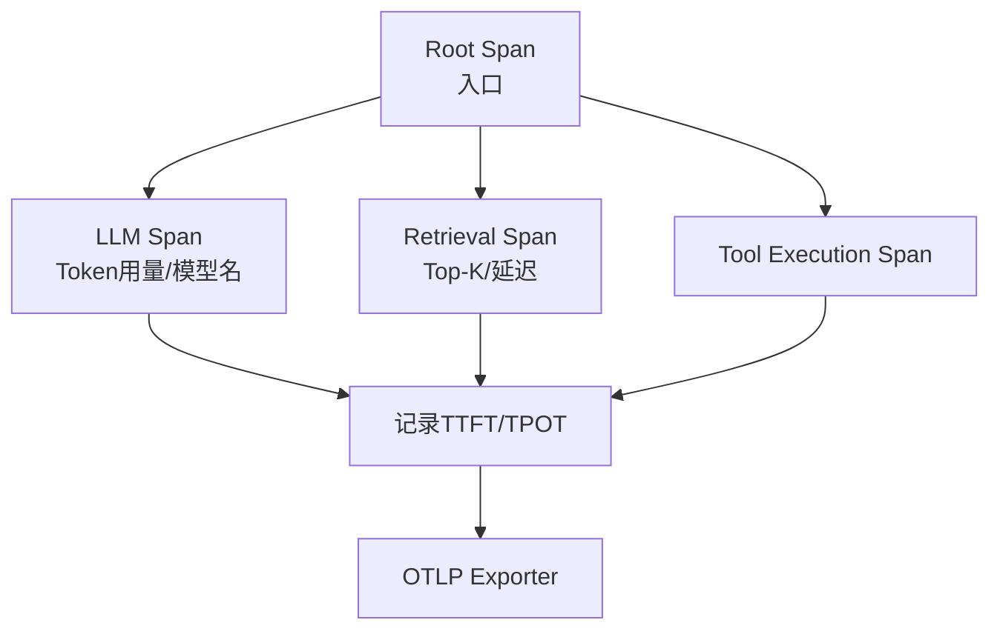

# OpenTelemetry 在 Agent 里一般打哪些 Span

在 Agent 的 OpenTelemetry (OTel) 链路追踪中，Span 的划分应体现调用层次与依赖关系，一般包含以下层级：

1.  **Root Span（顶层请求）**：
    *   标记整个 Agent 请求的入口，记录 `user_id`, `session_id`, `agent_type`。
2.  **Sub Spans（子 Span）**：
    *   **LLM Call**：记录模型调用。属性：`llm.provider`, `llm.model_name`, `llm.prompt_tokens`, `llm.completion_tokens`, `llm.total_tokens`。
    *   **Retrieval**：记录检索过程。属性：`retrieval.index_name`, `retrieval.top_k`, `retrieval.latency_ms`。
    *   **Tool Execution**：记录工具调用。属性：`tool.name`, `tool.input_params` (脱敏), `tool.status` (success/failure)。
    *   **System Logic**：如 `memory_storage`, `prompt_assembly`。
    *   **Control Flow**：`retry` (重试次数), `fallback` (降级动作)。
3.  **关键事件**：
    *   在 Span 中添加 Events，如 `llm.start`, `llm.first_token`, `llm.end`，用于精确计算首字延迟（TTFT）。

4.  **边界情况**：
    *   **流式响应的处理**：流式请求的 Span 结束时间应以“最后一个 Token 到达”为准，而不是以“请求发送”为准。需特别记录 `llm.time_to_first_token` 和 `llm.time_per_output_token`。
    *   **并发链路**：如果 Agent 并行调用了多个工具，OTel 需正确记录 `Link` 关系，避免将并发耗时误认为是串行累加。
    *   **循环迭代**：Agent 在执行 While 循环（如思考-行动循环）时，应将每次迭代标记为独立的 Span，防止一个无限循环的请求产生一个巨大的单 Span，难以分析。

**实战案例**：
在排查一个多轮对话响应慢的问题时，通过 OTel 发现每一轮对话都有长达 800ms 的「其他」耗时。由于我们在 Memory Span 里没有细粒度打点，一度以为是 Redis 慢。后来我们在 Memory Read 内部增加了一个 `vector_search` 子 Span，才发现是向量库的连接池配置过小导致排队。**经验：所有 I/O 操作必须开启独立 Span，即使是内部组件调用。**

**代码示例**：
```python
from opentelemetry import trace

tracer = trace.get_tracer(__name__)

def execute_tool(tool_name, args):
    with tracer.start_as_current_span("tool.execution") as span:
        span.set_attribute("tool.name", tool_name)
        span.set_attribute("tool.input", str(args)[:100]) # 截断防止超大日志
        
        try:
            result = external_api.call(args)
            span.set_status(trace.Status(trace.StatusCode.OK))
            return result
        except Exception as e:
            span.record_exception(e)
            span.set_status(trace.Status(trace.StatusCode.ERROR, str(e)))
            raise
```

| 层级 | Span Name | 关键 Attributes | 核心目的 |
| :--- | :--- | :--- | :--- |
| **L1 (Root)** | `agent.request` | `user.id`, `session.id` | 关联全链路，定位用户问题 |
| **L2 (Orchestration)**| `agent.plan` | `thought`, `next_action` | 理解 Agent 的决策逻辑 |
| **L2 (Knowledge)** | `agent.retrieval`| `vector_db.latency`, `top_k` | 诊断 RAG 效果与性能 |
| **L2 (Inference)** | `llm.inference` | `model.name`, `token.usage` | 成本核算与模型性能监控 |

## 面试追问
1.  **Agent 中的 Prompt 往往很长，导致 Trace 中的 Logs 体积巨大且包含敏感信息，你会如何处理 Span Attributes 的脱敏与采样策略？**
2.  **如何利用 OTel 的 Baggage 机制在复杂的异步 Agent 任务（如通过消息队列触发的后台任务）中透传用户上下文？**
3.  **对于 ReAct 模式的 Agent，如何通过 Span 分析出它在哪一步陷入了“死循环”？**

## 易错点
1.  **遗漏“思考”过程的打点**：只记录了 Tool Call 和 LLM Call，却没记录 LLM 输出的“Thought”内容（特别是 CoT 模式），导致 Trace 中只能看到动作却不知道动作的原因，排查问题困难。
2.  **混淆 Span 与 Log**：将高频的 Token 生成内容作为 Event 打入 Span，导致 Trace 后端存储压力爆炸。应只记录关键 Metric（如 Token 计数），而非完整内容。




## 记忆要点

- Root Span 记录入口，Sub Spans 划分 LLM Call、Retrieval、Tool Execution。
- LLM Span 记录 Token 用量与模型名，Retrieval Span 记录 Top-K 与延迟。
- 流式处理：Span 结束时间以最后一个 Token 为准，记录 TTFT 和 TPOT 事件。
- 并发与循环：并行调用用 Link 记录，循环迭代每次标记独立 Span，避免巨大单 Span。

## 结构化回答

**30 秒电梯演讲：** Agent 的 OTel 打点像快递物流追踪，记录经过的每个中转站和处理耗时。Root Span 记录整个请求入口；Sub Spans 划分三类关键调用：LLM Call 记 token 用量和模型名、Retrieval 记 Top-K 和延迟、Tool Execution 记工具名和状态。流式场景 Span 结束时间以最后一个 token 为准，并发用 Link 关联，循环每次独立 Span 避免巨大单 Span。

**展开框架：**
1. **Root Span** — 标记整个 Agent 请求入口，记录 user_id、session_id、agent_type 等顶层属性，覆盖全生命周期。
2. **三类 Sub Span** — LLM Call 记录 provider、model_name、token 用量；Retrieval 记录 index_name、top_k、延迟；Tool Execution 记录 tool.name、脱敏后的 input_params、success/failure 状态。
3. **流式、并发与循环处理** — 流式 Span 结束时间以最后一个 token 为准，记录 TTFT 和 TPOT 事件；并发调用用 Link 关联；循环迭代每次独立标记 Span，避免单个巨大 Span 难以分析。

**收尾：** 一句话，OTel Span 要体现 Agent 的调用层次与依赖。您想深入聊聊 Span 属性怎么标准化，还是流式场景的 TTFT 怎么采集？

## 视频脚本

> 预计时长：1 分 30 秒 | 由浅入深

| 时间 | 画面/字幕 | 口播台词 | 讲解要点 |
|------|----------|----------|----------|
| 0:00 | 标题《Agent OTel Span》+ 快递物流追踪漫画 | Agent 的 OTel 打点像快递物流追踪，记录经过的每个中转站和处理耗时。 | 类比开场 |
| 0:20 | Root Span + 三类 Sub Span 层次图 | Root Span 记录请求入口，Sub Spans 划分 LLM Call、Retrieval、Tool Execution 三类关键调用。 | Span 层次 |
| 0:50 | 各 Span 关键属性：token 用量/Top-K/工具状态 | LLM Span 记 token 用量和模型名，Retrieval Span 记 Top-K 和延迟，Tool Span 记工具名和状态。 | 关键属性 |
| 1:15 | 流式 + 并发 + 循环处理 | 流式以最后一个 token 为结束记 TTFT 和 TPOT；并发用 Link 关联；循环每次独立 Span 避免巨大单 Span。 | 特殊处理 |

