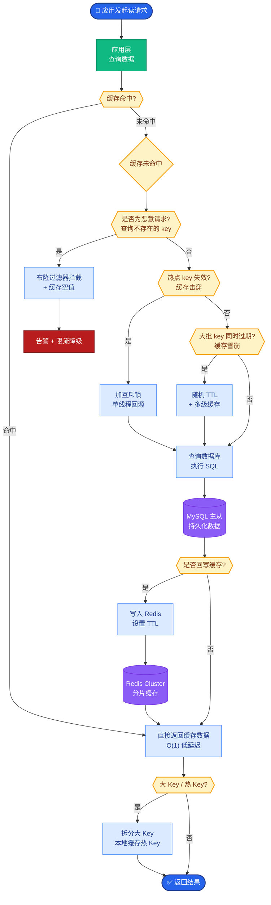

# 工具调用的「两步授权」怎么做

工具调用的「两步授权」旨在将「意图识别」与「实际执行」解耦，防止模型直接越权操作。具体流程如下：

1.  **第一步：意图生成（计划阶段）**
    *   模型仅根据用户输入生成「调用意图」与「参数结构」，不直接执行操作。
    *   输出示例：`{"tool": "transfer", "args": {"to": "user_b", "amount": 100}}`。
2.  **第二步：策略校验（授权阶段）**
    *   **鉴权服务**介入，不直接调用工具，而是检查：
        *   **角色权限**：当前用户是否有权调用该工具（RBAC）。
        *   **资源边界**：参数中的资源 ID（如 `to: user_b`）是否在允许范围内。
        *   **速率限制**：该敏感操作是否超过频率限制。
    *   **人工确认（可选）**：对于高风险操作（如删除数据库、大额转账），触发二次确认（2FA 或人工审批）。
3.  **第三步：执行与反馈**
    *   校验通过后，执行器调用真实工具。
    *   如果拒绝，将具体的拒绝原因（如「余额不足」、「无权操作」）转化为自然语言反馈给模型，由模型组织话术回复用户。

**实战案例**：
在 Code Interpreter 场景中，曾遭遇模型生成 `rm -rf /` 的恶意指令。虽然我们在意图生成阶段做了限制，但参数校验层必须独立。我们在沙箱执行前增加了一个**静态 AST 分析器**，检查生成的 Python 代码是否包含高危系统调用，如果包含则直接拦截，不依赖 LLM 的自我修正。

**代码示例**：
```python
# 伪代码：两步授权中间件
def handle_tool_call(user_intent, user_context):
    # Step 1: 意图解析 (由 LLM 完成)
    tool_plan = llm.generate_plan(user_intent) 
    # tool_plan = {"name": "delete_user", "args": {"id": 123}}

    # Step 2: 策略引擎校验 (核心安全防线)
    policy_check = PolicyEngine.verify(
        user=user_context.user,
        action=tool_plan.name,
        resource=tool_plan.args["id"]
    )
    
    if not policy_check.allowed:
        # 拒绝不执行，返回错误原因
        return llm.refuse_response(reason=policy_check.reason)

    # Step 3: 执行
    return tool_registry.execute(tool_plan.name, tool_plan.args)
```

| 阶段 | 执行主体 | 核心动作 | 风险控制点 |
| :--- | :--- | :--- | :--- |
| **意图生成** | LLM | 提取结构化参数 | 输出格式约束、Prompt 注入防御 |
| **策略校验** | 确定性代码 | 权限、额度、合规检查 | **RBAC、资源所有权校验、参数正则过滤** |
| **实际执行** | 执行器/沙箱 | 访问外部资源 | 最小权限原则、操作审计日志 |

```text
     用户
      │
      ▼
   ┌─────┐
   │ LLM │ (1. 生成意图: "Transfer $100 to B")
   └──┬──┘
      │
      ▼
 ┌──────────────┐
 │ 策略引擎     │ ◀─── (2. 检查: 限额? 权限? 风险?)
 │ (AuthZ)      │
 └──┬───────┬───┘
    │       │
    │ 否    │ 是
    ▼       ▼
 ┌────┐ ┌────────┐
 │反馈│ │执行器  │ (3. 调用真实 API)
 └────┘ └───┬────┘
            │
            ▼
         真实世界
```

### 边界情况补充
*   **循环调用与递归**：需防止 Agent 通过自我调用形成死循环（如 A调用B，B又调用A），策略层需维护调用链深度限制（Depth Limit）。
*   **参数注入攻击**：模型生成的参数可能包含 SQL 注入或 Script 注入，即使权限通过，执行前必须对参数进行清洗。
*   **幻觉参数**：模型可能生成不存在的资源 ID（如 `user_id: 99999`），策略校验层需不仅校验权限，还要校验资源存在性，避免执行器报错暴露内部结构。
*   **超时控制**：工具执行可能长时间无响应，必须在执行器层面设置严格的 Timeout，防止拖垮整个 Agent 服务。

## 易错点
1.  **过度依赖 LLM 生成参数**：直接将 LLM 输出的参数传给后端而不做类型校验（如期望传 Int，传了 String），导致执行器崩溃。
2.  **混淆鉴权与授权**：只验证了用户身份（AuthN），而未验证该用户是否有权操作该特定资源（AuthZ/ZBAC），导致水平越权漏洞。

## 面试追问
1.  如果工具执行失败（如数据库连接超时），如何设计错误反馈机制能让 LLM 更好地自我修正并生成重试逻辑？
2.  在高并发场景下，策略校验层（如查库验证权限）可能成为性能瓶颈，如何优化？（追问：本地缓存、JWT 解析、旁路校验）
3.  如果工具调用需要强一致性（如转账），两步授权中的执行阶段失败如何回滚？如何保证分布式事务？


## 核心流程图



## 记忆要点

- 核心解耦：将「意图生成」与「实际执行」分离，防止模型直接越权操作。
- 两步校验：LLM 仅生成结构化参数，由确定性策略引擎校验权限与资源边界。
- 安全防线：鉴权层需独立验证 RBAC、参数清洗及资源存在性，不依赖 LLM 自我修正。
- 闭环反馈：校验拒绝时需将具体错误原因转化为自然语言，由 LLM 组织话术回复。

## 结构化回答

**30 秒电梯演讲：** 工具调用的两步授权像先填申请单说明意图、审批通过才能盖章办事。第一步意图生成：LLM 只生成调用意图和参数结构，不直接执行；第二步策略校验：鉴权服务独立检查 RBAC 权限、参数清洗、资源存在性，通过才放行。核心是把意图和执行解耦，鉴权层不依赖 LLM 自我修正，拒绝时把原因转成自然语言闭环反馈。

**展开框架：**
1. **第一步：意图生成（计划阶段）** — LLM 根据用户输入只生成结构化的调用意图和参数（如 tool、args），不直接执行操作，把"想做什么"和"真去做"分开。
2. **第二步：策略校验（授权阶段）** — 鉴权服务介入检查角色权限（RBAC）、参数清洗（防注入）、资源存在性，全部通过才调用工具；不依赖 LLM 自我修正。
3. **闭环反馈** — 校验拒绝时，把具体错误原因转化为自然语言，由 LLM 组织话术回复用户，形成"拒绝有理由、用户能理解"的闭环。

**收尾：** 一句话，两步授权把意图和执行解耦，让安全可控。您想深入聊聊策略引擎怎么设计，还是 RBAC 在 Agent 里怎么做？

## 视频脚本

> 预计时长：1 分 30 秒 | 由浅入深

| 时间 | 画面/字幕 | 口播台词 | 讲解要点 |
|------|----------|----------|----------|
| 0:00 | 标题《工具调用两步授权》+ 填申请单审批盖章漫画 | 两步授权像先填申请单说明意图，审批通过后才能盖章办事，把意图和执行分开。 | 类比开场 |
| 0:20 | 第一步：意图生成，LLM 只出参数 | 第一步意图生成：LLM 只生成调用意图和参数结构，比如工具名和参数，不直接执行操作。 | 意图生成 |
| 0:50 | 第二步：策略校验 RBAC + 参数清洗 + 资源存在性 | 第二步策略校验：鉴权服务独立检查 RBAC 权限、参数清洗、资源存在性，全通过才放行。 | 策略校验 |
| 1:15 | 闭环反馈：拒绝原因转自然语言 | 校验拒绝时把具体错误原因转成自然语言，由 LLM 组织话术回复，形成闭环。 | 闭环反馈 |

