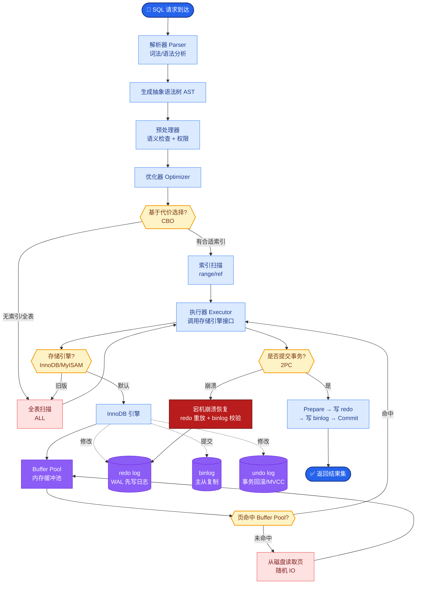

# 线上发现幻觉率升高,你如何排查

### 排查思路：由表及里，由近及远

#### 1. 确认影响范围（分层监控）
- **宏观指标**：查看整体幻觉率、Bad Case 率是否突增。
- **微观维度**：按租户、特定 Prompt 模板、特定模型版本、特定知识库切片进行下钻，确认是否是局部问题（如某个客户上传了错误文档）。

#### 2. 变更审查（回归分析）
- **模型层**：供应商是否在后台更新了模型（如从 `gpt-4-turbo` 升级到 `gpt-4o` 且未通知），或者你自己切换了模型版本/温度参数。
- **Prompt 层**：是否修改了 System Prompt 或 Few-shot Examples，导致指令约束变弱。
- **RAG 索引层**：最近是否有大规模数据导入？分块策略或 Embedding 模型是否变更？

#### 3. 链路抽样分析
- **Trace 检查**：随机抽取失败案例的 Trace ID。
  - **召回检查**：查看检索到的上下文是否包含答案？
    - *如果是，但模型未答* → Prompt 问题或模型指令遵循能力下降。
    - *如果不是* → 检索相关性问题（Embedding 质量或分块边界截断了答案）。
  - **工具调用检查**：Agent 是否调用了错误的工具，或工具返回了异常数据却被模型强行解释。

#### 4. 降级与边界情况
- **工具失败**：检查搜索 API 或数据库是否经常超时，导致模型在“无据可依”的情况下开始编造。
- **对抗攻击**：查看近期是否有 Prompt Injection 攻击导致 System Prompt 被覆盖。

#### 5. 对比验证
- **离线评估集**：使用历史固定的“黄金测试集”对当前线上模型进行回测。
  - 如果离线也差 → 模型/代码问题。
  - 如果离线正常，线上差 → 数据分布漂移 或 线上特定输入特征问题。

### 实战案例
某次线上客服 Agent 开始胡乱回答用户问题。排查发现，运营团队为了优化回答长度，在 System Prompt 中添加了“请尽量简短回答”。这导致模型在检索上下文不足时，为了满足“简短”约束而牺牲了准确性，开始编造。回滚 Prompt 修改后立即恢复。

### 代码示例 (伪代码 - 链路 Trace 检查)
```python
def debug_trace(trace_id: str):
    trace = get_trace(trace_id)
    context = trace.retrieved_context
    answer = trace.final_answer
    
    # 1. 检查召回质量
    if not verify_answer_in_context(answer, context):
        print(f"Alert: Hallucination detected! Answer not in context.")
        
    # 2. 检查工具调用异常
    for tool_call in trace.tool_calls:
        if tool_call.status == 'error':
            print(f"Alert: Tool {tool_call.name} failed, LLM might guess.")
```

```text
┌───────────────────┐     ┌───────────────────┐
│   幻觉率升高告警   │────▶│   确认影响范围     │
└─────────┬─────────┘     └───────┬───────────┘
          │                       │
          ▼                       ▼
┌───────────────────┐     ┌───────────────────┐
│  变更审查         │     │  链路抽样分析     │
│ (Model/Prompt/RAG)│     │ (召回/工具/Trace) │
└─────┬─────┬───────┘     └───────┬───────────┘
      │     │                     │
      ▼     ▼                     ▼
┌───────────────────┐     ┌───────────────────┐
│  离线回归测试      │◀────│  数据/环境差异    │
│ (Golden Set 跑分) │     │ (输入分布/网络)   │
└─────────┬─────────┘     └───────────────────┘
          │
          ▼
┌───────────────────┐
│  根因修复与验证    │
└───────────────────┘
```

## 常见考点
1. **如何量化“幻觉”**？
   - 答：可通过 LLM-as-a-Judge（让更强的模型打分）、Fact-Scoring（提取原子事实与知识库比对）或 BERTScore 等指标进行辅助判定。
2. **RAG 中召回正确但模型答错，通常是什么原因**？
   - 答：常见于 Prompt 中给模型的任务指令与检索到的上下文冲突，或者上下文太长导致模型“迷失”在中间，需要优化 Prompt 结构或使用 Re-rank 截断长度。
3. **如果是模型供应商端悄悄升级导致的问题，怎么解决**？
   - 答：必须对模型版本进行 Pinning（如 `gpt-4-0613` 而非 `gpt-4`），并在接口层做 Shadow Test（影子测试）验证新模型效果后再切换。


## 核心流程图



## 记忆要点

- 分层排查：先看宏观指标，再按租户、Prompt、模型版本下钻确认影响范围。
- 变更审查：检查模型版本漂移、Prompt 修改及 RAG 索引更新。
- 链路抽样：通过 Trace ID 检查召回上下文是否包含答案，区分检索与生成问题。
- 离线验证：使用黄金测试集回测，区分模型能力下降与数据分布漂移。

## 结构化回答

**30 秒电梯演讲：** 线上幻觉率升高，排查像看病：先问最近吃了啥（改了啥），再查哪项指标不对。分层排查：先看宏观指标，再按租户、Prompt、模型版本下钻确认影响范围；变更审查检查模型版本漂移、Prompt 修改、RAG 索引更新；链路抽样通过 Trace ID 看召回上下文是否包含答案，区分检索还是生成问题；最后用黄金测试集离线回测。

**展开框架：**
1. **分层排查确认范围** — 先看整体幻觉率和 Bad Case 率是否突增，再按租户、Prompt 模板、模型版本、知识库切片下钻，确认是全局问题还是局部问题（如某客户上传了错误文档）。
2. **变更审查** — 检查模型版本是否漂移（供应商偷偷微调）、Prompt 是否被修改、RAG 索引是否更新引入了脏数据。
3. **链路抽样与离线验证** — 通过 Trace ID 检查召回上下文是否包含正确答案，区分是检索没找到还是模型理解错；用黄金测试集离线回测，区分模型能力下降与线上数据分布漂移。

**收尾：** 一句话，幻觉排查要由表及里、由近及远。您想深入聊天下数据分布漂移怎么检测，还是 Trace 抽样怎么定位环节？

## 视频脚本

> 预计时长：2 分钟 | 由浅入深

| 时间 | 画面/字幕 | 口播台词 | 讲解要点 |
|------|----------|----------|----------|
| 0:00 | 标题《幻觉率升高排查》+ 看病问诊漫画 | 线上幻觉率升高，排查像看病：先问最近吃了啥，也就是改了啥，再查哪项指标不对。 | 类比开场 |
| 0:25 | 分层排查：宏观指标 → 租户/Prompt/模型下钻 | 先看整体幻觉率是否突增，再按租户、Prompt 模板、模型版本下钻，确认是全局还是局部问题。 | 分层排查 |
| 0:55 | 变更审查：模型漂移/Prompt 修改/索引更新 | 变更审查检查模型版本是否漂移、Prompt 是否被改、RAG 索引是否更新引入了脏数据。 | 变更审查 |
| 1:25 | 链路抽样：Trace ID 看召回上下文 | 通过 Trace ID 检查召回上下文是否包含正确答案，区分是检索没找到还是模型理解错。 | 链路抽样 |
| 1:50 | 离线验证：黄金测试集回测 | 最后用黄金测试集离线回测，区分模型能力下降和线上数据分布漂移。 | 离线验证 |

