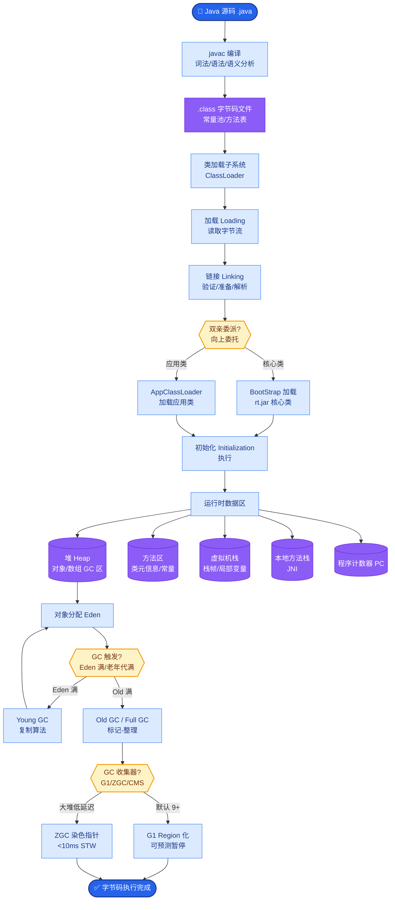
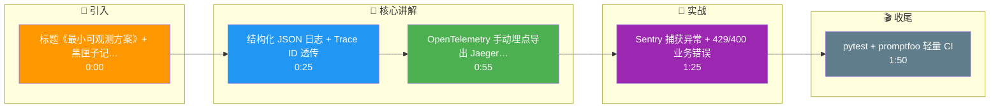

# 小型团队没有 LangSmith,最小可观测方案是什么

### 方案核心：以 Trace 为核心的轻量级可观测性栈

#### 1. 核心数据结构：结构化日志
- **Trace ID 传递**：每个请求生成唯一 `trace_id`，并在 LLM 调用、Tool 调用、向量检索时透传。
- **日志规范**：
  - `timestamp`
  - `trace_id`
  - `span_id` (当前环节)
  - `parent_id` (父环节)
  - `event_type` (e.g., `llm_start`, `tool_end`)
  - `payload`: `{ model_name, input_tokens, output_tokens, latency_ms, error_msg }`
- **输出目标**：JSON 格式写入 stdout（容器标准输出），由 Log Agent 采集。

#### 2. 分布式追踪
- **手动埋点**：在关键函数入口/出口使用 Decorator 打点。
- **OpenTelemetry (OTel)**：
  - 使用 OTel SDK 自动捕获 HTTP 请求。
  - 对 LLM 调用手动创建 `Span`，记录 Prompt/Completion 的摘要或 Hash（避免敏感信息泄露）。
  - 导出至 **Jaeger** 或 **Tempo** 等开源后端，可视化调用链路。

#### 3. 错误监控
- **Sentry Integration**：捕获代码层的 Exception。
- **LLM 特定异常**：捕获 Rate Limit (429)、Context Length Exceeded (400) 等业务错误，并在 Sentry 中设置 Alert 规则。

#### 4. 评估与质量保障
- **数据集**：维护 CSV/JSONL 格式的 QA 对。
- **CI 脚本**：
  - 使用 `pytest` 编写测试用例。
  - 集成 `promptfoo` 或 `deepeval` 等轻量库。
  - 在每次 PR 或发版时运行，断言通过率（如 Levenshtein 距离 < 阈值 或 LLM 判分 > 8分）。

#### 5. 可视化面板（低成本）
- 将结构化日志导入 **Grafana Loki** 或 **ClickHouse**。
- 编写简单的 SQL/LogQL 查询面板：
  - 平均 Token 消耗/耗时
  - 错误率 Top N
  - 具某用户的对话历史回放

```text
┌────────────────────────────────────────────────────────────┐
│                      应用代码
│  ┌──────────┐    ┌──────────┐    ┌──────────────┐          │
│  │  Agent   │───▶│ LLM Call │───▶│ Vector Store │          │
│  └────┬─────┘    └────┬─────┘    └──────┬───────┘          │
│       │              │                 │                   │
│       │  Structured Logging (JSON + TraceID)              │
└───────┼──────────────┼─────────────────┼───────────────────┘
        │              │                 │
        ▼              ▼                 ▼
┌───────────────┐ ┌───────────────────┐ ┌──────────────────┐
│ Sentry (Errors)│ │ OTel Exporter     │ │ Log Stream       │
└───────────────┘ └────────┬───────────┘ └────────┬─────────┘
                           │                       │
                           ▼                       ▼
                  ┌─────────────────┐    ┌───────
```

#### 实战案例
在生产环境中，曾遇到 OpenAI 流式输出导致中间 Token 未被 OTel 捕获的问题。解决方案是改用手动拦截 `stream=True` 的响应块，累积字数后在 `span.end()` 时统一记录 `output_tokens`，避免了监控数据虚低。

#### 代码示例
```python
# Python: 结构化日志上下文管理器
import json, uuid, time
class LLMObservability:
    def __init__(self, model_name):
        self.trace_id = str(uuid.uuid4())
        self.model_name = model_name
    def log(self, stage, status, **kwargs):
        log_entry = {
            "timestamp": time.time(), "trace_id": self.trace_id,
            "event_type": f"llm_{stage}", "status": status,
            "model": self.model_name, **kwargs
        }
        print(json.dumps(log_entry)) # Stdout for Loki/Filebeat

# Usage
obs = LLMObservability("gpt-4")
obs.log("start", "processing", prompt_tokens=10)
# ... LLM Call ...
obs.log("end", "success", latency_ms=500, output_tokens=50)
```

#### 对比表格：轻量级方案 vs LangSmith
| 特性 | 轻量级自研方案 | LangSmith |
| :--- | :--- | :--- |
| **成本** | 极低 (仅基础设施) | 高 (按用量/席位付费) |
| **上手难度** | 高 (需搭建日志、OTel、DB) | 低 (SaaS 即插即用) |
| **数据隐私** | 完全本地化 | 需上传数据至云端 |
| **LLM 评估** | 需手写 CI 脚本 | 内置 Playground & Datasets |
| **适用场景** | 内网环境、敏感数据、预算紧张 | 快速迭代、公开数据、初创团队 |

## 核心流程图



## 记忆要点

- 核心结构：以 Trace ID 透传的结构化 JSON 日志为核心，串联全链路。
- 追踪方案：使用 OpenTelemetry 手动埋点 LLM 调用，导出至 Jaeger/Tempo。
- 错误监控：集成 Sentry 捕获代码异常及 LLM 业务错误（如 429/400）。
- 评估保障：用 pytest + promptfoo 编写轻量 CI，发版前断言通过率。

## 结构化回答

**30 秒电梯演讲：** 小团队没有 LangSmith，最小可观测方案像用黑匣子记录飞机每一步操作。核心是以 Trace ID 透传的结构化 JSON 日志串联全链路；追踪用 OpenTelemetry 手动埋点 LLM 调用，导出到 Jaeger 或 Tempo；错误监控集成 Sentry 捕获代码异常和 LLM 业务错误（429/400）；评估保障用 pytest 加 promptfoo 写轻量 CI，发版前断言通过率。

**展开框架：**
1. **核心数据结构** — 以 Trace ID 透传的结构化 JSON 日志为核心，每步记录 timestamp、trace_id、span_id、事件类型和 payload，串联 LLM 调用、工具调用、向量检索全链路。
2. **追踪与错误监控** — 用 OpenTelemetry 手动埋点 LLM 调用，导出到 Jaeger 或 Tempo 看链路；集成 Sentry 捕获代码异常和 LLM 业务错误（如 429 限流、400 参数错误）。
3. **评估保障** — 用 pytest 加 promptfoo 编写轻量 CI，维护 CSV 用例集，发版前自动跑断言通过率，低成本守住质量底线。

**收尾：** 一句话，最小方案 = 结构化日志 + OTel + Sentry + promptfoo CI。您想深入聊聊结构化日志的字段怎么设计，还是 promptfoo CI 怎么搭？

## 视频脚本

> 预计时长：2 分钟 | 由浅入深

| 时间 | 画面/字幕 | 口播台词 | 讲解要点 |
|------|----------|----------|----------|
| 0:00 | 标题《最小可观测方案》+ 黑匣子记录飞机操作漫画 | 小团队没有 LangSmith，最小可观测方案像用黑匣子记录飞机每一步操作，出事能回放。 | 类比开场 |
| 0:25 | 结构化 JSON 日志 + Trace ID 透传 | 核心是以 Trace ID 透传的结构化 JSON 日志，串联 LLM 调用、工具调用、向量检索全链路。 | 核心数据结构 |
| 0:55 | OpenTelemetry 手动埋点导出 Jaeger/Tempo | 追踪用 OpenTelemetry 手动埋点 LLM 调用，导出到 Jaeger 或 Tempo 看链路拓扑和延迟。 | 追踪方案 |
| 1:25 | Sentry 捕获异常 + 429/400 业务错误 | 错误监控集成 Sentry，捕获代码异常和 LLM 业务错误，比如 429 限流、400 参数错误。 | 错误监控 |
| 1:50 | pytest + promptfoo 轻量 CI | 评估保障用 pytest 加 promptfoo 写轻量 CI，发版前自动断言通过率，守住质量底线。 | 评估保障 |

### 视频流程图




