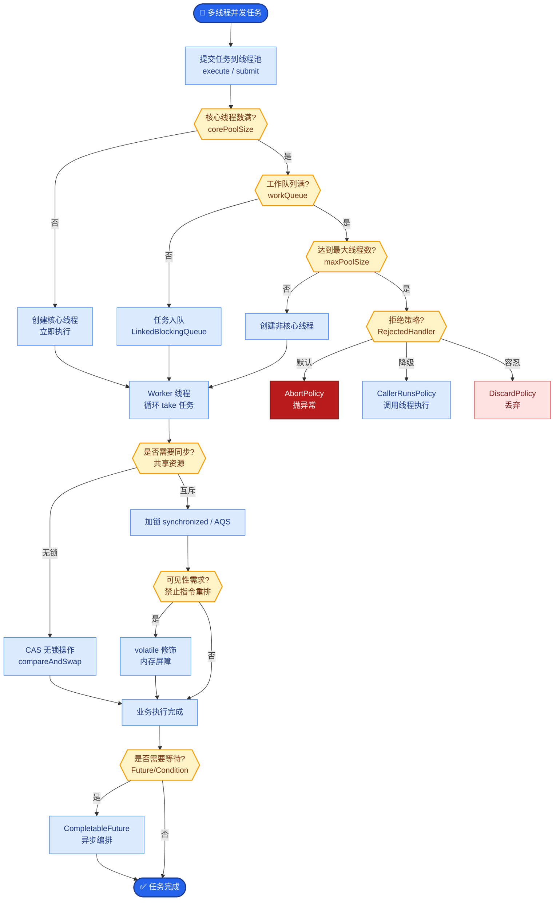

# 并发控制 Semaphore 设多大

### 核心策略：瓶颈识别，容量规划，分层隔离

#### 1. 确定上限的因素
- **供应商硬限制**：
  - **RPM (Requests Per Minute)**：如 OpenAI 免费版 3 RPM。
  - **TPM (Tokens Per Minute)**：限制更严格，需按峰值 Token 消耗换算。
- **本机资源瓶颈**：
  - **CPU/内存**：如果本地做复杂预处理（如长文本解析），CPU 可能先于 API 限制成为瓶颈。
  - **连接数**：Python 的异步 I/O 或数据库连接池大小。
- **下游依赖容量**：Agent 调用的 Vector DB 或 API 工具的并发承受能力。

#### 2. 压测与饱和点
- **逐步加压**：使用 Locust 或 K6 模拟并发请求。
- **寻找拐点**：观察 P99 Latency 和 Error Rate。当 Error Rate（主要是 429 Rate Limit）开始上升，或 Latency 指数级增长时的并发数，即为**饱和点**。
- **安全余量**：生产环境 Semaphore 设置通常为饱和点的 **70%~80%**，留出余量应对突发流量或供应商波动。

#### 3. 动态调整与分层隔离
- **按租户分桶**：
  - 防止“噪声邻居”，即一个高流量租户耗尽所有配额导致其他租户不可用。
  - 实现：`Semaphore(per_tenant_limit)` 之外，再加一个全局 `Semaphore(global_limit)`。
- **优先级队列**：
  - 关键任务（见上题）拥有独立的 Semaphore 池，不被非关键任务阻塞。

```text
┌──────────────────────────────────────────────────────────┐
│                     并发请求源                             │
└──────────────────────┬───────────────────────────────────┘
                       │
         ┌─────────────┴──────────────┐
         │                            │
         ▼                            ▼
┌──────────────────┐         ┌──────────────────┐
│  全局 Semaphore  │         │  租户级 Semaphore │
│  (保护本地资源)   │◀────┼───│  (保护配额隔离)   │
└────────┬─────────┘         └────────┬─────────┘
         │                            │
         └─────────────┬──────────────┘
                       ▼
            ┌──────────────────────┐
            │     请求执行器         │
            │ (Agent / Tool / LLM)  │
            └──────────────────────┘
                       │
                       ▼
         ┌─────────────────────────────┐
         │      监控反馈                 │
         │  - 429 Error Rate            │
         │  - P99 Latency               │
         └──────────┬──────────────────┘
                    │ (自动调整 Semaphore 大小)
                    └─────────────────────┘
```

#### 实战案例
某日流量高峰，OpenAI 返回大量 429 错误，导致服务雪崩。排查发现 Semaphore 设为固定值 100，但当时供应商侧限流阈值动态下调了。后改为“自适应 Semaphore”，根据最近 5 分钟的 429 错误率动态减小信号量，错误率降低后自动恢复，实现了“柔性限流”。

#### 代码示例
```python
import asyncio
from collections import deque

class AdaptiveSemaphore:
    def __init__(self, initial_limit: int):
        self._limit = initial_limit
        self._sem = asyncio.Semaphore(initial_limit)
        self._error_history = deque(maxlen=10) # Store recent status

    async def acquire(self):
        await self._sem.acquire()
    
    def release(self, success: bool):
        self._error_history.append(not success) # True if error
        self._adjust_limit()
        self._sem.release()

    def _adjust_limit(self):
        # If recent error rate > 30%, shrink limit
        if sum(self._error_history) / len(self._error_history) > 0.3:
            self._limit = max(1, int(self._limit * 0.8))
            print(f"Reducing limit to {self._limit}")
```

#### 对比表格：并发控制策略
| 策略 | 适用场景 | 优点 | 缺点 |
| :--- | :--- | :--- | :--- |
| **Semaphore** | 保护本地资源/连接池 | 简单，防止进程过载 | 无法精确控制上游 API RPM |
| **Token Bucket** | API 限流、平滑流量 | 允许突发流量，精度高 | 实现略复杂，需分布式同步 |
| **RateLimiter (固定窗口)** | 简单的 QPS 限制 | 极易实现 | 边缘流量突刺（临界问题） |
| **Adaptive Limiter** | 不稳定的第三方 API | 自动适应供应商波动 | 反馈有延迟，可能震荡 |


## 核心流程图



## 记忆要点

- 上限依据：受限于供应商 RPM/TPM、本机连接数及下游依赖容量。
- 压测定值：逐步加压寻找 P99 延迟与错误率拐点，生产设为饱和点的 70%-80%。
- 分层隔离：设置全局 Semaphore 保护资源，按租户分桶防止噪声邻居。
- 动态调整：监控 429 错误率，自适应调整信号量大小实现柔性限流。

## 结构化回答

**30 秒电梯演讲：** Semaphore 设多大像红绿灯，要看路口大小和车流量，还要防隔壁车道堵死你。上限受限于供应商 RPM/TPM、本机连接数和下游容量；定值要压测逐步加压找 P99 延迟和错误率拐点，生产设为饱和点的 70% 到 80%；还要分层隔离——全局 Semaphore 保护资源、按租户分桶防噪声邻居；动态上监控 429 错误率自适应调整实现柔性限流。

**展开框架：**
1. **上限依据** — 受限于供应商硬限制（RPM/TPM）、本机资源瓶颈（CPU/内存/连接数）和下游依赖容量，三者取最小值作为理论上限。
2. **压测定值** — 逐步加压寻找 P99 延迟和错误率的拐点（饱和点），生产环境设为饱和点的 70% 到 80% 留余量。
3. **分层隔离与动态调整** — 全局 Semaphore 保护共享资源，按租户分桶防噪声邻居；监控 429 错误率，自适应调整信号量大小实现柔性限流。

**收尾：** 一句话，Semaphore 要瓶颈识别、容量规划、分层隔离。您想深入聊天下压测怎么做，还是噪声邻居怎么防？

## 视频脚本

> 预计时长：2 分钟 | 由浅入深

| 时间 | 画面/字幕 | 口播台词 | 讲解要点 |
|------|----------|----------|----------|
| 0:00 | 标题《Semaphore 设多大》+ 红绿灯定时长漫画 | Semaphore 设多大像红绿灯，要看路口大小和车流量定绿灯时长，还要防隔壁车道堵死你。 | 类比开场 |
| 0:25 | 上限依据：供应商 RPM/TPM + 本机 + 下游 | 上限受限于供应商 RPM 和 TPM、本机连接数和下游依赖容量，三者取最小值。 | 上限依据 |
| 0:55 | 压测定值：找拐点，生产设 70-80% | 定值要压测逐步加压，找 P99 延迟和错误率的拐点，生产环境设为饱和点的 70% 到 80% 留余量。 | 压测定值 |
| 1:25 | 分层隔离：全局 Semaphore + 租户分桶 | 分层隔离：全局 Semaphore 保护共享资源，按租户分桶防止噪声邻居互相影响。 | 分层隔离 |
| 1:50 | 动态调整：监控 429 自适应 | 动态上监控 429 错误率，自适应调整信号量大小，实现柔性限流。 | 动态调整 |

