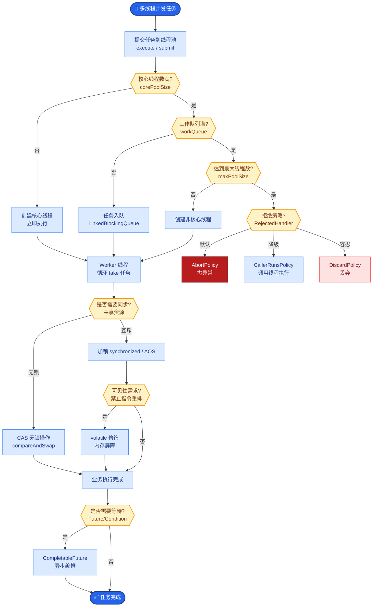

# 为什么 Agent 更需要「版本化」的 Prompt 与模型

### 核心痛点：非确定性系统难以 Debug

#### 1. 问题背景：Agent 的“黑盒”特性
- **Prompt 敏感性**：微小的措辞变化可能导致行为剧变。
- **模型漂移**：供应商可能在不通知的情况下微调模型底座。
- **链路复杂性**：多步推理中，某一步的微小偏差会被后续步骤放大。

#### 2. 版本化的必要性
- **可复现性**：确保“昨天的正确答案”今天能复现。
- **快速回滚**：一旦线上出现幻觉或性能下降，能瞬间切回上一稳定版本。
- **因果分析**：将具体的线上 Bad Case 精确绑定到特定版本的 Prompt/模型组合，排除变量干扰。

#### 3. 实施策略
- **Prompt 版本管理**：
  - 使用 Git 管理 Prompt 模板文件（如 `.jinja`, `.mustache`）。
  - 部署时携带版本号（如 `v1.2.3`），而非直接硬编码字符串。
  - 推荐使用专门的 Prompt 管理工具（如 PromptLayer, LangSmith, 或自研 Prompt Service）。
- **模型版本 Pinning**：
  - 永远调用具体快照版本（如 `gpt-4-0613`），禁止调用别名版本（如 `gpt-4`），除非在明确的“升级窗口”。
- **版本与数据绑定**：
  - **Trace 记录**：每条 Trace 日志必须包含 `prompt_version` 和 `model_version` 字段。
  - **评估集关联**：离线评估结果必须标记是在哪个 Prompt 版本下得出的，建立 A/B 测试基线。

```text
┌──────────────────┐
│   Git Repository │
│ (Prompt/Config)  │
└────────┬─────────┘
         │ Commit (v1.0 -> v1.1)
         ▼
┌──────────────────┐     ┌───────────────────────┐
│   CI/CD Pipeline │────▶│  Prompt/Model Service  │
└────────┬─────────┘     │ (Versioned API)        │
         │               └───────────┬───────────┘
         ▼                           │
┌──────────────────┐                 │
│  Agent Runtime   │◀────────────────┘
│  Request: {      │
│    "prompt_ver": "v1.1",
│    "model_ver":  "gpt-4-0613"
│  }               │
└────────┬─────────┘
         │
         ▼
┌──────────────────┐
│   Trace Logs     │◀───┐
│ (含 Version ID)  │    │ 用于复盘
└──────────────────┘    │
                        ▼
              ┌───────────────────┐
              │  离线评估        │
              │ (评估不同版本表现) │
              └───────────────────┘
```

#### 实战案例
某次上线后，客服 Agent 的回答突然变得非常冗长。由于没有版本化 Prompt，排查耗费了数小时对比代码和线上环境。后引入 Prompt 版本管理后，通过 Trace 日志直接锁定是 `v1.3` 版本删除了“简洁回答”的指令，2 分钟内回滚至 `v1.2` 恢复服务。

#### 代码示例
```python
# Python: 简单的版本化 Prompt 加载器
import yaml

class PromptManager:
    def __init__(self, config_file="prompts.yaml"):
        self.config = yaml.safe_load(open(config_file))
        self.active_version = self.config["active_version"]

    def get_prompt(self, prompt_name):
        # Load content specifically for the active version
        template = self.config["versions"][self.active_version][prompt_name]
        return template

    def get_version_info(self):
        return {
            "prompt_ver": self.active_version,
            "model_ver": self.config["versions"][self.active_version]["model_pin"]
        }

# Usage
pm = PromptManager()
sys_msg = pm.get_prompt("system_message")
version_info = pm.get_version_info()
# Pass version_info to LLM call and Log
```

#### 对比表格：Prompt 管理方式
| 方式 | 管理粒度 | 迭代速度 | A/B 测试支持 | 推荐场景 |
| :--- | :--- | :--- | :--- | :--- |
| **硬编码** | 无 | 慢 (需发版) | 不支持 | 原型验证、Demo |
| **配置文件** | 版本级 | 中 | 较弱 (需手动切换) | 中小型项目、单一环境 |
| **Prompt Service (DB)** | 特性级/用户级 | 快 (热更新) | 强 (动态流量分配) | 生产环境、多租户 SaaS |
| **LangSmith/PromptLayer** | 实验级 | 极快 | 极强 (内置对比) | 需要深度评估和实验的团队 |


## 核心流程图



## 记忆要点

- 痛点：非确定性系统难 Debug，需版本化确保可复现与快速回滚。
- Prompt 管理：使用 Git 或 Prompt Service 管理模板，部署携带版本号。
- 模型 Pinning：禁止调用别名（如 gpt-4），必须锁定快照版本（如 gpt-4-0613）。
- 因果分析：Trace 日志必须包含 prompt_version 和 model_version，绑定 Bad Case。

## 结构化回答

**30 秒电梯演讲：** Agent 更需要版本化，像代码版本控制，每次改配置要打标签，出 Bug 能秒回滚。因为 Agent 是非确定性系统，Prompt 措辞微变就行为剧变，供应商还会偷偷微调模型底座。Prompt 要用 Git 或 Prompt Service 管理并带版本号部署；模型要 Pinning，禁止调别名（如 gpt-4），必须锁快照版本（如 gpt-4-0613）；Trace 日志要含 prompt_version 和 model_version 绑定 Bad Case。

**展开框架：**
1. **为什么需要版本化** — Agent 是非确定性系统：Prompt 微小措辞变化导致行为剧变、供应商不通知就微调模型、多步推理的偏差会被放大，不版本化就无法复现和回滚。
2. **Prompt 与模型版本管理** — Prompt 用 Git 或 Prompt Service 管理模板，部署时携带版本号；模型 Pinning 禁止调别名（如 gpt-4），必须锁定快照版本（如 gpt-4-0613）防漂移。
3. **因果分析与回滚** — Trace 日志必须包含 prompt_version 和 model_version，绑定 Bad Case 做因果分析；出问题时能快速定位是哪个版本引入的，秒级回滚。

**收尾：** 一句话，版本化让非确定性系统可复现、可回滚。您想深入聊聊 Prompt Service 怎么搭，还是模型 Pinning 怎么落地？

## 视频脚本

> 预计时长：1 分 30 秒 | 由浅入深

| 时间 | 画面/字幕 | 口播台词 | 讲解要点 |
|------|----------|----------|----------|
| 0:00 | 标题《Agent 版本化》+ 代码打标签秒回滚漫画 | Agent 更需要版本化，像代码版本控制，每次改配置要打标签，出 Bug 能秒回滚。 | 类比开场 |
| 0:20 | 痛点：Prompt 敏感 + 模型漂移 + 链路放大 | 因为 Agent 是非确定性系统：Prompt 措辞微变就行为剧变，供应商还偷偷微调模型，多步偏差会被放大。 | 为什么需要 |
| 0:50 | Prompt 管理 + 模型 Pinning | Prompt 用 Git 或 Prompt Service 管理带版本号；模型禁止调别名，必须锁快照版本比如 gpt-4-0613。 | 版本管理 |
| 1:15 | Trace 含版本号 + 因果分析 + 回滚 | Trace 日志必须含 prompt_version 和 model_version，绑定 Bad Case 做因果分析，出问题秒级回滚。 | 因果与回滚 |

