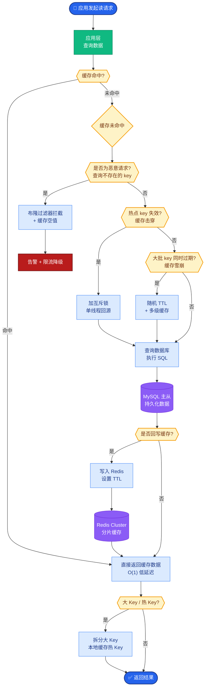

# 如何设计一个多模型网关的架构?模型路由策略有哪些

- **多模型网关架构:**
```
用户请求 → API Gateway
├─ 路由决策(LLM/规则) → 选择模型
├─ 负载均衡 → 多API Key轮询
├─ 限流 → Token Bucket
├─ 缓存 → 语义缓存
└─ Fallback → 主模型失败切换备用
```

- **路由策略:**

1. **任务类型路由**
```python
if task == 'code': model = 'deepseek-coder'
elif task == 'reasoning': model = 'o1'
elif task == 'simple': model = 'gpt-4o-mini'
```

2. **复杂度路由**
```python
complexity = llm.classify(prompt)  # simple/medium/complex
budget = {'simple': 0.001, 'medium': 0.01, 'complex': 0.1}[complexity]
model = select_model_within_budget(budget)
```

3. **延迟路由**
- P50请求 → 小模型(快)
- P99请求 → 大模型(准)

4. **成本路由**
- 预算充足 → 大模型
- 预算紧张 → 小模型 + RAG

- **工具:** LiteLLM(开源)、Portkey(SaaS)、OpenRouter(API)

#### 实战案例
某企业接入国产大模型时，由于不同供应商（阿里通义、百度文心、智谱）对 JSON 格式的输出处理能力不一。我们在网关层增加了一个“格式兼容层”：如果主模型返回 JSON 解析失败，自动将 Prompt 调整为更严格的 JSON 模式并请求备用模型，成功后再返回给用户，屏蔽了下游差异。

#### 代码示例
```python
# Python: 简易的多模型网关路由逻辑
from functools import lru_cache

class ModelGateway:
    def __init__(self):
        self.providers = {
            "high_perf": ["gpt-4", "claude-3-opus"],
            "low_cost": ["gpt-3.5-turbo", "claude-3-haiku"]
        }
    
    @lru_cache(maxsize=1000)
    def classify_intent(self, prompt_hash: str):
        # Simple rule-based or cached classification
        return "reasoning" if "analyze" in prompt_hash else "simple"

    def route(self, prompt: str):
        intent = self.classify_intent(hash(prompt))
        if intent == "reasoning":
            return self.providers["high_perf"][0] # Return primary model
        return self.providers["low_cost"][0]
```

#### 对比表格：主流网关方案选型
| 方案 | 核心优势 | 局限性 | 适用场景 |
| :--- | :--- | :--- | :--- |
| **LiteLLM** | 统一接口，支持 100+ 模型，易自托管 | 功能偏向代理，高级路由需自己写 | 需要快速接入多模型的企业内部网关 |
| **Portkey** | 强大的语义缓存、可观测性、A/B 测试 | SaaS 依赖，数据需出境 | 初创团队，需要开箱即用的全套可观测 |
| **OpenRouter** | 聚合了海量开源/小众模型，按次付费 | 不支持自有 Key 混用，主要面向 C 端 | 个人开发者或探索新模型的研究 |
| **Kong/Nginx + Plugin** | 极致性能，现有基础设施复用 | 无 LLM 特性（如 Token 计费），需大量开发 | 高并发流量的通用 API 网关层 |

## 核心流程图



## 记忆要点

- 架构核心：网关层统一处理路由、限流、缓存与降级，屏蔽底层模型差异。
- 路由策略：按任务类型、复杂度、延迟分级或成本预算动态选择最优模型。
- 实战技巧：增加格式兼容层，主模型JSON解析失败时自动切换备用模型。
- 工具选型：LiteLLM适合自托管，Portkey强于可观测性，OpenRouter聚合模型多。

## 结构化回答

**30 秒电梯演讲：** 多模型网关像旅行社调度，根据客人需求、预算和时间派最合适的导游。架构核心是网关层统一处理路由、限流、缓存、降级，屏蔽底层模型差异。路由策略按任务类型、复杂度、延迟分级或成本预算动态选最优模型。实战技巧是加格式兼容层，主模型 JSON 解析失败自动切备用模型。选型上 LiteLLM 适合自托管，Portkey 强在可观测性，OpenRouter 聚合模型多。

**展开框架：**
1. **架构核心** — 网关层统一接入多厂商 API 并处理鉴权，集中处理路由、限流、缓存、降级，屏蔽底层模型差异，让上游调用方无感知。
2. **路由策略** — 按任务类型（代码/聊天）、复杂度、延迟分级或成本预算动态选择最优模型；可加 Intent Router 先判意图再分发。
3. **实战技巧与工具选型** — 增加格式兼容层，主模型 JSON 解析失败自动切备用模型；选型上 LiteLLM 适合自托管、Portkey 强在可观测性、OpenRouter 聚合模型多。

**收尾：** 一句话，多模型网关是统一接入加智能分发的中枢。您想深入聊聊路由策略怎么评估准确性，还是路由决策本身会增加多少延迟？

## 视频脚本

> 预计时长：2 分 30 秒 | 由浅入深

| 时间 | 画面/字幕 | 口播台词 | 讲解要点 |
|------|----------|----------|----------|
| 0:00 | 标题《多模型网关架构》+ 旅行社派导游漫画 | 多模型网关像旅行社调度，根据客人需求、预算和时间，派最合适的导游，统一接入加智能分发。 | 类比开场 |
| 0:25 | 架构核心：网关层统一处理路由/限流/缓存/降级 | 架构核心是网关层统一接入多厂商 API 并处理鉴权，集中处理路由、限流、缓存、降级，屏蔽底层差异。 | 架构核心 |
| 0:55 | 路由策略：任务类型/复杂度/延迟/成本 | 路由策略按任务类型、复杂度、延迟分级或成本预算动态选最优模型，可加 Intent Router 先判意图。 | 路由策略 |
| 1:30 | 实战技巧：格式兼容层自动切备用 | 实战技巧是增加格式兼容层，主模型 JSON 解析失败时自动切换备用模型，提升鲁棒性。 | 实战技巧 |
| 1:55 | 工具选型：LiteLLM/Portkey/OpenRouter | 选型上 LiteLLM 适合自托管，Portkey 强在可观测性，OpenRouter 聚合的模型最多。 | 工具选型 |

### 视频流程图


