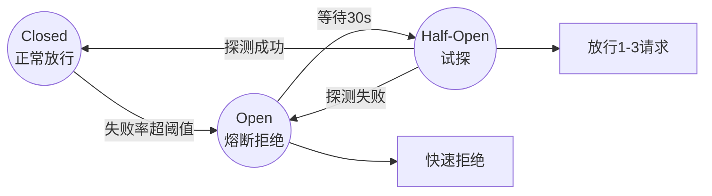

# 熔断器(Circuit Breaker)模式在Agent系统中如何实现?Half-Open状态放多少流量探测

- **熔断器三状态:**
```
Closed(正常) → 失败率>阈值 → Open(熔断,快速失败)
↓ 等待恢复时间
Half-Open(半开,试探)
↓ 成功 → Closed
↓ 失败 → Open
```

- **关键参数:**
| 参数 | 典型值 | 说明 |
|------|--------|------|
| 失败率阈值 | 50% | 触发熔断的失败率 |
| 最小请求数 | 20 | 统计窗口内最小样本 |
| 熔断时长 | 30s | Open状态持续时间 |
| Half-Open探测数 | **1-3** | 放行的探测请求数 |
| Half-Open成功阈值 | 2 | 恢复到Closed所需成功数 |

- **Half-Open放多少流量:**
- **1-3个请求**(不是百分比)
- 原因:半开状态是为了试探,不是正常服务
- 放行太多 → 如果下游还没恢复,会导致更多失败
- 放行太少 → 恢复检测延迟

- **降级策略(熔断期间):**
1. 返回缓存结果
2. 切换备用供应商
3. 返回简化响应(小模型)
4. 返回友好错误信息

- **实战案例：** 某电商客服Agent因依赖的向量DB突发流量导致Full GC，熔断器进入Open状态后，由于Half-Open配置为10%流量，导致瞬间大量“探测请求”打挂了刚恢复的DB，改为单次探测后恢复平稳。

- **代码示例（Python Sentinel）：**
```python
from sentinel import CircuitBreaker, Rule

# 配置熔断规则：异常比例>50% 且 最小请求数>5 触发
rule = Rule(exception_ratio_threshold=0.5, min_request_amount=5, 
           retry_timeout_ms=30000, pass_count_half_open=1)
cb = CircuitBreaker(resource_name="llm_api", rule=rule)

@cb.protect
def call_llm(prompt):
    return requests.post("http://llm-service", json={"p": prompt})
```



## 核心知识点图


## 记忆要点

- 三状态流转：Closed正常→失败率超阈值→Open熔断→Half-Open试探→恢复或熔断。
- 探测流量：Half-Open仅放行1-3个请求，非百分比，防止打挂刚恢复的下游。
- 关键参数：失败率阈值50%，最小请求数20，熔断时长30s。
- 降级策略：返回缓存、切换供应商、降级小模型或返回友好错误。

## 结构化回答

**30 秒电梯演讲：** 熔断器像电路保险丝，短路了自动断电止损，试探几次好了再通电恢复。三状态流转：Closed 正常 → 失败率超阈值 → Open 熔断快速失败 → Half-Open 试探 → 恢复或再熔断。Half-Open 只放行 1 到 3 个请求探测，不是百分比，防止打挂刚恢复的下游。关键参数是失败率阈值 50%、最小请求数 20、熔断时长 30 秒，熔断期间要有降级兜底。

**展开框架：**
1. **三状态流转** — Closed 正常放行并统计失败率；失败率超阈值进入 Open 快速失败、保护系统；等待熔断时长后进入 Half-Open 放少量请求试探，成功则恢复 Closed，失败则回到 Open。
2. **Half-Open 探测流量** — 仅放行 1 到 3 个请求探测（不是百分比），防止刚恢复的下游被大流量再次打挂；探测全部成功才认为下游恢复。
3. **关键参数与降级** — 失败率阈值约 50%、最小请求数 20 才有统计意义、熔断时长约 30 秒；熔断期间必须有降级兜底：返回缓存、切换供应商、降级小模型或返回友好错误。

**收尾：** 一句话，熔断器用快速失败和探测恢复实现系统自愈。您想深入聊天熔断时长怎么动态调整，还是多个熔断器怎么级联？

## 视频脚本

> 预计时长：2 分 30 秒 | 由浅入深

| 时间 | 画面/字幕 | 口播台词 | 讲解要点 |
|------|----------|----------|----------|
| 0:00 | 标题《熔断器模式》+ 保险丝断电试探恢复漫画 | 熔断器像电路保险丝，短路了自动断电止损，试探几次好了再通电恢复，实现故障快速失败和自愈。 | 类比开场 |
| 0:25 | 三状态流转：Closed → Open → Half-Open | 三状态流转：Closed 正常统计失败率，超阈值进 Open 快速失败，等熔断时长后进 Half-Open 试探。 | 三状态流转 |
| 0:55 | Half-Open 探测：仅放 1-3 个请求 | Half-Open 只放行 1 到 3 个请求探测，不是百分比，防止刚恢复的下游被大流量再次打挂。 | 探测流量 |
| 1:30 | 关键参数：失败率 50% / 最小 20 / 时长 30s | 关键参数：失败率阈值约 50%，最小请求数 20 才有统计意义，熔断时长约 30 秒。 | 关键参数 |
| 1:55 | 降级策略：缓存/切供应商/小模型/友好错误 | 熔断期间必须有降级兜底：返回缓存、切换供应商、降级小模型或返回友好错误。 | 降级策略 |

