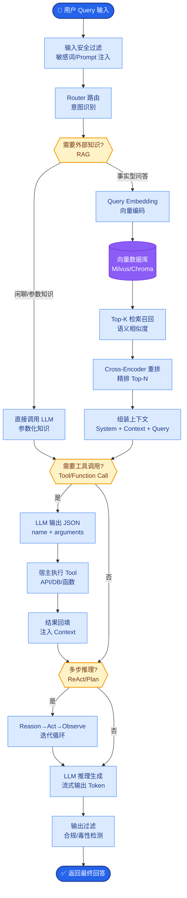

# Agent Loop 是什么?它和普通工作流(Workflow)有什么本质区别

- **Agent Loop** 是 AI Agent 的核心设计模式:模型接收任务 -> 思考 -> 调用工具 -> 观察结果 -> 继续思考 -> 直到任务完成.

- **与普通工作流的本质区别:**

- **工作流:** 路径是预定义的,开发者写好步骤 A -> B -> C,LLM 只在每个节点做内容生成.

- **Agent Loop:** 路径是动态的,LLM 自主决定下一步做什么、调用什么工具、何时停止.循环次数和工具组合不可预知.

- **Agent Loop 的关键要素:**
1. 工具集:Agent 可以调用的能力
2. 上下文管理:维护对话历史和中间结果
3. 停止条件:任务完成、达到最大轮数、用户中断
4. 审批机制:人工确认高危操作

- **实际案例:** Claude Code 的 Agent Loop 每轮包含 reasoning -> tool_call -> observation,最多 25 轮迭代,支持上下文压缩避免溢出.

- **Agent Loop vs Workflow 流程对比图:**

```text
[ Workflow (静态) ]          [ Agent Loop (动态) ]

Start                         Start
  │                             │
  ▼                             ▼
┌────────┐                  ┌──────────────┐
│ Step A │───────────────▶  │ 思考 
└───┬────┘                  └──────┬───────┘
    │                             │ 决策: Tool_2
    ▼                             ▼
┌────────┐                  ┌──────────────┐
│ Step B │                  │ 调用 Tool_2   │
└───┬────┘                  └──────┬───────┘
    │                             │ 观察结果
    ▼                             ▼
┌────────┐                  ┌──────────────┐
│ Step C │                  │ 思考 
└───┬────┘                  └──────┬───────┘
    │                             │ 决策: Tool_5
    ▼                             ▼
  End                    ┌──────────────┐
                        │ 调用 Tool_5   │
                        └──────┬───────┘
                               │
                               ▼
                             End (满足条件)
```

- **对比表格:**
| 维度 | Workflow (DAG/链式) | Agent Loop (ReAct/反射) |
| :--- | :--- | :--- |
| **控制权** | 开发者 | LLM (模型) |
| **路径确定性** | 100% 确定 (编译时) | 动态生成 (运行时) |
| **可预测性** | 高，适合固定流程 | 低，适合探索性任务 |
| **调试难度** | 低，步骤清晰 | 高，需追踪思维链 |
| **典型场景** | ETL 流程、审批流 | 复杂问答、代码生成 |

- **实战案例:** 在开发代码审计 Agent 时，初期使用 Workflow (静态步骤：取代码->查规则->报错)，无法处理多文件依赖分析。改用 Agent Loop 后，Agent 能自主决定何时查看 `import` 的文件，覆盖率提升 40%，但也出现过因陷入递归死循环导致 API 消耗 $50 的事故。

- **代码示例:**
```python
def agent_loop(task, max_steps=10):
    history = []

- **边界情况：**
1. **无限循环/震荡**：Agent 在两个工具之间来回切换（例如修复了A导致B报错，修复B又导致A报错），无法收敛。需要设置最大步数或震荡检测。
2. **上下文窗口溢出**：随着 Loop 迭代，历史累积的 Token 超过了模型 Context Window，导致截断丢失早期关键信息。需要动态的摘要或滑动窗口机制。
3. **工具调用幻觉**：模型调用了一个不存在的工具或传入了极其错误的参数（虽然 Schema 校验能拦一部分），导致 Loop 异常中断而非优雅退出。

- **## 面试追问：**
1. 如何设计 Agent Loop 的“短期记忆”和“长期记忆”管理，既能保持上下文连贯，又能控制 Token 成本？
2. 当 Agent 进入死胡同（如连续三次工具调用失败）时，除了报错，有哪些自动恢复或回溯策略？
3. 在多 Agent 协作场景下，如何避免多个 Agent 之间的 Loop 相互干扰或产生竞争条件？

- **## 易错点：**
1. **混淆自主性与随机性**：认为 Agent Loop 越随机越智能。实际上，优秀的 Agent Loop 应该有“规划”能力，而非盲目的试错。
2. **忽略停止条件的多样性**：只设置了“任务完成”作为停止条件，忽略了“无法完成”的情况。模型可能会为了完成任务而无限编造工具调用。


## 核心流程图



## 记忆要点

- 本质区别：Workflow路径静态预定义，Agent Loop路径由LLM动态决策。
- 核心要素：工具集、上下文管理、停止条件、审批机制。
- 控制权对比：Workflow控制权在开发者，Agent Loop控制权在模型。
- 风险控制：需设最大步数防死循环，用摘要机制防上下文溢出。


## 结构化回答

**30 秒电梯演讲：** 模型自主感知、思考并行动的动态迭代循环。——打个比方，工作流是“照菜谱做菜”，Agent Loop是“大厨根据食材和火候自由发挥”。

**展开框架：**
1. **本质区别** — Workflow路径静态预定义，Agent Loop路径由LLM动态决策。
2. **核心要素** — 工具集、上下文管理、停止条件、审批机制。
3. **控制权对比** — Workflow控制权在开发者，Agent Loop控制权在模型。

**收尾：** 以上三点都能配合实战聊。我可以展开任一要点，比如「Agent Loop 如何防止无限循环」这类追问您感兴趣吗？

## 视频脚本

> 预计时长：2 分钟 | 由浅入深

| 时间 | 画面/字幕 | 口播台词 | 讲解要点 |
|------|----------|----------|----------|
| 0:00 | 标题卡 | "Agent Loop 是什么，30 秒讲清楚。" | 开场钩子 |
| 0:30 | 概念定义动画 | "一句话：模型自主感知、思考并行动的动态迭代循环。" | 核心定义 |
| 1:00 | 本质区别图解 | "Workflow路径静态预定义，Agent Loop路径由LLM动态决策。" | 本质区别 |
| 1:30 | 总结卡 | "记好这几条，面试不慌。下期见。" | 收尾 |
