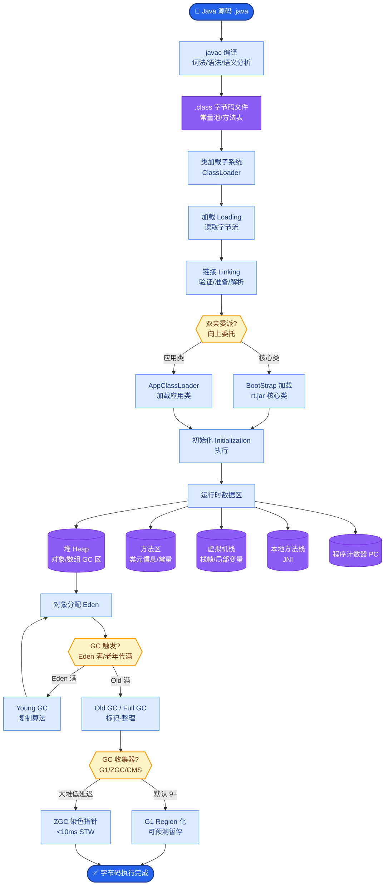

# 生产级 Agent 的可观测性(Observability)怎么做?需要追踪哪些指标

**Agent 可观测性** 是确保 Agent 在生产环境可靠运行的基础.

**Trace 轨迹追踪:**
*   记录每一轮的输入 prompt、模型输出、工具调用、工具返回.
*   构建完整的执行链路图,关联 Span ID.
*   支持回放:用历史数据重新执行以复现 Bug.

**核心指标:**

*   **1. 质量指标:** 任务完成率、工具调用成功率、用户满意度(CSAT).
*   **2. 性能指标:** 端到端延迟、首 token 延迟(TTFT)、每轮平均时间.
*   **3. 成本指标:** 每次 Token 消耗、API 调用费用、工具调用次数.
*   **4. 安全指标:** Prompt 注入检测次数、权限越界尝试.

**观测架构图:**
```text
┌──────────┐       ┌──────────┐       ┌──────────┐       ┌──────────┐
│  User    │──────▶│  Agent   │──────▶│  LLM/Tool│──────▶│ External │
│ Request  │ Trace │ Runtime  │ Span  │ Execution│ Span  │  APIs    │
└──────────┘       └────┬─────┘       └────┬─────┘       └──────────┘
                        │                   │
                        │ Generate/Collect  │
                        ▼                   ▼
                 ┌─────────────────────────────┐
                 │    Trace/Log Collector       │
                 │  (Async, Non-blocking)       │
                 └──────────────┬──────────────┘
                                │
                                ▼
                 ┌─────────────────────────────┐
                 │  Observability Platform      │
                 │  (LangSmith / Langfuse)      │
                 │  - Dashboard                 │
                 │  - Root Cause Analysis       │
                 │  - Dataset Evaluation        │
                 └─────────────────────────────┘
```

**工具生态:** LangSmith(LangChain)、Langfuse(开源)、Arize Phoenix、Helicone.

**关键设计:** 结构化日志(非纯文本,推荐 JSON)、采样率控制(高流量时只记录 1-10%)、异步上报(不阻塞主流程).

### 实战深化

**1. 实战案例:**
某线上 Agent 偶发出现“工具参数缺失”错误，通过查看 Trace 发现是因为某个 RAG 检索步骤延迟过高（P99 > 5s），导致后续 LLM 上下文被截断，丢失了工具定义。优化后，我们在 Trace 中增加了“Context Window Usage %”指标，一旦超过 80% 即报警。

**2. 代码示例 (Python - 装饰器埋点):**
```python
from langfuse.decorators import observe

@observe() # 自动捕获输入、输出和异常
@observe(name="tool_call")
def run_tool(tool_name: str, args: dict):
    start = time.time()
    try:
        res = external_api.call(tool_name, args)
        return res
    except Exception as e:
        # 记录异常堆栈和上下文
        log_error(e, context={"tool": tool_name, "args": args})
        raise
```

## 边界情况
1. **PII 隐私合规**：在生产环境中，Trace 可能会记录用户的敏感信息（如身份证号、对话内容），必须在上报前配置脱敏规则或数据加密，否则违反 GDPR/合规要求。
2. **异步上报的丢失风险**：如果 Agent 进程崩溃或被强制杀死，缓冲在内存中未异步发送的 Trace 数据会丢失，需考虑“at-least-once”语义或本地磁盘缓冲。
3. **高采样率下的成本爆炸**：全量 Trace 可能会产生巨大的存储费用和 API 调用费用（如 OpenAI Token 费），必须实施基于“错误率”或“用户ID白名单”的动态采样策略。

## 面试追问
1. 如何在海量 Trace 数据中自动发现 Agent 的“逻辑错误”（而不是简单的 API 报错）？有没有尝试过用 LLM 来分析 Trace 日志并归类问题？
2. 你的监控告警阈值是如何设定的？如果是基于 Latency，如何区分是“模型本身慢”还是“上游服务慢”？
3. 如何利用 Trace 数据进行 Agent 的迭代优化？有没有建立“Bad Case 数据集”用于后续的微调或 Prompt 优化？

## 易错点
1. **过度依赖埋点库的默认行为**：很多库（如 LangChain）默认会记录所有 Prompt 和 Output，这在生产环境极易泄露隐私，必须显式配置屏蔽字段或关闭自动记录。
2. **忽视 Trace ID 的透传**：在微服务架构中，如果 Trace ID 没有正确透传到下游（如向量库或数据库），则无法在统一的 View 中看到完整的调用链路，导致排障困难。


## 核心流程图



## 记忆要点

- Trace 追踪：记录每轮输入输出、工具调用链路，支持回放复现 Bug。
- 四大指标：质量（完成率）、性能（TTFT/延迟）、成本（Token/费用）、安全（注入次数）。
- 工程实践：结构化 JSON 日志、异步非阻塞上报、动态采样率控制（1-10%）。


## 结构化回答

**30 秒电梯演讲：** 通过全链路追踪和多维指标监控Agent运行状态。——打个比方，给Agent装上“黑匣子”和“体检表”，随时查健康。

**展开框架：**
1. **Trace 追踪** — 记录每轮输入输出、工具调用链路，支持回放复现 Bug。
2. **四大指标** — 质量（完成率）、性能（TTFT/延迟）、成本（Token/费用）、安全（注入次数）。
3. **工程实践** — 结构化 JSON 日志、异步非阻塞上报、动态采样率控制（1-10%）。

**收尾：** 以上三点都能配合实战聊。我可以展开任一要点，比如「如何设计 Trace 的采样策略」这类追问您感兴趣吗？

## 视频脚本

> 预计时长：2 分钟 | 由浅入深

| 时间 | 画面/字幕 | 口播台词 | 讲解要点 |
|------|----------|----------|----------|
| 0:00 | 标题卡 | "生产级 Agent 的可观测性(Observability)怎么做，30 秒讲清楚。" | 开场钩子 |
| 0:30 | 概念定义动画 | "一句话：通过全链路追踪和多维指标监控Agent运行状态。" | 核心定义 |
| 1:00 | Trace 追踪图解 | "记录每轮输入输出、工具调用链路，支持回放复现 Bug。" | Trace 追踪 |
| 1:30 | 总结卡 | "记好这几条，面试不慌。下期见。" | 收尾 |
