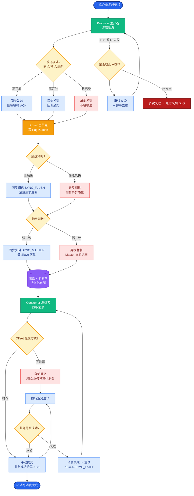

# Multi-Agent 系统中,Agent 之间如何通信和编排?有哪些常见模式

**Multi-Agent 通信与编排** 是复杂 Agent 系统的核心设计问题.

**通信方式:**

*   **1. 直接消息传递:** Agent A 直接调用 Agent B 的接口.简单但不灵活,紧耦合.
*   **2. 共享黑板:** 所有 Agent 读写同一个共享状态空间.松耦合但需要锁机制和并发控制.
*   **3. 事件驱动:** Agent 发布事件到 Message Queue,其他 Agent 订阅.最灵活但调试困难.

**编排模式:**

*   **1. 层级编排:** 主 Agent 分配任务给子 Agent,子 Agent 汇报结果.适合任务可清晰拆分的场景.
*   **2. 竞争编排:** 多个 Agent 独立完成同一任务,选最佳结果.适合创意类任务.
*   **3. 流水线编排:** 任务按顺序流经多个专业 Agent.适合流程固定的场景.
*   **4. 网状编排:** Agent 之间自由协商,无中心节点.适合去中心化协作.

**架构对比图:**
```text
Hierarchical           Competitive               Pipeline
   │                     │                         │
   ▼                     ▼                         ▼
┌─────┐               ┌─────┐                   ┌─────┐
│Mgr  │               │Judge│                   │Ag A │
└──┬──┘               └──┬──┘                   └──┬──┘
   │   ┌───┬───┐         │   ┌───┬───┬───┐          │
   ├──▶│Ag1│Ag2│         ├──▶│Ag1│Ag2│Ag3│          ▼
   │   └───┴───┘         │   └───┴───┴───┘       ┌─────┐
   │   ┌───┬───┐         │                      │Ag B │
   └──▶│Ag3│Ag4│         └─────────────────────▶└──┬──┘
       └───┴───┘                                   │
                                                  ▼
                                               ┌─────┐
                                               │Ag C │
                                               └─────┘
```

**工程代价:** Multi-Agent 的通信开销、状态同步、错误处理远比单 Agent 复杂,不是所有场景都适合.需警惕“过度设计”.

### 实战深化

**1. 实战案例:**
在一个代码生成 Multi-Agent 系统中，采用“竞争编排”让三个不同 Agent (GPT-4, Claude 3, DeepSeek) 同时写单元测试，然后用一个“判官 Agent” 通过运行测试用例来选出覆盖率最高的代码。虽然增加了 3 倍 Token 成本，但代码可用性从单 Agent 的 70% 提升到了 95%。

**2. 代码示例 (Python - 简单的消息广播):**
```python
class AgentHub:
    def __init__(self):
        self.agents = []
        self.message_queue = []

    def broadcast(self, sender_name: str, message: str):
        # 简单的网状通信/事件广播
        event = {"from": sender_name, "content": message, "timestamp": now()}
        # 所有其他 Agent 接收消息
        for agent in self.agents:
            if agent.name != sender_name:  # 避免回环
                agent.receive(event)
```

## 边界情况
*   **死锁与活锁**: 在层级或网状编排中，如果 Agent A 等待 Agent B 的结果，而 Agent B 也在等待 Agent A 的输入，会产生死锁。需要设计超时机制和任务依赖拓扑排序（DAG）来避免循环依赖。
*   **循环通信**: 在网状编排中，消息可能无限传递（例如 A->B->C->A）。需要在消息头中增加 TTL（Time To Live）或去重 ID 机制。
*   **单点故障**: 层级编排中的 Manager Agent 如果宕机，整个子树任务会全部失败。需要考虑 Manager 的状态持久化和故障恢复策略。

## 面试追问
1.  在竞争编排中，如果多个 Agent 返回的结果存在冲突，除了“判官模式”，还有什么更高效的决策机制？（参考：投票机制、基于置信度的加权、辩论机制）
2.  当系统规模扩展到上百个 Agent 时，网状通信的消息风暴如何治理？（参考：引入消息中间件、Topic 分区、限制订阅扇出）
3.  如何监控 Multi-Agent 系统的链路耗时？如果某个 Agent 响应变慢，如何实现熔断和降级？

## 易错点
*   **忽视状态一致性**: 认为“事件驱动”完全不需要关心状态。实际上，跨 Agent 的业务流程（如 Saga 模式）需要复杂的事务补偿机制来保证最终一致性。
*   **过度依赖自然语言通信**: 试图让 Agent 之间完全用自然语言对话解决问题，导致解析成本高、意图歧义。工程实践中，Agent 间通信应尽量使用结构化数据（JSON/Proto），仅将自然语言用于内容生成。


## 核心流程图



## 记忆要点

- 通信方式：直接消息（紧耦合）、共享黑板（松耦合）、事件驱动（最灵活）。
- 编排模式：层级（主从）、竞争（选优）、流水线（顺序）、网状（去中心化）。
- 工程代价：通信开销大，需防死锁（超时/DAG）、防循环（TTL）、防单点故障。


## 结构化回答

**30 秒电梯演讲：** 定义Agent间交互语言和任务协作的组织结构。——打个比方，像公司管理，明确谁给谁发消息，谁是经理谁是员工。

**展开框架：**
1. **通信方式** — 直接消息（紧耦合）、共享黑板（松耦合）、事件驱动（最灵活）。
2. **编排模式** — 层级（主从）、竞争（选优）、流水线（顺序）、网状（去中心化）。
3. **工程代价** — 通信开销大，需防死锁（超时/DAG）、防循环（TTL）、防单点故障。

**收尾：** 以上三点都能配合实战聊。我可以展开任一要点，比如「如何决定用单 Agent 还是 Multi-Agent」这类追问您感兴趣吗？

## 视频脚本

> 预计时长：2 分钟 | 由浅入深

| 时间 | 画面/字幕 | 口播台词 | 讲解要点 |
|------|----------|----------|----------|
| 0:00 | 标题卡 | "Multi-Agent 系统中,Agent 之间如何通信和编排，30 秒讲清楚。" | 开场钩子 |
| 0:30 | 概念定义动画 | "一句话：定义Agent间交互语言和任务协作的组织结构。" | 核心定义 |
| 1:00 | 通信方式图解 | "直接消息（紧耦合）、共享黑板（松耦合）、事件驱动（最灵活）。" | 通信方式 |
| 1:30 | 总结卡 | "记好这几条，面试不慌。下期见。" | 收尾 |
