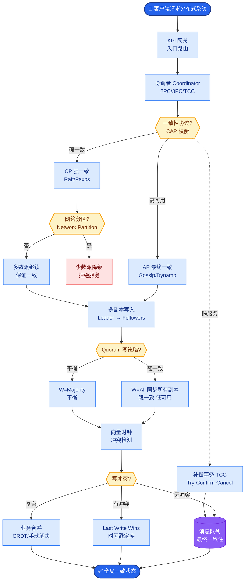

# Agent 系统如何约束大模型的幻觉?有哪些工程手段

**Agent 幻觉约束** 是生产系统的核心安全要求.

**四层防线:**

**1. Prompt 层约束:**
*   明确指示:不得编造不存在的文件、函数、API.
*   输出格式约束:要求引用来源,如“根据工具 X 的结果...”.
*   角色设定:限定在特定知识范围内,遇到未知回答“不知道”.

**2. 工具层约束:**
*   所有事实性信息必须通过工具获取(而非模型自行生成).
*   工具返回空结果时,Agent 必须明确告知用户而非编造答案.
*   文件操作前先验证文件是否存在.

**3. 证据层约束:**
*   要求模型在输出中标注信息来源(引用了哪个工具的返回值及对应的 Snippet ID).
*   对关键信息做交叉验证(多工具验证同一事实).

**4. 输出校验层:**
*   用另一个 LLM (Judge Model) 验证输出是否与工具返回一致.
*   正则/规则检查输出格式.
*   关键操作人工审批.

**校验流程图:**
```text
Input Query
     │
     ▼
┌─────────────┐
│     LLM     │───▶ Raw Output
└──────┬──────┘
       │
       ▼
┌─────────────────────┐    No     ┌──────────┐
│ Fact Checking (LLM) │──────────▶│ Feedback │(Retry w/ Error Msg)
└──────────┬──────────┘           └──────────┘
     │ Yes (Pass)
       ▼
┌─────────────────────┐    No     ┌──────────┐
│ Format Validator    │──────────▶| Feedback │(Fix Format)
└──────────┬──────────┘           └──────────┘
     │ Yes
       ▼
  Final Output
```

**兜底处理:** 检测到幻觉时,返回明确的不确定提示而非错误答案.

### 实战深化

**实战案例:** 在 SQL Agent 中，曾遇到模型在生成 SQL 时幻觉编造了不存在的列名。通过在 Prompt 中强制要求“只能从提供的 Schema 元数据中选择列”，并在 Python 代码中加入 AST 检查，将错误率从 15% 降至 0.1%。

**代码示例 (Python - 证据链校验):**
```python
# 校验 Agent 回答是否引用了工具返回的真实 Source ID
def validate_citation(answer, tool_contexts):
    cited_ids = re.findall(r"\[source:(\d+)\]", answer)
    valid_ids = {ctx['id'] for ctx in tool_contexts}
    
    for cid in cited_ids:
        if cid not in valid_ids:
            return False, f"Hallucination detected:引用了不存在的来源 {cid}"
    return True, "OK"
```

## 边界情况
*   **工具结果冲突**: 当多个工具返回矛盾的信息（例如不同数据库的同步延迟导致数据不一致），Agent 需要设计优先级策略（如信任最新的时间戳或权威数据源）。
*   **越狱攻击**: 恶意用户通过复杂的 Prompt 绕过系统指令，诱导 Agent 忽略工具层约束直接输出训练数据中的敏感信息。需要输入层的安全围栏。
*   **级联幻觉**: Judge Model 自身产生幻觉，错误的将真实的输出标记为幻觉并拒绝。需要设定白名单规则或低置信度转人工机制。

## 面试追问
1.  如果工具调用失败（如网络超时），Agent 应该如何重试？如何避免重试风暴导致的后端服务雪崩？（参考：指数退避、断路器模式）
2.  在数学或逻辑推理场景中，如何通过“思维链”的约束来减少中间步骤的幻觉？（参考：Step-back prompting，Zero-shot CoT）
3.  对于生成的代码或 SQL，除了 AST 检查，还有哪些自动化验证手段可以保证其安全性？（参考：沙箱执行、静态分析工具、代码相似度检测）

## 易错点
*   **过度依赖 Prompt**: 认为只要 Prompt 写得够好（如“不要编造”），模型就能完全遵守。实际上，必须结合 Tool Use 和 Output Validator 才能在生产环境杜绝幻觉。
*   **误将置信度当准确率**: 有些方案通过 LLM 的 self-reflection 生成置信度分数，认为低分就是幻觉。但在某些情况下，模型可能对错误的答案产生“盲目自信”，单纯的置信度阈值不可靠。


## 核心流程图



## 记忆要点

- 四层防线：Prompt 层明确指令、工具层强制获取、证据层引用来源、输出层校验一致性。
- 核心手段：事实必须工具验证，空结果报错而非编造，关键操作人工审批。
- 兜底处理：检测到幻觉返回不确定提示，而非错误答案，避免级联错误。


## 结构化回答

**30 秒电梯演讲：** 通过Prompt、工具、证据、校验四层机制防止模型胡编乱造。——打个比方，不仅让学生闭卷考，还要核对来源，甚至请老师复核。

**展开框架：**
1. **四层防线** — Prompt 层明确指令、工具层强制获取、证据层引用来源、输出层校验一致性。
2. **核心手段** — 事实必须工具验证，空结果报错而非编造，关键操作人工审批。
3. **兜底处理** — 检测到幻觉返回不确定提示，而非错误答案，避免级联错误。

**收尾：** 以上三点都能配合实战聊。我可以展开任一要点，比如「如何评估幻觉率」这类追问您感兴趣吗？

## 视频脚本

> 预计时长：2 分钟 | 由浅入深

| 时间 | 画面/字幕 | 口播台词 | 讲解要点 |
|------|----------|----------|----------|
| 0:00 | 标题卡 | "Agent 系统如何约束大模型的幻觉，30 秒讲清楚。" | 开场钩子 |
| 0:30 | 概念定义动画 | "一句话：通过Prompt、工具、证据、校验四层机制防止模型胡编乱造。" | 核心定义 |
| 1:00 | 四层防线图解 | "Prompt 层明确指令、工具层强制获取、证据层引用来源、输出层校验一致性。" | 四层防线 |
| 1:30 | 总结卡 | "记好这几条，面试不慌。下期见。" | 收尾 |
