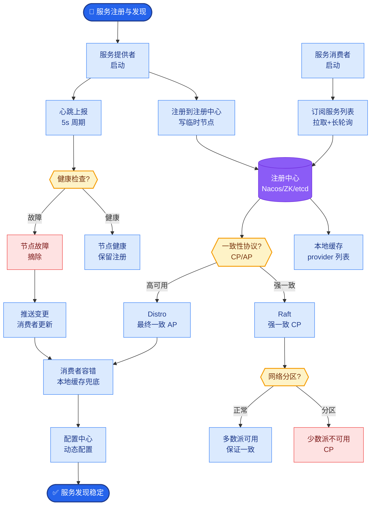

# A2A(Agent-to-Agent)协议是什么?它和 MCP 有什么区别

**A2A(Agent-to-Agent Protocol)** 是 Google 提出的开放协议(注:非2025年,早期概念),旨在标准化 Agent 之间的通信.

**核心概念:**
*   **Agent Card:** 每个 Agent 发布自己的能力卡片(JSON-LD 格式),描述能做什么.
*   **Task:** Agent 之间的工作单元,有生命周期(submitted -> working -> done).
*   **Agent Message:** Agent 之间的结构化消息.
*   支持 HTTP + JSON-RPC 传输.

**与 MCP 的区别:**

*   **MCP (Model Context Protocol):** 解决的是 Agent 与工具/数据源的连接(垂直方向).相当于 Agent 怎么使用工具. 主从关系明显.
*   **A2A:** 解决的是 Agent 与 Agent 之间的通信(水平方向).相当于 Agent 之间怎么协作. 对等关系.

**架构对比图:**
```text
      MCP (Vertical)              A2A (Horizontal)

    ┌───────────┐                ┌───────────┐
    │   Agent   │                │   Agent A │
    └─────┬─────┘                └─────┬─────┘
          │  Call/Use                  │  Negotiate
          ▼                            ▼
    ┌───────────┐                ┌───────────┐
    │  Tool /   │                │   Agent B │
    │ Resource  │                └───────────┘
    └───────────┘
```

**两者互补:**
*   Agent A 用 MCP 连接数据库和文件系统.
*   Agent A 用 A2A 把任务委托给 Agent B.
*   MCP 和 A2A 一起构成完整的 Agent 通信体系.

**为什么 MCP 解决不了 A2A:** MCP 是 client-server 模式,适合工具调用.但 Agent 之间是 peer-to-peer 的,需要更丰富的状态管理和任务协商机制.

### 实战深化

**实战案例:** 在多智能体代码审查系统中，主 Agent 通过类 A2A 协议将“安全性检查”子任务分发给专门的 Security Agent。由于 A2A 支持任务状态查询，主 Agent 能够处理 Security Agent 长时间（>30s）的静态分析扫描，而不会像普通 MCP 工具调用那样超时失败。

**协议对比表格:**

| 维度 | MCP (Model Context Protocol) | A2A (Agent-to-Agent) |
| :--- | :--- | :--- |
| **核心目标** | 模型与数据/工具的连接 | 智能体之间的协作与任务分发 |
| **通信模式** | 主从 | 对等 |
|   | (Controller -> Host/Tool) | (Agent A <-> Agent B) |
| **状态管理** | 无状态/请求响应为主 | 有状态 |
| **典型负载** | 读取文件、执行 SQL、搜索 | 任务委派、结果协商、联合推理 |
| **适用场景** | RAG 系统、功能调用 | 多 Agent 编排、分布式工作流 |

## 边界情况
*   **异构协议兼容**: 当跨组织协作时，Agent A 使用 A2A，而 Agent B 仅支持基于 gRPC 的私有接口。需要引入 Protocol Gateway（协议网关）进行转换，或者约定统一的 API Gateway 层。
*   **网络分区**: 在网状 A2A 通信中，如果网络发生分区，Agent 可能无法感知对方的状态。需要实现心跳机制和“故障安全”策略，防止脑裂导致任务重复执行。
*   **版本兼容性**: Agent Card 升级后，旧版 Agent 可能无法理解新的能力描述。协议设计中需包含版本协商和向下兼容的字段处理策略。

## 面试追问
1.  A2A 强调“对等”和“协商”，但在实际生产中，为了可观测性和管理，通常会保留一个“Orchestrator”。这种“带中心的伪 P2P”架构有哪些利弊？
2.  既然 A2A 可以承载长任务，如果 Agent B 在执行过程中崩溃（进程kill），任务状态如何持久化和恢复？（参考：WAL - Write Ahead Log，检查点机制）
3.  在大规模 Agent 生态中，如何实现“服务发现”？即 Agent A 如何动态找到拥有特定能力的 Agent B？（参考：注册中心、能力索引服务）

## 易错点
*   **混淆数据传输与逻辑协作**: 认为 A2A 只是大号的 JSON-RPC。实际上，A2A 的核心在于语义层面的意图理解（Task、Proposal），而不仅仅是数据交换。
*   **忽视认证授权**: 在假设的 P2P 协作中，容易忽略“谁能调用我”的问题。开放的 A2A 协议必须配套严格的安全鉴权机制（如 OAuth2 + mTLS），否则会被恶意利用进行 DDoS 攻击。


## 核心流程图



## 记忆要点

- A2A 协议：解决 Agent 间水平协作（对等），含 Agent Card、Task、Message。
- MCP 协议：解决 Agent 与工具垂直连接（主从），侧重数据读取与执行。
- 区别：MCP 是调用工具，A2A 是任务委派与协商，两者互补构成完整通信体系。


## 结构化回答

**30 秒电梯演讲：** 标准化Agent间协作的通信协议，区别于连接工具的MCP。——打个比方，MCP是Agent与工具的“普通话”，A2A是Agent之间的“工作语言”。

**展开框架：**
1. **A2A 协议** — 解决 Agent 间水平协作（对等），含 Agent Card、Task、Message。
2. **MCP 协议** — 解决 Agent 与工具垂直连接（主从），侧重数据读取与执行。
3. **区别** — MCP 是调用工具，A2A 是任务委派与协商，两者互补构成完整通信体系。

**收尾：** 以上三点都能配合实战聊。我可以展开任一要点，比如「A2A 如何处理 Agent 之间的安全认证」这类追问您感兴趣吗？

## 视频脚本

> 预计时长：2 分钟 | 由浅入深

| 时间 | 画面/字幕 | 口播台词 | 讲解要点 |
|------|----------|----------|----------|
| 0:00 | 标题卡 | "A2A(Agent-to-Agent)协议是什么，30 秒讲清楚。" | 开场钩子 |
| 0:30 | 概念定义动画 | "一句话：标准化Agent间协作的通信协议，区别于连接工具的MCP。" | 核心定义 |
| 1:00 | A2A 协议图解 | "解决 Agent 间水平协作（对等），含 Agent Card、Task、Message。" | A2A 协议 |
| 1:30 | 总结卡 | "记好这几条，面试不慌。下期见。" | 收尾 |
