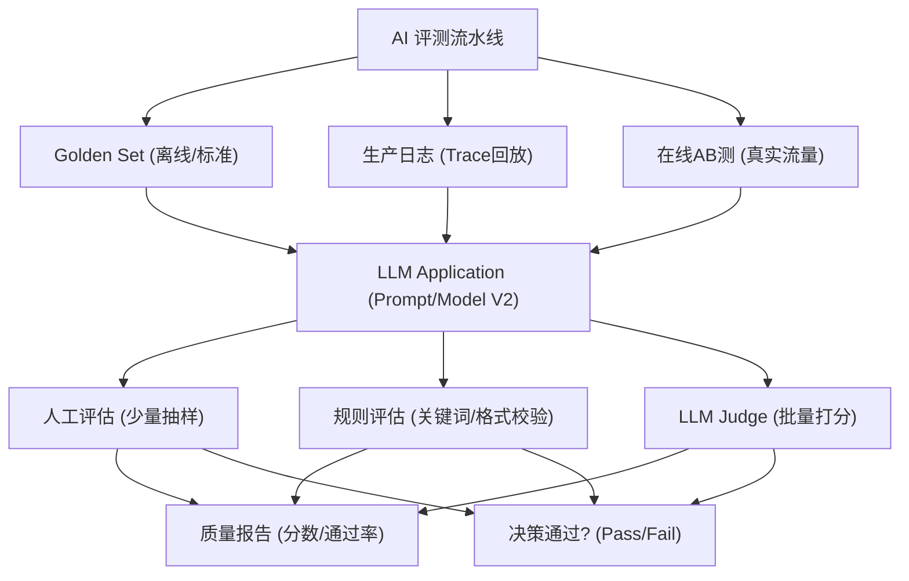

# 什么是 Golden Set 和 LLM-as-Judge?如何在生产中构建 AI 评测体系

- **AI 评测体系** 是确保 Prompt 和模型变更不引入回归的核心手段.

- **Golden Set(黄金测试集):**
  - 人工标注的高质量测试用例(问题 + 标准答案 + 评分标准)
  - 覆盖核心场景和边界情况,通常 100-1000 条
  - 每次 Prompt 或模型变更后跑一遍
  - 用通过率衡量变更安全性

- **LLM-as-Judge:**
  - 用 GPT-4 或 Claude 评估另一个模型的输出质量
  - 评分维度:正确性、完整性、相关性、安全
  - 优势:比人工评估快 100 倍,比规则评估灵活
  - 风险:评判模型自身有偏差

- **评测流程:**
  1. 构建 Golden Set(人工标注)
  2. 每次变更跑 Golden Set
  3. 用 LLM-as-Judge 自动打分
  4. 低分样本人工复核
  5. 变更通过率 > 95% 才上线

- **Trace 回放:** 用历史真实请求的 Trace 数据,在新版本上回放,确保不影响线上体验.

- **系统架构示意:**


### 实战深化

**实战案例:** 在优化 RAG 系统检索算法时，通过 LLM-as-Judge 运行 500 条 Golden Set，发现准确率提升了 5%。但在上线后，用户投诉增多。原因是 Judge 模型偏好信息详尽的回答（即使包含幻觉），而用户更看重简洁准确。通过调整 Judge 的 Prompt 强调“准确性优先”解决了该问题。

**边界情况补充:**
- **数据泄露**：严禁将 Golden Set 中的样本直接放入模型的 Few-shot 示例中，否则会导致评测虚高。
- **评分一致性**：对于开放式生成问题（如创意写作），LLM-as-Judge 自身的方差较大，建议引入“多 Judge 投票”机制（如 3 个 Judge 模型评分取平均）来提升稳定性。
- **长文本处理**：当模型输出超过 Judge 上下文窗口时，需进行截断或分段评估，否则会丢失关键信息导致误判。

**代码示例 (Python - LLM-as-Judge 评估):**
```python
eval_prompt = """
You are an AI judge. Rate the following Answer based on the User Question and Reference Answer.
Score from 1 to 5.
1: Incorrect, 3: Partially Correct, 5: Perfect.
Only output the JSON score.

Question: {question}
Reference: {reference}
Answer: {answer}
"""
# ... call LLM API ...
```

## 记忆要点

- Golden Set 是人工标注的高质量测试集，覆盖核心场景，用于回归测试保安全。
- LLM-as-Judge 用强模型评估弱模型，速度快 100 倍，但需防范自身偏差。
- 生产流程：构建 Golden Set -> 变更跑测 -> LLM 打分 -> 人工复核低分。
- 上线标准：变更通过率需大于 95%，严禁将测试集样本放入 Few-shot。
- Trace 回放利用历史真实请求，确保新版本不影响线上真实体验。

## 结构化回答

**30 秒电梯演讲：** 用Golden Set定基准，用LLM-as-Judge自动化回归测试。——打个比方，像自动化考试系统，有标准答案，机器帮老师改卷。

**展开框架：**
1. **Golden S** — Golden Set 是人工标注的高质量测试集，覆盖核心场景，用于回归测试保安全。
2. **LLM-as-J** — LLM-as-Judge 用强模型评估弱模型，速度快 100 倍，但需防范自身偏差。
3. **生产流程** — 构建 Golden Set -> 变更跑测 -> LLM 打分 -> 人工复核低分。

**收尾：** 以上三点都能配合实战聊。我可以展开任一要点，比如「Golden Set 需要多少条」这类追问您感兴趣吗？

## 视频脚本

> 预计时长：2 分钟 | 由浅入深

| 时间 | 画面/字幕 | 口播台词 | 讲解要点 |
|------|----------|----------|----------|
| 0:00 | 标题卡 | "Golden Set 和 LLM-as-Judge，30 秒讲清楚。" | 开场钩子 |
| 0:30 | 概念定义动画 | "一句话：用Golden Set定基准，用LLM-as-Judge自动化回归测试。" | 核心定义 |
| 1:00 | 要点图解 | "Golden Set 是人工标注的高质量测试集，覆盖核心场景，用于回归测试保安全。" | 要点 |
| 1:30 | 总结卡 | "记好这几条，面试不慌。下期见。" | 收尾 |

### 视频流程图


