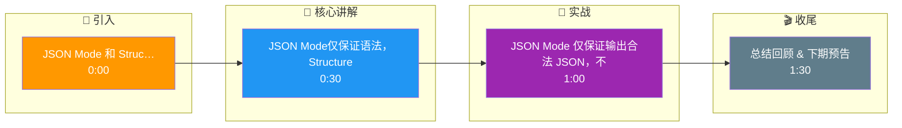

# JSON Mode 和 Structured Output 有什么区别?生产环境如何选择

两者都是让 LLM 输出结构化 JSON 的方式,但原理和可靠性不同.

- **JSON Mode:**
  - 让模型输出合法的 JSON(但不保证 schema)
  - 通过在生成时限制 token 只能是合法 JSON 字符来实现
  - 可能输出了 JSON 但字段名/类型不符合预期
  - 支持:OpenAI、Claude、国产模型多数支持

- **Structured Output(Structured Outputs):**
  - 不仅保证输出合法 JSON,还保证符合指定的 JSON Schema
  - 通过约束解码(Constrained Decoding)实现:在每一步生成时只允许 schema 合法的 token
  - 100% 保证格式正确
  - 支持:OpenAI(2024年8月推出)、Outlines、lm-format-enforcer

- **生产选择:**
  - 简单场景(只需要 JSON 格式):JSON Mode 够用
  - 需要严格 schema(如 API 参数):Structured Output
  - 开源模型:用 Outlines / Instructor 库实现

- **注意:** JSON Mode 不等于 Structured Output,前者只保证语法正确,后者保证语义正确.

- **增强原理与技术细节:**
  - **BNF Grammar (上下文无关文法):** Structured Output 的核心通常将 JSON Schema 转换为 BNF 语法。在推理阶段，模型每采样一个 Token，都会检查该 Token 是否在当前语法路径的候选集中。例如，在需要产生 `"status": ` 的情况下，下一个合法 Token 必须是字符串定义的引号或 Schema 中规定的 Enum 值，从而从数学上保证格式不出错。
  - **Logits Bias (Logit Processor):** 实现约束解码的一种手段。通过修改模型的 Logits（将非法 Token 的 logits 设为负无穷大 `inf`），强制模型采样合法 Token。
  - **性能损耗:** Structured Output 由于需要实时计算 Mask（掩码）来过滤 Token，推理性能会有轻微下降（通常 5-10%），但避免了重试的巨额成本。

- **约束解码示意图:**

```text
目标 Schema: { "name": string, "age": integer }

当前生成进度: { "name": 

         ┌─────────────────────────────────────┐
         │  模型原始输出 Logits (Top-k Tokens)  │
         │  "Alice" (0.8)  "Bob" (0.1) ...     │
         └──────────────┬──────────────────────┘
                        │
                        ▼
         ┌─────────────────────────────────────┐
         │  JSON Schema / BNF 语法约束检查      │
         │  当前状态: String Value (Expecting) │
         │  检查: "Alice", "Bob" 均合法        │
         └──────────────┬──────────────────────┘
                        │
                        ▼
         ┌─────────────────────────────────────┐
         │  修改后的 Logits                    │
         │  非法 Token (如冒号 :, 大括号 })     │
         │  Logits -> -Infinity (被 Mask)      │
         └──────────────┬──────────────────────┘
                        │
                        ▼
              采样 Token: "Alice"
```

## 易错点
1. **枚举值幻觉**：即使使用了 Structured Output，如果 Schema 中的 Enum（枚举）值在模型的训练数据中很少见，模型仍可能尝试强行生成它认为“合理”的值，导致约束逻辑不得不强行截断或选错。
2. **思维链冲突**：如果要求模型输出思维链（CoT）再输出 JSON，JSON Mode 有时会将思维链内容也包裹在 JSON 字符串中，破坏结构；需要在 Prompt 中明确划分阶段。

## 面试追问
1. **Reasoning 模型的约束**：对于 o1 或 DeepSeek-R1 这类强化学习推理模型，其内部思维过程对用户不可见，如果强制要求 Structured Output，是否会影响其推理质量？
2. **任意格式支持**：除了 JSON，如果要强制输出 SQL、Python 代码或 XML，Structured Output 的原理是否适用？如何实现？

## 核心流程图

```mermaid
flowchart TD
    Start([🚀 SpringBoot 启动<br/>main 方法]):::start
    SpringApplication[SpringApplication.run<br/>启动入口]:::process
    PrepareEnv[准备 Environment<br/>加载 application.yml]:::process
    ContextQ{{应用上下文?<br/>Servlet/Reactive}}:::decision
    ServletCtx[AnnotationConfigCtx<br/>传统 MVC]:::process
    ReactiveCtx[ReactiveWebCtx<br/>WebFlux]:::process
    Refresh[refresh 刷新容器<br/>核心入口]:::process
    BeanFactory[BeanFactory<br/>IoC 容器]:::store
    BeanDef[BeanDefinition<br/>扫描 @Component/@Bean]:::process
    ScanQ{{配置方式?<br/>注解/XML}}:::decision
    AnnoScan[ComponentScan<br/>ClassPathBeanDefinitionScanner]:::process
    XmlScan[XmlBeanDefinitionReader<br/>解析 XML]:::process
    Instantiate[实例化 Bean<br/>反射 newInstance]:::process
    Populate[属性填充<br/>依赖注入 @Autowired]:::process
    AwareQ{{实现 Aware 接口?}}:::decision
    Aware[BeanNameAware / ContextAware<br/>回调注入]:::process
    InitQ{{自定义初始化?}}:::decision
    PostConstruct[@PostConstruct<br/>初始化方法]:::process
    AOPQ{{需要 AOP 增强?<br/>切面 @Aspect}}:::decision
    Proxy[创建动态代理<br/>JDK/CGLIB]:::process
    ProxyChain[代理链<br/>MethodInvocation]:::process
    Final([✅ Bean 就绪 可用]):::start

    Start --> SpringApplication --> PrepareEnv --> ContextQ
    ContextQ -->|传统| ServletCtx --> Refresh
    ContextQ -->|响应式| ReactiveCtx --> Refresh
    Refresh --> BeanFactory --> BeanDef --> ScanQ
    ScanQ -->|注解| AnnoScan --> Instantiate
    ScanQ -->|XML| XmlScan --> Instantiate
    Instantiate --> Populate --> AwareQ
    AwareQ -->|是| Aware --> InitQ
    AwareQ -->|否| InitQ
    InitQ -->|是| PostConstruct --> AOPQ
    InitQ -->|否| AOPQ
    AOPQ -->|是| Proxy --> ProxyChain --> Final
    AOPQ -->|否| Final

    classDef start fill:#2563eb,stroke:#1e3a8a,color:#fff,stroke-width:2px;
    classDef process fill:#dbeafe,stroke:#3b82f6,color:#1e3a8a;
    classDef decision fill:#fef3c7,stroke:#f59e0b,color:#78350f,stroke-width:2px;
    classDef store fill:#8b5cf6,stroke:#6d28d9,color:#fff;

```

## 记忆要点

- JSON Mode 仅保证输出合法 JSON，不保证字段符合 Schema 定义。
- Structured Output 通过约束解码，100% 保证符合 JSON Schema。
- 原理：将 Schema 转为 BNF 语法，每步生成 Mask 非法 Token。
- 选择：简单格式用 JSON Mode，严格 API 参数用 Structured Output。
- 注意：约束解码有轻微性能损耗，但避免了重试成本。

## 结构化回答

**30 秒电梯演讲：** JSON Mode仅保证语法，Structured Output通过约束解码保证Schema匹配。——打个比方，前者保证句子通顺，后者保证句子符合指定模板。

**展开框架：**
1. **JSON Mod** — JSON Mode 仅保证输出合法 JSON，不保证字段符合 Schema 定义。
2. **Structur** — Structured Output 通过约束解码，100% 保证符合 JSON Schema。
3. **原理** — 将 Schema 转为 BNF 语法，每步生成 Mask 非法 Token。

**收尾：** 以上三点都能配合实战聊。我可以展开任一要点，比如「约束解码如何影响生成质量」这类追问您感兴趣吗？

## 视频脚本

> 预计时长：2 分钟 | 由浅入深

| 时间 | 画面/字幕 | 口播台词 | 讲解要点 |
|------|----------|----------|----------|
| 0:00 | 标题卡 | "JSON Mode 和 Structured Output 有什么区别，30 秒讲清楚。" | 开场钩子 |
| 0:30 | 概念定义动画 | "一句话：JSON Mode仅保证语法，Structured Output通过约束解码保证Schema匹配。" | 核心定义 |
| 1:00 | 要点图解 | "JSON Mode 仅保证输出合法 JSON，不保证字段符合 Schema 定义。" | 要点 |
| 1:30 | 总结卡 | "记好这几条，面试不慌。下期见。" | 收尾 |

### 视频流程图




