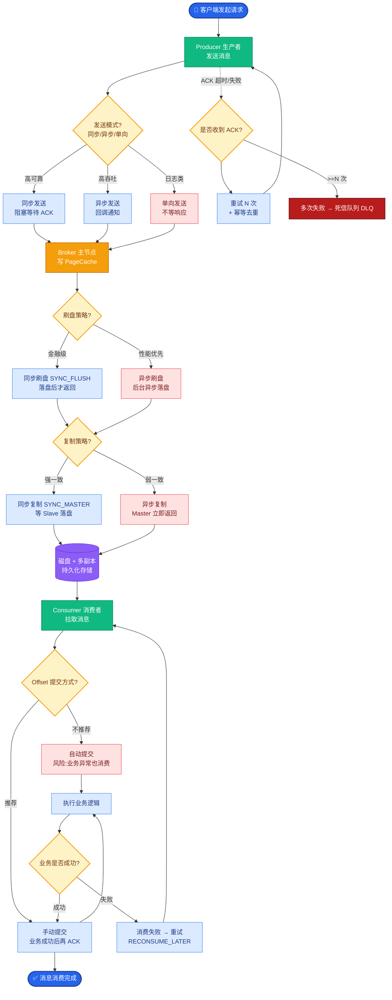

# 为什么 LLM API 都用 SSE(Server-Sent Events)做流式输出?和 WebSocket 有什么区别

- **SSE(Server-Sent Events)** 是 LLM API 流式输出的标准协议.

- **为什么选 SSE 而非 WebSocket:**
  - **SSE:**
    - 基于 HTTP,单向服务器 -> 客户端
    - 简单:用标准 HTTP 连接,自动重连
    - 与现有基础设施兼容(CDN、代理、负载均衡)
    - 适合 LLM 场景:只需要服务器推给客户端,不需要双向通信
  - **WebSocket:**
    - 全双工双向通信
    - 需要协议升级(HTTP -> WS),增加复杂度
    - 某些代理/防火墙不支持
    - 过度设计(LLM 场景不需要客户端 -> 服务器的流式通信)

- **SSE 实现要点:**
  - Content-Type: text/event-stream
  - 每条消息格式:data: {json}\n\n
  - 客户端用 EventSource API 或 fetch + ReadableStream
  - 注意超时和断线重连

- **OpenAI/Claude/GLM 的 API 都使用 SSE 格式.

- **增强原理与技术细节:**
  - **协议开销:** SSE 协议头简单，每条消息仅包含 `data:` 前缀和两个换行符，开销极低。而 WebSocket 虽然也是二进制帧，但在连接建立初期需要额外的握手 RTT (Round Trip Time)。
  - **断点续传:** SSE 原生支持 `Last-Event-ID`。当客户端断线重连时，会发送上一次接收到的 Event ID，服务端可以据此发送重放或后续数据，保证数据不丢（但在生成式 AI 场景下，通常服务端是无状态的，更多依赖客户端重试或上下文恢复）。
  - **编码格式:** LLM 流式输出通常返回增量内容（`delta`），而非全量文本，以减少带宽占用。例如：`data: {"choices": [{"delta": {"content": "Hello"}}]}`

- **协议交互对比图:**

```text
┌─────────────┐                  ┌──────────────┐
 │   Client    │                  │   Server     │
 └──────┬──────┘                  └──────┬───────┘
        │                                │
        │  1. GET /stream (HTTP/1.1)     │
        │  Headers: Accept: text/event-stream │
        │ ──────────────────────────────> │
        │                                │
        │  2. 200 OK                      │
        │  Headers: Content-Type: text/event-stream │
        │  (Keep-Alive Connection)       │
        │ <────────────────────────────── │
        │                                │
        │  3. Stream Start (SSE Chunks)  │
        │ <──── data: {"content":"Hi"}\n\n ──│
        │ <──── data: {"content":","}\n\n ──│
        │ <──── data: [DONE]\n\n ─────────│
        │                                │
        │  4. Connection Close            │
        │ ──────────────────────────────> │

  WebSocket (对比):
        │  1. GET /ws (Upgrade)           │
        │ ──────────────────────────────> │
        │  2. 101 Switching Protocols     │
        │ <────
```


## 核心流程图



## 记忆要点

- SSE 基于 HTTP 单向推送，简单兼容 CDN/代理，适合 LLM 流式输出。
- WebSocket 是双向全双工，需协议升级，对 LLM 场景属于过度设计。
- SSE 格式：text/event-stream，每条 data: {json}\n\n，自动重连。
- 优势：SSE 协议头简单，原生支持断点续传，基础设施兼容性好。
- 对比：SSE 用于服务推，WebSocket 用于双向交互，LLM 选 SSE。


## 结构化回答

**30 秒电梯演讲：** 利用HTTP单向推送的SSE协议实现LLM流式响应，简化架构。——打个比方，像广播电台发送信号，你只管收听，不用对讲。

**展开框架：**
1. **SSE 基于 H** — SSE 基于 HTTP 单向推送，简单兼容 CDN/代理，适合 LLM 流式输出。
2. **WebSocke** — WebSocket 是双向全双工，需协议升级，对 LLM 场景属于过度设计。
3. **SSE 格式** — text/event-stream，每条 data: {json}\n\n，自动重连。

**收尾：** 以上三点都能配合实战聊。我可以展开任一要点，比如「如何处理 SSE 断线重连」这类追问您感兴趣吗？

## 视频脚本

> 预计时长：2 分钟 | 由浅入深

| 时间 | 画面/字幕 | 口播台词 | 讲解要点 |
|------|----------|----------|----------|
| 0:00 | 标题卡 | "LLM API 都用 SSE(Server-Sent Events)做流式输出，30 秒讲清楚。" | 开场钩子 |
| 0:30 | 概念定义动画 | "一句话：利用HTTP单向推送的SSE协议实现LLM流式响应，简化架构。" | 核心定义 |
| 1:00 | 要点图解 | "SSE 基于 HTTP 单向推送，简单兼容 CDN/代理，适合 LLM 流式输出。" | 要点 |
| 1:30 | 总结卡 | "记好这几条，面试不慌。下期见。" | 收尾 |
