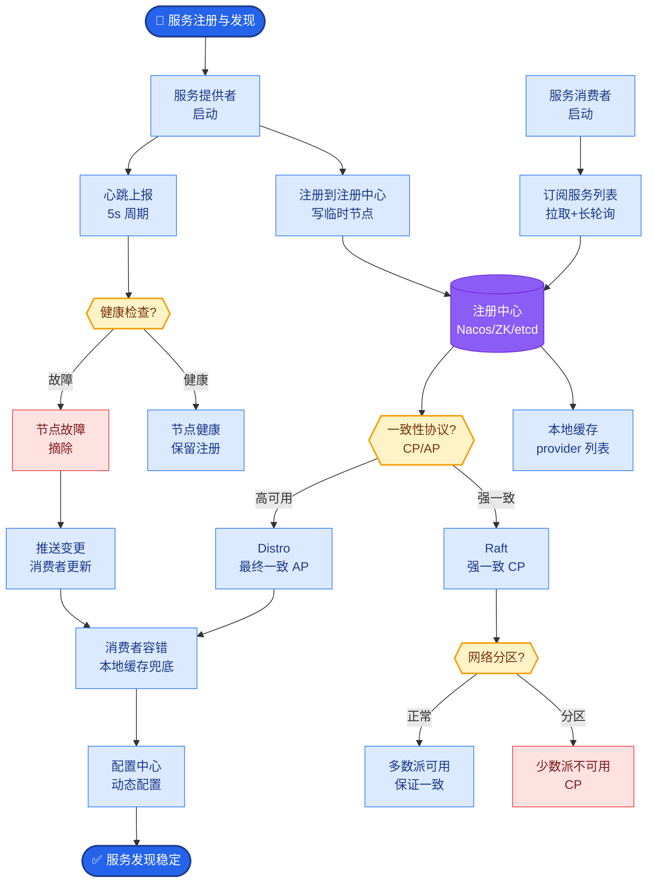

# 模型路由与容错

### 模型路由与容错

**概念解释**：
- **模型路由**：像快递分拣中心，根据任务类型、成本预算、延迟要求等，将请求动态分发到最合适的模型（如 GPT-4、Claude、开源小模型），而非全量跑大模型。
- **容错**：当模型超时、报错或限流时，系统自动切换、重试或降级，保障服务高可用。

**原理详解**：
1. **多模型管理（统一抽象）**：
   - **Provider Adapter**：统一各厂商接口（如 OpenAI、Anthropic），封装 `chat()` 方法。
   - **配置中心**：维护模型能力矩阵（是否支持函数调用、长上下文）、价格、限额。

2. **调度策略**：
   - **成本优先**：满足质量阈值下选最便宜模型。
   - **延迟优先**：SLA 严格时选最快模型。
   - **任务分类**：代码生成用强模型，简单摘要用弱模型。

3. **三态熔断器**：
   - **Closed（闭合）**：正常请求，统计失败率。
   - **Open（断开）**：失败超阈值，直接拒绝并进入冷却期（防止雪崩）。
   - **Half-Open（半开）**：冷却结束，放行少量探测流量，成功则恢复，失败则继续断开。

4. **自动降级**：
   - **模型降级**：强模型失败时切至弱模型（或更快的模型）。
   - **功能降级**：关闭复杂工具调用，改为单轮问答。
   - **策略**：配合日志标记 `degraded=true`，必要时提示用户。

5. **重试与指数退避**：
   - 针对 429/503 错误，等待时间指数增长（`base * 2^attempt + jitter`），避免瞬时拥塞。
   - **不可重试**：参数错误 (400)、权限错误 (401/403) 直接失败。

- **架构流转图:**

```text
User Request
      │
      ▼
┌─────────────────┐
│   Router Core   │ ◄─── 路由规则: 成本/速度/质量
│   (决策层)       │
└────────┬────────┘
         │
         ├───┬───────────────┬────────────┐
         │   │               │            │
         ▼   ▼               ▼            ▼
   ┌─────────┐      ┌──────────────┐ ┌──────────┐
   │Provider │      │   Provider   │ │ Provider │
   │  GPT-4  │      │   Claude 3   │ │ Llama 3  │
   │(Primary)│      │  (Fallback)  │ │(Backup)  │
   └────┬────┘      └──────┬───────┘ └────┬─────┘
        │                  │               │
        │ 500/429/Timeout  │               │
        ▼                  │               │
   ┌─────────┐             │               │
   │Circuit  │             │               │
   │ Breaker │             │               │
   └────┬────┘             │               │
        │(Open/Trip)       │               │
        └──────────────────┼───────────────┘
                           │
                           ▼
                  ┌─────────────────┐
                  │   Fallback /    │
                  │   Retry Logic   │ ◄─── 指数退避 / 降级
                  └────────┬────────┘
                           │
```

**边界情况:**
- **全盘崩溃：** 当所有配置的 Fallback 模型提供商都不可用时（如全域断网或密钥全部失效），Router 应具备“保底逻辑”，如返回预设的静态错误回复或引导用户稍后重试，而非抛出未捕获异常。
- **僵尸恢复：** 熔断器进入 Open 状态后，如果下游服务实际上已经恢复，但 Half-Open 探测流量恰好全是由于客户端业务逻辑导致的错误（而非服务端错误），会导致熔断器无法及时关闭。需要区分服务端错误码（5xx）和客户端错误码（4xx）进行统计。
- **非幂等性请求：** 在重试机制中，如果 LLM 调用伴随着副作用（如写库、发邮件、扣费），盲目重试会导致重复操作。Router 需支持识别请求的幂等性，对非幂等请求配置“不重试”或“仅限特定错误重试”。

## 面试追问
1.  **关于路由决策：** 做路由判断时，往往需要先分析用户的 Prompt。如果这个“分析判断”本身也要消耗一次模型调用，是否会反而增加成本和延迟？有没有低成本的路由策略？
2.  **关于一致性：** 从 GPT-4 切换到 Claude 3 作为 Fallback 时，两个模型的输出格式（如 JSON Schema 结构、工具调用名称）可能不兼容，下游应用如何处理这种异构响应？
3.  **关于熔断颗粒度：** 熔断器是应该设置在“单个模型实例”维度（如某个 Azure endpoint），还是“供应商”维度（如整个 OpenAI 服务）？这如何影响系统的整体可用性？

## 易错点
1.  **重试风暴：** 在高并发场景下，如果所有客户端同时触发重试，会瞬间击垮下游服务。必须在重试策略中引入高阶的抖动或集中式的协调器，避免重试时间同步。
2.  **忽略 429 Too Many Requests 的细节：** 很多 Retry 逻辑看到 429 就直接重试。但实际上 OpenAI 等厂商的 429 响应头中往往包含 `Retry-After` 或具体的信息，忽略这些 Header 会导致重试过早（继续被拒）或过晚（浪费 SLA 时间）。


## 核心流程图



## 记忆要点

- 模型路由根据成本、延迟、任务类型，动态分发请求至最合适模型。
- 容错机制：三态熔断器，失败超阈值直接拒绝，探测流量恢复。
- 降级策略：强模型失败切弱模型，关闭复杂工具，标记降级日志。
- 重试策略：429/503 指数退避，400/403 等参数错误不重试。
- 关键点：非幂等请求（如写库）严禁盲目重试，防止重复操作。


## 结构化回答

**30 秒电梯演讲：** 通过策略分发请求和故障隔离，保障AI服务高可用且低成本。——打个比方，像出租车调度中心，豪车坏了叫经济型，堵车了换路，确保把你送到。

**展开框架：**
1. **模型路由根据成本** — 模型路由根据成本、延迟、任务类型，动态分发请求至最合适模型。
2. **容错机制** — 三态熔断器，失败超阈值直接拒绝，探测流量恢复。
3. **降级策略** — 强模型失败切弱模型，关闭复杂工具，标记降级日志。

**收尾：** 以上三点都能配合实战聊。您想深入聊哪一块？

## 视频脚本

> 预计时长：4 分钟 | 由浅入深

| 时间 | 画面/字幕 | 口播台词 | 讲解要点 |
|------|----------|----------|----------|
| 0:00 | 标题卡 | "模型路由与容错，30 秒讲清楚。" | 开场钩子 |
| 0:40 | 概念定义动画 | "一句话：通过策略分发请求和故障隔离，保障AI服务高可用且低成本。" | 核心定义 |
| 1:20 | 要点图解 | "模型路由根据成本、延迟、任务类型，动态分发请求至最合适模型。" | 要点 |
| 2:00 | 容错机制图解 | "三态熔断器，失败超阈值直接拒绝，探测流量恢复。" | 容错机制 |
| 2:40 | 降级策略图解 | "强模型失败切弱模型，关闭复杂工具，标记降级日志。" | 降级策略 |
| 3:20 | 总结卡 | "记好这几条，面试不慌。下期见。" | 收尾 |
