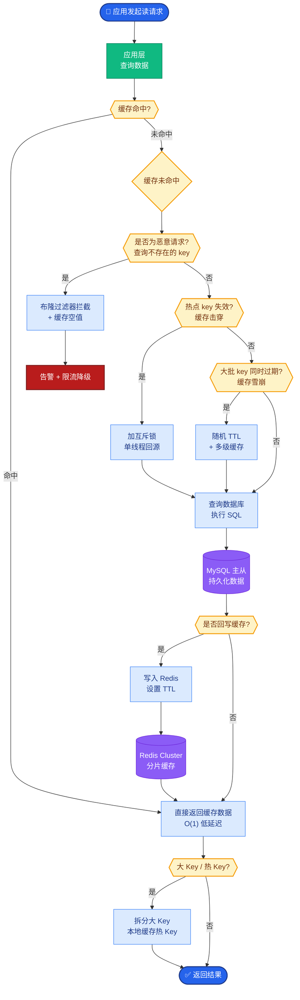

# Token 成本控制

### Token 成本控制

**核心目标**：Agent 多轮对话导致上下文迅速膨胀，需在保证质量的前提下，让 Token 消耗可控、可预测。

#### 原理详解

1.  **Token 计数与估算**
    *   **工具**：使用 `tiktoken` (OpenAI)、`tokenizers` (HuggingFace) 在本地进行精准预估。
    *   **关键参数**：注意不同模型采用不同的 Tokenizer（如 `cl100k_base` vs `o200k_base`），计算时需指定正确名称。
    *   **边界条件**：本地计数通常不包括 Completion 中的特殊 Stop Token 或图像 Token，实际账单可能略多于预估。

2.  **Prompt 精简技巧**
    *   **合并指令**：删除冗余示例，将多条系统提示合并为一条权威描述。
    *   **结构化输出**：强制 JSON 格式减少来回澄清。
    *   **上下文压缩**：长文档先摘要，RAG 仅取 Top-K 片段。
    *   **历史裁剪**：保留 System 指令 + 最近 N 轮对话 + 历史摘要。

3.  **缓存策略**
    *   **精确缓存**：基于请求哈希，适合重复的参数化任务。
    *   **语义缓存**：基于 Embedding 相似度匹配，适合相似问题（需防范“相近但不同”的误用）。
    *   **注意**：部分厂商（如 Anthropic）提供 Prompt Caching 功能，可自动缓存 System Message，长对话成本大幅降低。

4.  **模型与算力优化**
    *   **大小模型搭配**：小模型做分类/摘要，大模型做最终生成。
    *   **批量处理**：非实时场景合并请求，利用 Batch API 降低单价。

5.  **监控与告警**
    *   按租户、功能、模型维度监控日均 Token 和 P95 成本。
    *   设置预算封顶，超限时返回友好错误。

#### 边界情况补充

*   **多模态 Token 计价**：当前方案主要针对文本。在涉及图片（如 GPT-4o Vision）时，需注意图片通常按 Tile（块）计费，高分辨率图片的 Token 消耗可能远超文本，需在入口处做分辨率压缩或裁剪。
*   **Function Calling 开销**：频繁的工具调用虽然能提高准确率，但每次函数调用模型的输出都会消耗 Token，且需将函数结果再次输入模型。需在“精度”与“工具调用次数”之间做权衡。
*   **极端长文本截断**：当上下文长度逼近模型上限（如 128k）时，简单的“保留最近 N 轮”策略可能会丢失关键的初始指令。需实现“滑动窗口 + 关键信息锚定”策略，确保 System Prompt 和关键实体始终在窗口内。

#### 实战案例
在长文档客服问答场景中，直接将 50 页 PDF 全文塞入 Prompt 导致单次调用成本超 5 美元。优化策略是先用 GPT-3.5 生成结构化摘要（链式索引），再由 GPT-4 基于摘要回答，成本降至 0.1 美元，且准确率未下降。

#### 代码示例
```python
import tiktoken

def check_token_limit(text: str, model: str = "gpt-4o", limit: int = 120000):
    # 指定模型对应的编码器，解决 cl100k_base vs o200k_base 差异
    try:
        encoding = tiktoken.encoding_for_model(model)
    except KeyError:
        encoding = tiktoken.get_encoding("cl100k_base")
    
    token_count = len(encoding.encode(text))
    
    if token_count > limit:
        print(f"警告：Token 数 {token_count} 超过限制 {limit}，将启用截断策略")
        return False
    return True
```

#### 模型选型对比
| 维度 | 小模型 (e.g., GPT-3.5/4o-mini) | 大模型 (e.g., GPT-4o/Claude 3.5 Sonnet) |
| :--- | :--- | :--- |
| **成本** | 极低 (Input/Output 均便宜) | 高 (特别是 Output tokens) |
| **响应速度** | 快 (低延迟，高并发) | 慢 (高延迟，推理重) |
| **指令遵循** | 一般 (需优化 Prompt) | 强 (复杂逻辑/格式更稳) |
| **典型场景** | 摘要、分类、意图识别 | 复杂推理、代码生成、最终合成 |

#### 缓存与处理架构

```text
User Request
      │
      ▼
┌─────────────┐    Hit    ┌──────────────┐
│ Exact Cache │───────────>│   Return     │
└─────────────┘            
```

## 面试追问
1.  **动态截断策略**：在历史对话轮次非常多时，如何设计算法决定保留哪些轮次、丢弃哪些轮次，既能最大化保留有效信息，又能控制 Token 成本？（提示：计算历史轮次的 Embedding 与当前问题的相似度，或基于重要性权重打分）。
2.  **Prompt Caching 失效**：当利用厂商的 Prompt Caching（如 Anthropic）时，什么样的改动会导致缓存失效？如何设计 System Prompt 以适应缓存机制？（提示：System Message 中的任何微小变动都会失效，需将静态指令与动态变量分离）。
3.  **成本与质量平衡**：如果预算有限，如何构建一个自动化的机制，动态决定当前简单问题用小模型，复杂问题升级给大模型？（提示：设计路由模型，基于问题复杂度或历史尝试失败率进行分流）。

## 易错点
1.  **只计算 Input，忽略 Output**：很多开发者只关注输入 Context 的长度，忽略了模型生成的 Output Token 也是收费的，且通常单价更高（特别是 GPT-4 等大模型）。在流式输出场景下，需警惕无限循环生成导致的成本失控。
2.  **忽视调试模式的 Token 消耗**：在 Prompt 中加入大量的“思维链”或“逐步解释”指令虽然能提高准确率，但会大幅增加推理阶段的 Token 消耗。在代码发布生产环境前，务必清理过详细的调试指令。


## 核心流程图



## 记忆要点

- Token 控制：本地精准计数，Prompt 精简，历史裁剪，长文档摘要。
- 缓存策略：精确缓存（哈希）和语义缓存（Embedding），降低重复成本。
- 模型搭配：小模型做分类摘要，大模型做最终生成，Batch API 降单价。
- 监控：按租户/功能监控 Token，设置预算封顶和超限告警。
- 注意：多模态图片按 Tile 计费，需压缩分辨率；长文本需锚定关键信息。


## 结构化回答

**30 秒电梯演讲：** 通过压缩、缓存和分级处理，减少无效Token消耗。——打个比方，像打电话省话费：长话短说、重复的事不重说、大事找经理小事找助理。

**展开框架：**
1. **Token 控制** — 本地精准计数，Prompt 精简，历史裁剪，长文档摘要。
2. **缓存策略** — 精确缓存（哈希）和语义缓存（Embedding），降低重复成本。
3. **模型搭配** — 小模型做分类摘要，大模型做最终生成，Batch API 降单价。

**收尾：** 以上三点都能配合实战聊。您想深入聊哪一块？

## 视频脚本

> 预计时长：4 分钟 | 由浅入深

| 时间 | 画面/字幕 | 口播台词 | 讲解要点 |
|------|----------|----------|----------|
| 0:00 | 标题卡 | "Token 成本控制，30 秒讲清楚。" | 开场钩子 |
| 0:40 | 概念定义动画 | "一句话：通过压缩、缓存和分级处理，减少无效Token消耗。" | 核心定义 |
| 1:20 | Token 控制图解 | "本地精准计数，Prompt 精简，历史裁剪，长文档摘要。" | Token 控制 |
| 2:00 | 缓存策略图解 | "精确缓存（哈希）和语义缓存（Embedding），降低重复成本。" | 缓存策略 |
| 2:40 | 模型搭配图解 | "小模型做分类摘要，大模型做最终生成，Batch API 降单价。" | 模型搭配 |
| 3:20 | 总结卡 | "记好这几条，面试不慌。下期见。" | 收尾 |
