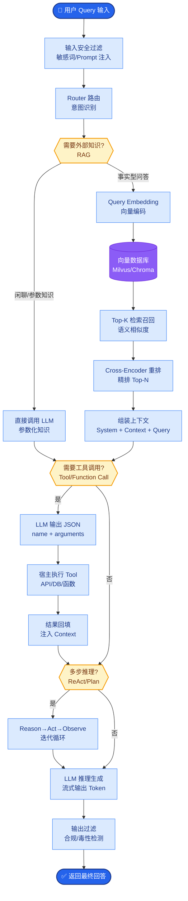

# Prompt 优化技巧

### 9. Prompt 优化技巧

#### 9.1 温度参数调优
**概念**
Temperature 控制采样分布的「平坦度」。本质上它是对 Softmax 概率分布的除法操作，低温度（0～0.3）拉大高概率词与低概率词的差距，输出更确定、更稳；高温度（0.7~1.0+）压平差距，使低概率词更有机会被选中，输出更多样、更有创造性。

**实践**
- 分类、JSON 提取、代码生成：低温度（0~0.2），确保逻辑严密和格式正确。
- 头脑风暴、文案创作、对话：中高温度（0.7~1.0），激发发散性思维。
- Agent 工具调用：偏低温度（0~0.3），减少模型幻觉和乱选工具的情况。

**实战案例**
在某金融研报生成项目中，我们将温度从 0.7 降至 0.1 后，模型捏造不存在的财务数据（幻觉）的情况减少了约 80%，但生成的文本风格变得略显机械。

**代码示例**
```python
from openai import OpenAI
client = OpenAI()

# 高创意场景（如起名）
creative = client.chat.completions.create(
    model="gpt-4", temperature=0.9,
    messages=[{"role": "user", "content": "给一只咖啡色的猫起个可爱的名字"}]
)
```

**细节与边界**
- 设为 0 时通常等同于贪婪解码，每次输出完全一致（取决于具体模型实现）。
- 温度通常与 `top_p` 配合使用，不建议同时大幅度调整两者。

#### 9.2 Top-p（核采样）
**概念**
在每步生成时，将概率最高的 tokens 按概率累加，直到累积概率达到 p（如 0.9），然后只从这个最小 token 集合里采样。这过滤掉了概率极低的“长尾”词。

**实践**
- 常用值在 0.8~0.95 之间。
- 若输出仍飘忽或出现乱码，先降 temperature，再微调 top_p。
- 需记录基线对比，因为 top_p 的微小变化可能改变语义。

**对比表格：Temperature vs Top-p**

| 维度 | Temperature | Top-p (Nucleus Sampling) |
| :--- | :--- | :--- |
| **控制对象** | 概率分布的平滑度（熵） | 累积概率截断阈值 |
| **核心效果** | 改变输出的随机性/创造力 | 过滤掉低概率的“噪音”词 |
| **主要用途** | 控制是“保守”还是“发散” | 保证生成内容在合理范围内 |
| **配合建议** | 优先调节此项 | 一般固定在 0.9，不做频繁变动 |

#### 9.3 提示词压缩
**概念**
在尽量不损语义的前提下缩短 Prompt 以降低成本和延迟。

**技巧**
- **去冗余**：删除礼貌用语、重复的修饰词。
- **结构化**：使用 `#`、`###`、`XML` 标签（如 `<instruction>`）代替自然语言连接词。
- **缩写定义**：在 System Prompt 中定义术语表，User Prompt 中直接使用缩写。
- **Few-shot 压缩**：只保留最具代表性的样本，或利用 Embedding 检索最相似的样本代替固定样本。

**实战案例**
在开发 RAG 知识库问答时，我们将 Prompt 中的指令从自然语言描述改写为紧凑的 XML 标签（如 `<ctx>` 包裹上下文），Token 消耗减少了 30%，同时模型提取答案的准确率提升（因为干扰信息变少）。

**代码示例**
```python
# 差：啰嗦的自然语言指令
bad_prompt = "请你仔细阅读下面提供的上下文信息，这个信息非常关键，请务必基于此回答..."

# 好：结构化指令
good_prompt = """Task: Answer based on context.
<context>{{context}}</context>
<query>{{query}}</query>
"""
```

**注意**
过度压缩可能增歧义；压缩后需进行回归测试，检查准确率是否下降。

#### 9.4 长 Prompt 管理
**架构图：RAG 混合检索架构**
```text
┌─────────────┐    ┌──────────────┐    ┌─────────────────────────────┐
│   用户输入   │───>│  意图/实体识别 │───>│      Prompt 组装器         │
└─────────────┘    └──────────────┘    └───────────┬─────────────────┘
                                                │
           ┌────────────────────────────────────┼───────────────────┐
           │                                    │                   │
           ▼                                    ▼                   ▼
    ┌─────────────┐                    ┌──────────────┐    ┌───────────────┐
    │ 静态模板     │                    │ 动态检索     │    │ 历史对话记忆  │
    │ (System/角色)│                    │ (RAG/知识库) │    │ (Summary/Window)│
    └─────────────┘                    └──────────────┘    └───────────────┘
           │                                    │                   │
           └──────────────────────┬────────────┴───────────────────┘
                                  ▼
                        ┌─────────────────┐
                        │  最终长 Prompt   │
                        │ ( < Max Tokens) │
                        └─────────────────┘
```


## 核心流程图



## 记忆要点

- Temperature：低(0-0.3)确定稳定，高(0.7-1.0)发散创造；Agent调0-0.3。
- Top-p：累积概率截断(常用0.8-0.95)，过滤长尾噪音词。
- 调参顺序：优先调temperature，top_p一般固定0.9不频繁变。
- 提示词压缩：去冗余+结构化(XML标签)，可省约30% Token。
- 温度陷阱：勿与top_p同时大幅调整；过度压缩需回归测试。


## 结构化回答

**30 秒电梯演讲：** 通过参数调整、结构化和自动化工具，提升 Prompt 效率与效果。——打个比方，像调优赛车：Prompt 指导航线，Temperature 是油门灵敏度。

**展开框架：**
1. **Temperat** — Temperature：低(0-0.3)确定稳定，高(0.7-1.0)发散创造；Agent调0-0.3。
2. **Top-p** — 累积概率截断(常用0.8-0.95)，过滤长尾噪音词。
3. **调参顺序** — 优先调temperature，top_p一般固定0.9不频繁变。

**收尾：** 以上三点都能配合实战聊。您想深入聊哪一块？

## 视频脚本

> 预计时长：4 分钟 | 由浅入深

| 时间 | 画面/字幕 | 口播台词 | 讲解要点 |
|------|----------|----------|----------|
| 0:00 | 标题卡 | "Prompt 优化技巧，30 秒讲清楚。" | 开场钩子 |
| 0:40 | 概念定义动画 | "一句话：通过参数调整、结构化和自动化工具，提升 Prompt 效率与效果。" | 核心定义 |
| 1:20 | Temperature图解 | "低(0-0.3)确定稳定，高(0.7-1.0)发散创造；Agent调0-0.3。" | Temperature |
| 2:00 | Top-p图解 | "累积概率截断(常用0.8-0.95)，过滤长尾噪音词。" | Top-p |
| 2:40 | 调参顺序图解 | "优先调temperature，top_p一般固定0.9不频繁变。" | 调参顺序 |
| 3:20 | 总结卡 | "记好这几条，面试不慌。下期见。" | 收尾 |
