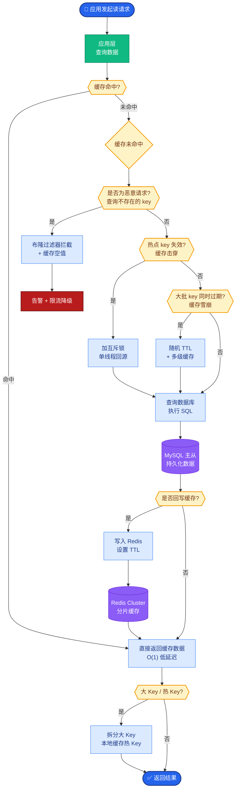
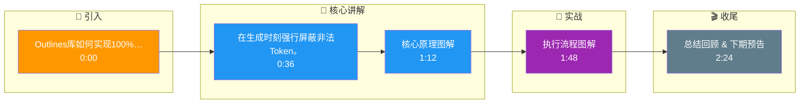

# Outlines库如何实现100%结构化输出?约束解码的原理是什么

- **Outlines核心:约束解码**

**传统方式：** LLM生成文本 → 解析 → 可能失败
**约束解码：** **在推理时强制LLM只能生成符合格式的token**

- **实战案例**：在构建低延迟的工业控制指令生成系统时，使用 Outlines 约束模型输出严格符合 `^[A-Z]\d{3}$` 正则的指令（如 “L123”），完全消除了因 LLM 产生无效字符导致 PLC 报错的情况，省去了后端异常处理的重试开销。

- **原理详解:**
1. **定义目标格式**: 基于 JSON Schema / Regex / Pydantic 定义结构。
2. **转换为有限状态机(FSM)**: 将正则或语法规则编译成 FSM，状态机的边代表合法的 token 转移。
3. **Token 集合过滤**:
   - 每生成一个 token，检查 FSM 当前状态允许的下一个 token 集合 $V_{allowed}$。
   - 将 vocabulary 中所有不在 $V_{allowed}$ 中的 token 的 logits 设为 $-\infty$。
4. **采样与更新**: 进行 softmax 采样，选出的 token 必然合法，随后更新 FSM 状态。
5. **效果**: 100%格式正确,0重试。

**FSM 约束解码流程图:**
```text
输入 Prompt: "User info is..."
│
├─> 1. 读取 Logits (维度: vocab_size)
│
├─> 2. 获取当前 FSM 状态
│     └─ 例如: 等待 JSON Key 的第一个字符
│
├─> 3. 计算合法 Token 集合
│     └─ V_allowed = { 'n', 'N', ... } (对应 "name")
│
├─> 4. 掩码操作
│     └─ logits[illegal_tokens] = -inf
│
├─> 5. Softmax & 采样 (只从合法集合中选)
│
└─> 6. 输出 Token + 更新 FSM 状态
```

- **代码实现:**
```python
from outlines import models, generate

# 定义schema
class User(BaseModel):
    name: str
    age: int

# 加载模型 + 约束
model = models.transformers("mistral-7b")
generator = generate.json(model, User)

# 输出保证是合法User
user = generator("提取用户信息:张三25岁")
# 100%合法,无需重试
```

- **vs Function Calling:**
| | Function Calling | Outlines |
|--|-----------------|----------|
| 依赖 | API支持 | **开源模型即可** |
| 准确率 | ~99% | **100%** |
| 灵活性 | API限制 | **Regex/JSON/Grammar** |
| 模型限制 | 仅特定模型 | **任何模型** |
| 性能 | 无额外开销 | **轻微推理开销** |

## 常见考点
1. **性能损耗**：约束解码会引入约 5%-15% 的推理延迟，原因是什么？（答：每一步需要计算掩码并遍历 vocab，且对缓存不友好）
2. **Debug 难度**：如果 FSM 定义错误（如正则死循环）会发生什么？（答：可能导致无限生成或无合法 token 可选）
3. **Context Limit**：约束解码是否影响上下文窗口的使用？（答：不影响，只影响生成的 token 序列）

## 核心流程图



## 记忆要点

- 核心原理：将正则/JSON编译为有限状态机(FSM)，推理时强制只生成合法Token
- 执行流程：每步计算FSM允许的Token集合，将非法Token Logits设为负无穷
- 效果对比：相比Function Calling，Outlines实现100%格式正确且无需重试
- 性能代价：引入约5%-15%推理延迟，因需每步计算掩码且对缓存不友好

## 结构化回答

**30 秒电梯演讲：** 在生成时刻强行屏蔽非法Token。——打个比方，像给键盘加个罩子，按下错键根本没反应，保证打出来的全是合法字符。

**展开框架：**
1. **核心原理** — 将正则/JSON编译为有限状态机(FSM)，推理时强制只生成合法Token
2. **执行流程** — 每步计算FSM允许的Token集合，将非法Token Logits设为负无穷
3. **效果对比** — 相比Function Calling，Outlines实现100%格式正确且无需重试

**收尾：** 以上三点都能配合实战聊。我可以展开任一要点，比如「约束解码对推理速度有多大影响」这类追问您感兴趣吗？

## 视频脚本

> 预计时长：3 分钟 | 由浅入深

| 时间 | 画面/字幕 | 口播台词 | 讲解要点 |
|------|----------|----------|----------|
| 0:00 | 标题卡 | "Outlines库如何实现100%结构化输出，30 秒讲清楚。" | 开场钩子 |
| 0:36 | 概念定义动画 | "一句话：在生成时刻强行屏蔽非法Token。" | 核心定义 |
| 1:12 | 核心原理图解 | "将正则/JSON编译为有限状态机(FSM)，推理时强制只生成合法Token" | 核心原理 |
| 1:48 | 执行流程图解 | "每步计算FSM允许的Token集合，将非法Token Logits设为负无穷" | 执行流程 |
| 2:24 | 总结卡 | "记好这几条，面试不慌。下期见。" | 收尾 |

### 视频流程图




