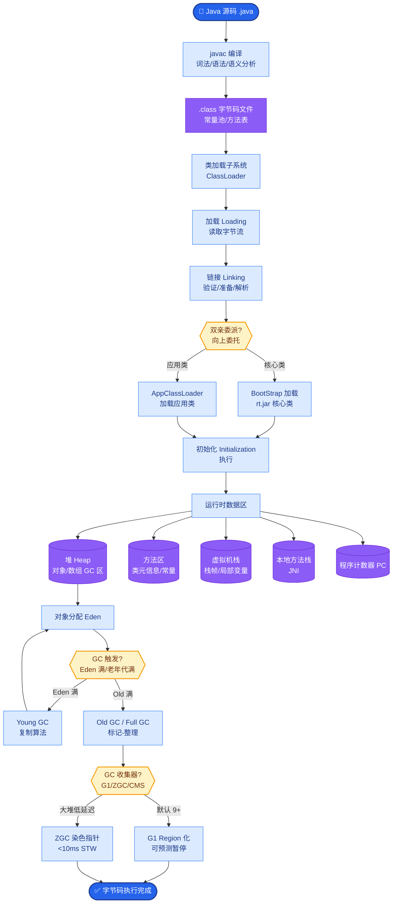

# Vercel AI SDK的核心设计是什么?它如何简化LLM应用的前端开发

- **Vercel AI SDK核心:**

前端(React/Vue/Svelte)与LLM API之间的桥接层.

- **三大模块:**
1. **AI SDK Core** - 统一的LLM调用接口(generateText/streamText)
2. **AI SDK UI** - 前端组件(useChat/useCompletion)
3. **AI SDK RSC** - React Server Components集成

- **核心优势 - 统一Provider:**
```typescript
// 换Provider只需改一行
import { openai } from '@ai-sdk/openai'
// import { anthropic } from '@ai-sdk/anthropic'

const result = await streamText({
  model: openai('gpt-4'),
  // model: anthropic('claude-3.5-sonnet'),
  prompt: 'Hello'
})
```

- **前端流式渲染原理:**
```tsx
const { messages, input, handleSubmit } = useChat()

return (
  <div>
    {messages.map(m => <div key={m.id}>{m.content}</div>)}
    <form onSubmit={handleSubmit}>
      <input value={input} onChange={handleInputChange} />
    </form>
  </div>
)
```

**RSC (React Server Components) 流式传输架构图:**
```text
[Server: Edge Runtime]
│
├─> 1. streamText() 调用 LLM
│    (返回 ReadableStream<Part>)
│
├─> 2. 转换为 React Node 流
│    (AI SDK UI 负责转换文本增量)
│
└─> 3. 通过 HTTP (Transfer-Encoding: chunked) 发送
     │
     ▼
[Client: Browser]
│
├─> 4. React 渲染器接收流
├─> 5. 逐块更新 DOM
│    (用户看到打字机效果)
```

- **适合场景:**
- Next.js/React全栈LLM应用
- 需要流式UI的聊天/生成界面
- 快速原型开发

- **实战案例：** 在高并发场景下，`useChat` 默认将历史消息存在内存中，用户刷新页面会丢失上下文。生产环境必须配合 `useChat` 的 `onFinish` 回调，将消息异步写入 DB 或 KV 存储，并在组件初始化时通过 `initialMessages` 恢复。

- **关键代码：**
```typescript
// 生产环境：持久化消息历史
const { messages, handleSubmit } = useChat({
  onFinish: async (message) => {
    // 流结束后持久化到数据库，防止刷新丢失
    await supabase.from('messages').insert({
      role: message.role,
      content: message.content,
      chat_id: currentChatId
    });
  },
  initialMessages: fetchedHistory // 页面加载时恢复
});
```

## 常见考点
1. **Tool Calling 的流式处理**：AI SDK 如何处理工具调用的流式响应？（答：它解析前缀 `delta.toolCalls` 并在前端逐步构建调用参数）
2. **边缘运行时兼容性**：在 Edge Runtime (如 Vercel Edge) 上使用时有哪些限制？（答：需确保 Provider 支持 fetch API，部分大模型 SDK 依赖 Node.js 原生模块会报错）
3. **状态管理**：useChat 内部如何管理历史消息？（答：维护在 React state 中，且通过 `onFinish` 回调支持持久化到数据库）


## 核心流程图



## 记忆要点

- 核心定位：前端(React)与LLM API的桥接层，统一Provider接口
- 三大模块：Core(调用)、UI(组件)、RSC(服务端组件)，支持流式渲染
- 流式原理：服务端生成文本流，React渲染器逐块更新DOM实现打字机效果
- 生产注意：useChat默认存内存，需用onFinish回调持久化消息防刷新丢失


## 结构化回答

**30 秒电梯演讲：** React应用与LLM流式输出的标准化胶水。——打个比方，像为React专门订做的水管，让大模型的文字像水流一样平滑地流进界面。

**展开框架：**
1. **核心定位** — 前端(React)与LLM API的桥接层，统一Provider接口
2. **三大模块** — Core(调用)、UI(组件)、RSC(服务端组件)，支持流式渲染
3. **流式原理** — 服务端生成文本流，React渲染器逐块更新DOM实现打字机效果

**收尾：** 以上三点都能配合实战聊。我可以展开任一要点，比如「AI SDK的Tool Calling如何在前端使用」这类追问您感兴趣吗？

## 视频脚本

> 预计时长：3 分钟 | 由浅入深

| 时间 | 画面/字幕 | 口播台词 | 讲解要点 |
|------|----------|----------|----------|
| 0:00 | 标题卡 | "Vercel AI SDK的核心设计是什么，30 秒讲清楚。" | 开场钩子 |
| 0:36 | 概念定义动画 | "一句话：React应用与LLM流式输出的标准化胶水。" | 核心定义 |
| 1:12 | 核心定位图解 | "前端(React)与LLM API的桥接层，统一Provider接口" | 核心定位 |
| 1:48 | 三大模块图解 | "Core(调用)、UI(组件)、RSC(服务端组件)，支持流式渲染" | 三大模块 |
| 2:24 | 总结卡 | "记好这几条，面试不慌。下期见。" | 收尾 |
