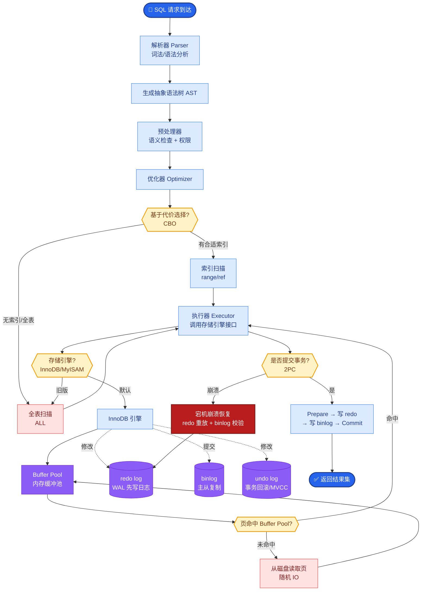

# 生产级RAG系统的分块策略如何设计?有哪些高级分块技术

- **生产级分块策略矩阵:**

| 文档类型 | 推荐策略 | chunk_size | overlap |
|---------|---------|-----------|---------|
| Markdown | 按标题层级 | 256-512 | 50 |
| PDF | 按段落+页面 | 400-800 | 100 |
| 代码 | 按函数/类 | 函数级 | 0 |
| HTML | 按DOM结构 | 300-500 | 50 |
| 对话 | 按轮次 | 200-400 | 0 |

- **高级分块技术:**

1. **语义分块**
- 计算相邻句子的embedding相似度
- 相似度骤降处作为分块边界
- 块边界更符合语义

2. **Late Chunking**
- 先对整个文档做embedding
- 再在embedding空间中分块
- 保留全文上下文信息

3. **Contextual Retrieval(Anthropic)**
- 每个chunk前加一段文档摘要
- 「这段文字来自一篇关于XX的文档,第N部分」
- 解决chunk脱离全文上下文的问题

4. **Agentic Chunking**
- 用LLM判断每段文本是否应该单独成块
- 理解内容后决定分块
- 最精确但成本最高

**语义分块原理示意图:**
```text
文本: ...句A。 [句B。] 句C。句D。 [句E。]...
│
├─> 句子级 Embedding 计算
│
├─> 计算相邻相似度余弦值:
     Sim(A,B) = 0.95
     Sim(B,C) = 0.92
     Sim(C,D) = 0.85
     Sim(D,E) = 0.60  ← 阈值断点
│
└─> 结果: Chunk 1 [A-D], Chunk 2 [E...]
```

- **实战案例：** 在处理法律合同时，简单的按字符分块会将“违约责任”拆散，导致模型在检索时无法关联上下文。改用“语义分块 + 索引父文档”策略后，检索准确率提升了 40%，且模型能引用完整条款。

- **关键代码：**
```python
from semantic_router.encoders import OpenAIEncoder
from semantic_chunkers import SemanticChunker

# 使用语义分块而非固定长度
encoder = OpenAIEncoder()
chunker = SemanticChunker(encoder=encoder)

documents = ["...long legal text..."]
chunks = chunker.split(documents)
# chunks 会在语义转折处自动断开
```

## 常见考点
1. **Overlap 的大小**：如何决定 Overlap 的 token 数？（答：通常为 chunk_size 的 10%-20%，目的是保证语义连续性和关键信息不被切断）
2. **Parent Document Retriever**：如果不想破坏语义完整性怎么办？（答：建立索引时用小 chunk，检索后返回其对应的父文档，即大块）
3. **表格分块**：简单的按行分块会有什么问题？（答：破坏了表头与数据的对应关系，应将表格作为一个整体或按列分块）

## 核心流程图



## 记忆要点

- 基础策略：按文档结构分块，代码按函数、对话按轮次，保留语义完整性
- 高级技术：语义分块(相似度骤降处断开)、Late Chunking(先Embed后分块)
- 上下文增强：Contextual Retrieval给Chunk加文档摘要，解决脱离上下文问题
- 参数设置：Overlap通常设为Chunk Size的10%-20%，防止关键信息被切断

## 结构化回答

**30 秒电梯演讲：** 不仅仅是切字符串，而是保留语义上下文。——打个比方，像切牛排，要顺着纹理切，而不是随意剁，保证每块都有头有尾。

**展开框架：**
1. **基础策略** — 按文档结构分块，代码按函数、对话按轮次，保留语义完整性
2. **高级技术** — 语义分块(相似度骤降处断开)、Late Chunking(先Embed后分块)
3. **上下文增强** — Contextual Retrieval给Chunk加文档摘要，解决脱离上下文问题

**收尾：** 以上三点都能配合实战聊。我可以展开任一要点，比如「Late Chunking如何实现」这类追问您感兴趣吗？

## 视频脚本

> 预计时长：2 分钟 | 由浅入深

| 时间 | 画面/字幕 | 口播台词 | 讲解要点 |
|------|----------|----------|----------|
| 0:00 | 标题卡 | "生产级RAG系统的分块策略如何设计，30 秒讲清楚。" | 开场钩子 |
| 0:30 | 概念定义动画 | "一句话：不仅仅是切字符串，而是保留语义上下文。" | 核心定义 |
| 1:00 | 基础策略图解 | "按文档结构分块，代码按函数、对话按轮次，保留语义完整性" | 基础策略 |
| 1:30 | 总结卡 | "记好这几条，面试不慌。下期见。" | 收尾 |

### 视频流程图


