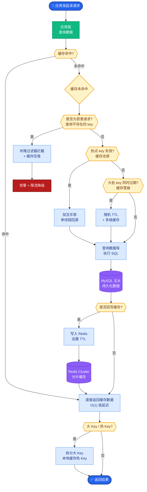

# 如何选择和部署Reranker?自建Reranker vs API Reranker

- **Reranker选择矩阵:**

| 方案 | 类型 | 延迟 | 成本 | 效果 |
|------|------|------|------|------|
| Cohere Rerank | API | 低 | $$ | **最好** |
| BGE-Reranker-Large | 开源 | 中 | 免费 | 很好 |
| BGE-Reranker-Base | 开源 | **低** | 免费 | 好 |
| Jina Reranker | API | 低 | $ | 好 |
| Cross-Encoder-ms-marco | 开源 | 中 | 免费 | 中 |

- **自建Reranker方案:**

1. **数据准备** - 从搜索日志/用户反馈构建训练集
2. **基座选择** - XLM-RoBERTa / DeBERTa-v3
3. **训练方式** - Cross-Encoder,对比学习
4. **蒸馏** - 用大Reranker蒸馏到小模型

- **部署优化:**
- ONNX Runtime加速
- 批量推理(50个候选一起打分)
- GPU缓存模型

- **Pipeline最佳实践:**
```
向量检索Top-100 → Reranker精排Top-10 → 取Top-3-5注入Prompt
```

- **效果对比:**
- 无Rerank: Recall@5 = 62%
- 有Rerank: Recall@5 = **85%**(+23%)

**Cross-Encoder (Reranker) 处理流程:**
```text
输入: Query, Doc[0...99] (Top 100)
│
├─> Bi-Encoder (检索阶段, 已完成)
│    仅计算 Query/Doc 独立向量, 无法交互
│
├─> Cross-Encoder (重排阶段)
    For each Doc[i]:
       Input: [CLS] Query [SEP] Doc[i] [SEP]
       Output: Relevance_Score (0~1)
    │
    └─> 串行计算或小批量计算 (GPU利用关键)
│
└─> Sort by Score Descending → Top-K
```

- **实战案例：** 在电商搜索中，使用 Cohere Rerank API 后，由于 Top-5 结果的相关性极高，CTR（点击率）提升了 15%。但为控制 API 成本，实际架构中采用了“策略”：只有当向量检索的分数低于阈值时，才触发 Rerank API 调用。

- **关键代码：**
```python
from sentence_transformers import CrossEncoder

# 生产部署：批量推理优化，避免逐个计算（非常慢）
model = CrossEncoder('BAAI/bge-reranker-base')

# 构造成对输入 [query, doc1], [query, doc2]...
pairs = [[query, doc] for doc in top_k_docs]

# 一次性批量打分，充分利用GPU并行能力
scores = model.predict(pairs)

# 重新排序
reranked_docs = sorted(zip(top_k_docs, scores), key=lambda x: x[1], reverse=True)
```

## 常见考点
1. **串行 vs 并行**：Reranker 通常需要将 Query 和每个 Doc 进行交叉计算，这在大规模 Top-K（如 1000）下如何优化？（答：使用 GPU Batch 推理，将 Query 复制拼接到所有 Doc 上，一次性送入模型计算）
2. **截断策略**：Reranker 模型的 Context Length 通常较短（如 512），长文档如何处理？（答：只截取文档的前 N 个 Token 或先用滑动窗口分段打分再聚合）
3. **混合检索**：能否替代 Reranker？（答：混合检索（向量+关键词）可提升召回，但难以替代 Reranker 的精细排序能力，通常作为前置步骤）


## 核心流程图



## 记忆要点

- 选型矩阵：Cohere API效果最好，BGE开源性价比高，需权衡成本与延迟
- Pipeline流程：向量检索Top-100 → Reranker精排Top-10 → 取Top-3注入Prompt
- 部署优化：使用ONNX加速，批量推理(一次打分多个Doc)提升GPU利用率
- 截断策略：Reranker Context Length较短，长文档需截取前N个Token或分段


## 结构化回答

**30 秒电梯演讲：** 用交叉注意力模型对粗排结果做精细重排，以少量延迟换大幅效果提升。——打个比方，先让保安（向量检索）拦住一堆嫌疑人，再让侦探（Reranker）仔细审问找出真凶。

**展开框架：**
1. **选型矩阵** — Cohere API效果最好，BGE开源性价比高，需权衡成本与延迟
2. **Pipeline** — Pipeline流程：向量检索Top-100 → Reranker精排Top-10 → 取Top-3注入Prompt
3. **部署优化** — 使用ONNX加速，批量推理(一次打分多个Doc)提升GPU利用率

**收尾：** 以上三点都能配合实战聊。我可以展开任一要点，比如「Cross-Encoder如何训练」这类追问您感兴趣吗？

## 视频脚本

> 预计时长：3 分钟 | 由浅入深

| 时间 | 画面/字幕 | 口播台词 | 讲解要点 |
|------|----------|----------|----------|
| 0:00 | 标题卡 | "选择和部署Reranker，30 秒讲清楚。" | 开场钩子 |
| 0:36 | 概念定义动画 | "一句话：用交叉注意力模型对粗排结果做精细重排，以少量延迟换大幅效果提升。" | 核心定义 |
| 1:12 | 选型矩阵图解 | "Cohere API效果最好，BGE开源性价比高，需权衡成本与延迟" | 选型矩阵 |
| 1:48 | Pipeline流程图解 | "向量检索Top-100 → Reranker精排Top-10 → 取Top-3注入Prompt" | Pipeline流程 |
| 2:24 | 总结卡 | "记好这几条，面试不慌。下期见。" | 收尾 |
