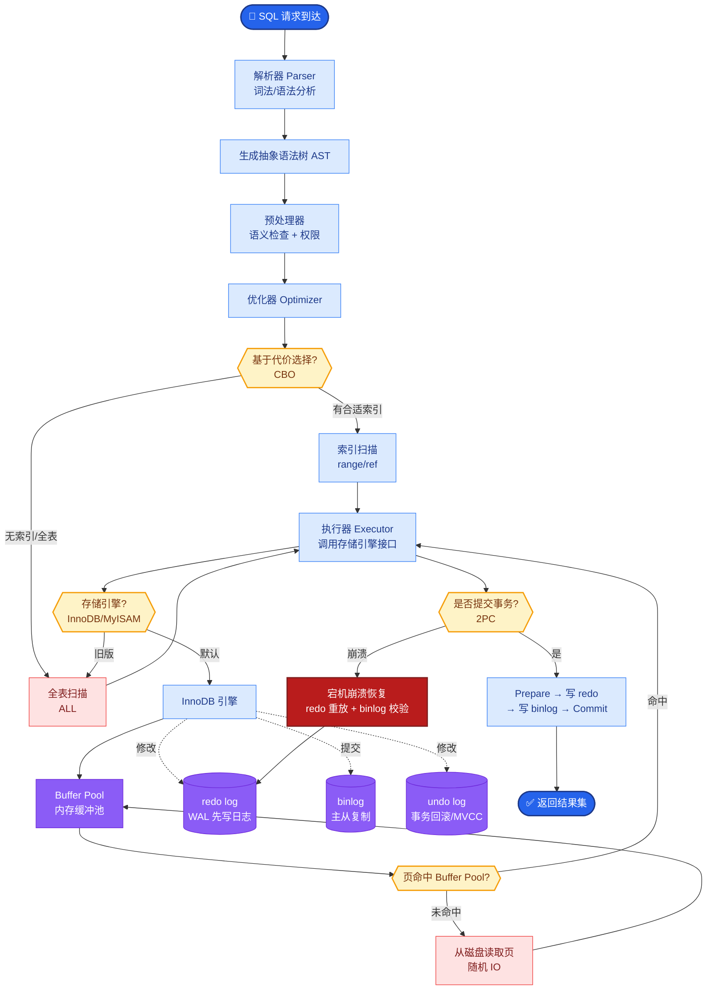

# 向量数据库中的PQ(Product Quantization)和SQ(Scalar Quantization)是什么?如何选择

- **向量量化目标:** 在尽量保持精度的前提下，压缩向量存储空间，利用SIMD指令加速距离计算，减少内存带宽瓶颈。

- **SQ (Scalar Quantization - 标量量化):**
- **原理**: 独立压缩向量的每一个维度。通过统计所有向量在该维度的 Min/Max 值，将 FP32 [Min, Max] 线性映射为 INT8 [0, 255] 或 INT8 [-128, 127]。
- **压缩比**: 4:1 (FP32 → INT8)。
- **精度损失**: 极小 (<1%)，适合对精度敏感的场景。
- **计算优化**: 查询时利用 CPU 的 AVX-512 或 GPU 的 Tensor Core 进行 INT8 加速。

- **PQ (Product Quantization - 乘积量化):**
- **原理**: 将一个高维向量（如1024维）切分成 M 个子向量（如 M=64，每个16维）。对每个子向量空间独立进行 K-Means 聚类（如 K=256），存储聚类中心 ID（1 Byte）而非原始向量。
- **压缩比**: 极高 (32:1 ~ 64:1)。原始向量 4KB 可被压缩至 64-128 Bytes。
- **精度损失**: 较大 (3-8%)，因为丢失了子空间内的部分精细信息。
- **距离计算**: 查询时，不需要解码向量，而是查表计算与聚类中心的距离。

- **对比:**

| 特性 | SQ (Scalar) | PQ (Product) |
|--|-----|-----|
| 压缩比 | 4:1 | **32:1 (甚至更高)** |
| 精度损失 | **<1%** | 3-8% |
| 计算速度 | 快 (SIMD友好) | **最快 (查表计算)** |
| 内存节省 | 4x | **32x** |
| 适用场景 | 通用场景，平衡性能与精度 | **超大规模，成本优先** |

- **架构流程:**
```
原始向量 (FP32)
   │
   ├─[SQ]───────────────────────────> [Min, Max] 查找表 ──> INT8 向量
   │
   └─[PQ]──> [切分] ──> [Subvector 0] [Subvector 1] ... [Subvector M]
                              │              │               │n                              v              v               v
                           (K-means)      (K-means)       (K-means)
                           Codebook 0     Codebook 1      Codebook M
```

- **实战案例**：在一个拥有 5 亿向量的图像检索系统中，全量 FP32 存储 768 维向量需要约 1.4TB 内存，成本极高。我们采用了 **IVF+PQ** 的混合索引方案，将内存占用降低到 80GB 以内。虽然 PQ 粗排的精度略有下降，但我们通过"检索100个候选集，再回表用 FP32 重排序"的策略，最终端到端的召回率仅损失了 0.8%，但硬件成本节省了 90%。

- **关键代码**：
```python
import faiss

nlist = 10000          # 聚类中心数
m = 64                 # PQ 切分的子向量数量
bits = 8               # 每个子向量编码位数 (8 bits = 256 clusters)

quantizer = faiss.IndexFlatL2(768)  # 基础量化器
index = faiss.IndexIVFPQ(quantizer, 768, nlist, m, bits)

# 训练聚类中心 (需要样本数据)
index.train(training_vectors)

# 添加向量 (会自动进行 PQ 编码)
index.add(vectors)

# 搜索时返回的是 PQ 近似距离，通常需要结合原始向量重排序
D, I = index.search(query_vector, k=100)
```

- **对比表格**：

| 量化策略 | 内存占用 | 召回率 | 查询延迟 | 训练成本 | 典型应用 |
| :--- | :--- | :--- | :--- | :--- | :--- |
| **FP32 (无量化)** | 100% (基准) | 100% | 慢 (带宽瓶颈) | 无 | 小规模数据集 (< 1M) |
| **SQ (INT8)** | 25% | 99%+ | 中等 | 极低 | 中大规模，追求高精度 |
| **PQ (8bit)** | ~6% | 90-95% | **快** | 高 (需K-Means) | 超大规模，节省显存/内存 |
| **PQ + Refine** | ~6% + 少量FP32 | 98%+ | 中等 (多一步计算) | 高 | 搜索引擎两阶段检索 |

- **## 常见考点**
1. **OPQ (Optimized Product Quantization)**：在PQ之前加一个旋转矩阵，让数据分布更适合切分，进一步提高精度（Milvus支持）。
2. **计算细节**：PQ搜索时的“查表”操作是如何避免完整向量解码的（ADC: Asymmetric Distance Computation）。
3. **重排序**：使用PQ召回后，为何通常需要用原始FP32向量进行一次重排序以弥补精度损失。
4. **内存带宽**：解释为何量化能加速计算（不仅仅是省内存，更重要的是减少内存传输延迟）。

## 核心流程图



## 记忆要点

- SQ标量量化：逐维压缩FP32至INT8，精度损失<1%，适合通用场景，利用SIMD加速。
- PQ乘积量化：切分子向量K-Means聚类，压缩比32:1，查表计算最快，适合超大规模。
- 选择策略：精度敏感选SQ；成本优先选PQ；实战常用IVF+PQ粗排，FP32重排序保召回。

## 结构化回答

**30 秒电梯演讲：** 通过降低向量精度（标量或分段）大幅压缩内存，以微小的精度损失换取成本和速度优势。——打个比方，把高清照片（FP32）压缩成标清图（INT8）存储，看的时候依然能认出人，但省空间。

**展开框架：**
1. **SQ标量量化** — 逐维压缩FP32至INT8，精度损失<1%，适合通用场景，利用SIMD加速。
2. **PQ乘积量化** — 切分子向量K-Means聚类，压缩比32:1，查表计算最快，适合超大规模。
3. **选择策略** — 精度敏感选SQ；成本优先选PQ；实战常用IVF+PQ粗排，FP32重排序保召回。

**收尾：** 以上三点都能配合实战聊。我可以展开任一要点，比如「PQ的M值如何选择」这类追问您感兴趣吗？

## 视频脚本

> 预计时长：2 分钟 | 由浅入深

| 时间 | 画面/字幕 | 口播台词 | 讲解要点 |
|------|----------|----------|----------|
| 0:00 | 标题卡 | "向量数据库中的PQ(Product Quantization)和SQ(Scala，30 秒讲清楚。" | 开场钩子 |
| 0:30 | 概念定义动画 | "一句话：通过降低向量精度（标量或分段）大幅压缩内存，以微小的精度损失换取成本和速度优势。" | 核心定义 |
| 1:00 | SQ标量量化图解 | "逐维压缩FP32至INT8，精度损失<1%，适合通用场景，利用SIMD加速。" | SQ标量量化 |
| 1:30 | 总结卡 | "记好这几条，面试不慌。下期见。" | 收尾 |

### 视频流程图


