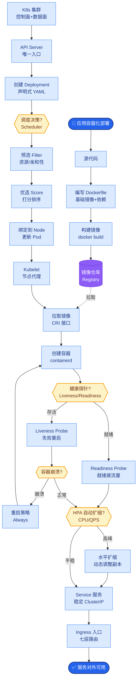

# Ollama的架构设计有什么巧妙之处?它为什么能成为本地LLM部署的标准

- **Ollama核心设计:**

1. **极简体验 (开发者友好)**
```bash
curl -fsSL https://ollama.ai/install | sh
ollama run llama3.2
```
无需配置Python venv、CUDA驱动或Conda环境，封装了所有复杂性。

2. **Modelfile (模型可编程)**: 类似Dockerfile，允许用户基于基础模型进行微调配置。
```dockerfile
FROM llama3.2
SYSTEM "你是中文助手"
PARAMETER temperature 0.7
PARAMETER num_ctx 4096  # 上下文长度
```

3. **GGUF格式与llama.cpp集成**
- **底层核心**: Ollama本质是llama.cpp的高层封装。
- **GGUF (GPT-Generated Unified Format)**: 单文件格式，包含模型权重、词表、配置参数，支持任意量化等级 (Q4_K_M, Q8_0)。
- **推理**: 支持CPU/GPU混合推理，自动卸载层到GPU（Metal/ROCm/CUDA）。

- **为什么成为标准:**

| 优势 | 说明 |
|------|------|
| **极简安装** | 无需CUDA/Python环境，屏蔽底层差异 |
| **模型管理** | `ollama pull/push/rm` 类似Docker体验，自带模型库 |
| **API兼容** | 原生提供 /v1/chat/completions 兼容OpenAI SDK |
| **多平台** | macOS/Linux/Windows(RSM) 全覆盖 |
| **GPU自动** | 自动检测并调用GPU，无需手动指定device |

- **架构设计:**
```
┌─────────────┐     HTTP/API     ┌──────────────────┐
│   Client    │ ────────────────> │  Ollama Server   │
│ (CLI/App)   │ <──────────────── │ (本地 11434)     │
└─────────────┘     REST/Stream   └────────┬─────────┘
                                              │
                                     ┌────────▼─────────┐
                                     │  GGUF Loader     │
                                     └────────┬─────────┘
                                              │
                                     ┌────────▼─────────┐
                                     │   llama.cpp      │
                                     │ (Graph Execution)│
                                     └────────┬─────────┘
                                              │
                           ┌──────────────────┼──────────────────┐
                           ▼                  ▼                  ▼
                     ┌──────────┐       ┌──────────┐       ┌──────────┐
                     │   CPU    │       │  Apple   │       │ NVIDIA   │
                     │ (BLAS)   │       │  Metal   │       │  CUDA    │
                     └──────────┘       └──────────┘       └────────────────
```

- **实战案例:**
我们在开发一个离线数据清洗工具时，利用 Ollama 的 `MODELFIELDS` 和本地 API 能力，在纯内网环境下快速部署了 Qwen2.5-7B。通过编写 Modelfile 自定义系统提示词，配合简单的 Python 脚本调用 `localhost:11434`，无需任何 GPU 驱动配置即可在普通办公机上稳定运行，解决了内网数据无法出域处理的安全合规痛点。

- **代码示例:**
```dockerfile
# Modelfile 实战：针对 JSON 格式输出的优化配置
FROM qwen2.5:7b

# 设置强制 JSON 输出的系统提示
SYSTEM You are a data extraction API. Output ONLY valid JSON.

# 调整参数以减少幻觉
PARAMETER temperature 0
PARAMETER num_ctx 8192
PARAMETER repeat_penalty 1.1
```

```python
# 使用 LangChain 兼容 Ollama
from langchain_ollama import ChatOllama

llm = ChatOllama(
    model="qwen2.5:7b", 
    temperature=0,
    num_predict=1024,
    # f16_kv=True  # 实战中针对显存较小的卡开启KV量化
)
res = llm.invoke("Extract names from: Alice and Bob")
```


## 核心流程图



## 记忆要点

- 核心架构：llama.cpp后端 + GGUF单文件格式，支持CPU/GPU混合推理。
- 极简体验：屏蔽环境配置，Modelfile实现模型可编程，API兼容OpenAI。
- 成为标准原因：跨平台支持、Docker式模型管理、一键启动、自动调用GPU。


## 结构化回答

**30 秒电梯演讲：** 封装llama.cpp和GGUF生态，提供类似Docker的极简模型管理和部署体验。——打个比方，大模型的“App Store”，下载即用，不用管底层的驱动和依赖。

**展开框架：**
1. **核心架构** — llama.cpp后端 + GGUF单文件格式，支持CPU/GPU混合推理。
2. **极简体验** — 屏蔽环境配置，Modelfile实现模型可编程，API兼容OpenAI。
3. **成为标准原因** — 跨平台支持、Docker式模型管理、一键启动、自动调用GPU。

**收尾：** 以上三点都能配合实战聊。我可以展开任一要点，比如「GGUF格式和Safetensors有什么区别」这类追问您感兴趣吗？

## 视频脚本

> 预计时长：4 分钟 | 由浅入深

| 时间 | 画面/字幕 | 口播台词 | 讲解要点 |
|------|----------|----------|----------|
| 0:00 | 标题卡 | "Ollama的架构设计有什么巧妙之处，30 秒讲清楚。" | 开场钩子 |
| 0:40 | 概念定义动画 | "一句话：封装llama.cpp和GGUF生态，提供类似Docker的极简模型管理和部署体验。" | 核心定义 |
| 1:20 | 核心架构图解 | "llama.cpp后端 + GGUF单文件格式，支持CPU/GPU混合推理。" | 核心架构 |
| 2:00 | 极简体验图解 | "屏蔽环境配置，Modelfile实现模型可编程，API兼容OpenAI。" | 极简体验 |
| 2:40 | 成为标准原因图解 | "跨平台支持、Docker式模型管理、一键启动、自动调用GPU。" | 成为标准原因 |
| 3:20 | 总结卡 | "记好这几条，面试不慌。下期见。" | 收尾 |
