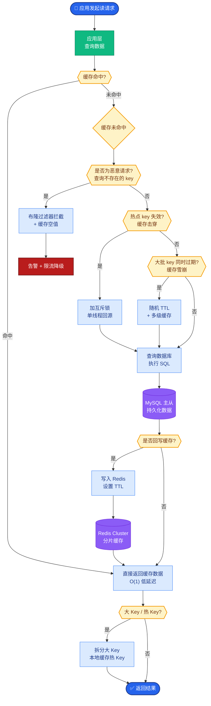
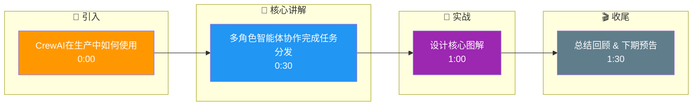

# CrewAI在生产中如何使用?有哪些常见的坑

- **CrewAI生产最佳实践:**

CrewAI 基于 **Role-Playing**（角色扮演）理念，通过定义 Agent、Task 和 Crew 来模拟团队协作。

- **1. Agent设计**
- **Role**: 明确具体的职位（如“高级数据分析师”而非“助手”），避免角色模糊。
- **Goal**: 具体的业务目标。
- **Backstory**: 设定背景，让LLM理解上下文。
- **Tools**: **精确挂载工具**，不要给Agent过多无关工具，以免干扰LLM决策。

- **2. Task设计**
- **Context**: 明确上下游依赖。
- **Expected Output**: **强制要求输出格式**（如JSON、Markdown表格），方便下游程序解析。
- **Async**: 优先使用异步执行 (`async=True`) 提高并发效率。

- **3. 常见的坑与解决:**

| 坑 | 症状 | 解决 |
|----|------|------|
| 角色重叠 | Agent互相抢任务，意见冲突 | 明确职责边界，使用不同层级 |
| 无限委派 | Manager不停委派，死循环 | 设置 `allow_delegation=False`，限制委托层级 |
| Token爆炸 | Context长度无限增长 | 启用 `memory=True` 但需限制记忆长度，或设置 `max_iter` |
| 格式不一致 | 下游Agent/代码无法解析 | 使用 Pydantic Model 定义 `output_json_pydantic` |
| 工具幻觉 | Agent调用不存在的工具或参数错误 | 在 Tool Description 中写清参数格式，或加 Guardrails |

- **4. 性能优化:**
- **分级模型**: 简单任务（如提取、总结）用小模型/快模型；复杂推理用大模型。
- **缓存**: 开启 LLM 缓存，避免重复思考相同内容。
- **并行执行**: 使用 `Process` 类让没有依赖的 Task 并行执行。
- **限流**: 设置 `max_rpm` (每分钟最大请求数)，防止触发 API Rate Limit。

- **CrewAI 执行流程:**
```
1. Define Crew (Manager + Agents)
       │
2. Kickoff (Input)
       │
       ▼
┌──────────────────┐
│   Manager Agent  │ ← 决定谁执行下一个Task
│  (Hierarchical)  │
└────────┬─────────┘
         │
    ┌────┴────┬─────────┐
    ▼         ▼         ▼
 Task A    Task B    Task C (Parallel)
    │         │         │
    ▼         ▼         ▼
 Agent 1   Agent 2   Agent 3
    │         │         │
    └─────────┴─────────┘
              │
              ▼
      Final Output (RAG/JSON)
```

- **实战案例:**
在构建自动化研报生成系统时，我们遇到“Token爆炸”问题，因为每轮对话都会将之前的完整报告塞入上下文。通过引入 CrewAI 的 `memory=True` 并配合自定义的短期记忆机制，仅将前序 Agent 的关键结论摘要传递给下一个 Agent，成功将单次生成的 Token 消耗降低了 60%，同时结合 Pydantic 强制输出格式，解决了后端解析 JSON 报错导致流程中断的稳定性问题。

- **代码示例:**
```python
from crewai import Agent, Task, Crew, Process
from pydantic import BaseModel

# 1. 使用 Pydantic 定义严格输出格式
class MarketReport(BaseModel):
    summary: str
    key_trends: list[str]
    risk_level: str

researcher = Agent(
    role="Senior Research Analyst",
    goal="Discover cutting-edge developments",
    backstory="You are an expert analyst",
    tools=[search_tool],
    verbose=True
)

task1 = Task(
    description="Research AI trends",
    expected_output="A markdown report",
    output_json_pydantic=MarketReport # 强制结构化输出
)

crew = Crew(
    agents=[researcher],
    tasks=[task1],
    process=Process.hierarchical,
    memory=True # 启用记忆
)
```

- **边界情况**：
1. **工具执行超时**：外部工具（如API查询）如果未设置超时，会导致整个Crew挂起。需在Tool定义中添加超时参数，并考虑增加超时重试机制。
2. **空输入/无意义输入**：当上游Task失败或返回空字符串时，下游Agent可能产生幻觉或崩溃。需在Agent的Prompt中增加“如果输入不足，请输出特定的占位符（如 'N/A'）”的指令。
3. **并发数限制**：在高并发场景下，`Process.parallel` 可能瞬间耗尽LLM的Rate Limit或本地内存。需根据实际并发能力限制Crew的实例化数量或使用消息队列缓冲。

- **## 面试追问**
1. 如果某个Agent的工具调用失败了，CrewAI默认行为是什么？如何自定义错误恢复策略？（如：是直接报错终止，还是重试，还是由Manager重新指派？）
2. 在Hierarchical模式下，Manager Agent的Token消耗往往很大，你如何优化Manager的Prompt或上下文以降低成本？
3. CrewAI的Memory机制在生产环境中如何持久化？（例如：如何将Agent的记忆存储在Redis中以便跨会话复用？）

- **## 易错点**
1. **过度依赖 `allow_delegation`**：认为开启自动委派就能解决所有问题，但实际上如果不限制层级，会导致“踢皮球”现象，甚至陷入无限递归调用。
2. **忽略 `output_json_pydantic` 的容错性**：虽然Pydantic强制了格式，但如果LLM输出的是代码块包裹的JSON（```json ... ```），直接解析会失败。需要预处理输出字符串或配置LLM允许直接输出Raw Text。

## 核心流程图



## 记忆要点

- 设计核心：Role-Playing角色扮演，明确Agent职责与Goal，避免角色重叠。
- 常见坑：无限委派致死循环，需限制allow_delegation；Token爆炸需限制记忆长度。
- 最佳实践：强制Pydantic输出格式，简单任务用小模型，开启异步并行。

## 结构化回答

**30 秒电梯演讲：** 多角色智能体协作完成任务分发——打个比方，像公司里不同部门员工协作完成项目

**展开框架：**
1. **设计核心** — Role-Playing角色扮演，明确Agent职责与Goal，避免角色重叠。
2. **常见坑** — 无限委派致死循环，需限制allow_delegation；Token爆炸需限制记忆长度。
3. **最佳实践** — 强制Pydantic输出格式，简单任务用小模型，开启异步并行。

**收尾：** 以上三点都能配合实战聊。我可以展开任一要点，比如「如何调试CrewAI的Agent行为」这类追问您感兴趣吗？

## 视频脚本

> 预计时长：2 分钟 | 由浅入深

| 时间 | 画面/字幕 | 口播台词 | 讲解要点 |
|------|----------|----------|----------|
| 0:00 | 标题卡 | "CrewAI在生产中如何使用，30 秒讲清楚。" | 开场钩子 |
| 0:30 | 概念定义动画 | "一句话：多角色智能体协作完成任务分发" | 核心定义 |
| 1:00 | 设计核心图解 | "Role-Playing角色扮演，明确Agent职责与Goal，避免角色重叠。" | 设计核心 |
| 1:30 | 总结卡 | "记好这几条，面试不慌。下期见。" | 收尾 |

### 视频流程图




