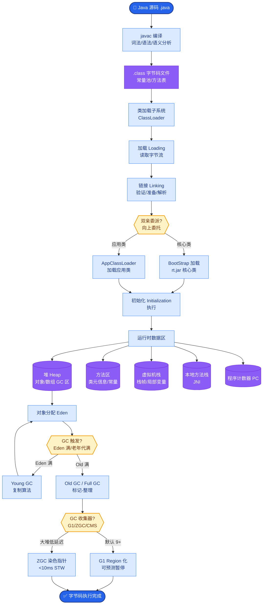

# LangSmith如何用于LLM应用的可观测性?核心功能有哪些

- **LangSmith核心功能:**

1. **Trace(追踪)** - 可视化每一步的执行链,每个LLM调用的完整input/output,Token消耗和延迟

2. **Datasets(数据集)** - 从生产Trace中创建评估数据集,手动标注/修正

3. **Evaluation(评估)** - 在数据集上运行应用,自动评估(LLM-as-judge),版本对比

4. **Playground(实验场)** - 修改prompt后立即测试,A/B对比效果

- **调用链路与数据流:**

```text
App (LangChain/LangGraph)
   │
   ├─> LangChain SDK (自动捕获上下文)
   │      │
   │      └─> POST /runs (发送到LangSmith API)
   │             │
   │             ▼
   ┌─────────────────────────────┐
   │      LangSmith Platform     │
   │  ┌───────┐ ┌───────┐ ┌─────┐│
   │  │ Traces│ │  Eval │ │Data ││
   │  └───────┘ └───────┘ └─────┘│
   └─────────────────────────────┘
```

- **实战案例：** 某客服机器人回答准确率突然下降，利用 LangSmith 的 "Compare Runs" 功能，将最近失败的 Trace 与上周成功的 Trace 并排对比，发现 System Prompt 在一次热更中意外丢失了“拒绝回答敏感问题”的指令。

- **集成方式:**
设置环境变量`LANGCHAIN_TRACING_V2=true`和`LANGCHAIN_API_KEY`,自动追踪所有LangChain/LangGraph调用

- **非LangChain应用:** 使用LangSmith SDK手动添加trace (需构建 RunTree 结构)

- **关键代码示例 (非 LangChain 集成):**
```python
from langsmith import Client
client = Client()

# 手动创建 Trace 树
with client.trace(name="manual_agent_run", session_id="user_123") as run:
    llm_result = call_openai_api("Hello") # 假设这是原生调用
    run.end(output={"response": llm_result})
    # 添加元数据或标签方便检索
    run.metadata = {"version": "v1.2", "env": "prod"}
```

- **功能特性对比：**

| 特性 | LangSmith | 传统 APM (如 Datadog) | 自研系统 |
| :--- | :--- | :--- | :--- |
| **LLM 细节** | LLM I/O, Token, Prompt 模板 | 仅 HTTP 调用/延迟 | 取决于实现 |
| **数据评估** | 内置 LLM-as-a-Judge | 无 | 需开发 |
| **迭代闭环** | 一键从 Trace 创建 Dataset | 困难 | 困难 |

- **定价:** 免费5K traces/月,之后按量付费

- **边界情况**：
1. **高并发下的采样策略**：在生产高流量（如 QPS > 100）场景，全量 Trace 上传会导致网络带宽瓶颈和成本爆炸。需配置 `sampling_rate`（如仅采集 10% 或基于错误的动态采样）。
2. **超大上下文截断**：当输入 prompt 超过 LangSmith 单次显示上限（如 128k 字符）时，UI 可能只显示部分内容，导致调试困难。需利用 Metadata 字段存储摘要信息。
3. **嵌套循环 Trace**：在递归调用或死循环场景下，Trace 树深度可能过深导致渲染卡顿。需在应用层设置 `max_execution_steps` 并在 Trace 中标记，防止树形结构无限生长。

- **## 面试追问**
1. LangSmith 的 `feedback` 功能如何与业务指标（如用户点赞率）关联？是通过 API 异步回调吗？
2. 在 LangSmith 中进行 Evaluation 时，如果评估器本身也是 LLM（LLM-as-a-Judge），如何避免评估本身的成本过高或偏见？（例如：使用小模型评估，或使用少数投票）
3. LangSmith 如何保证数据在传输过程中的安全性？是否支持 VPC Peering 或私有化部署？

- **## 易错点**
1. **混淆 Tracing 和 Evaluation**：认为只要接入了 LangSmith 就能自动评估应用质量。实际上 Tracing 只是记录，必须手动配置 Evaluator（如正确性、相关性检测）并运行 Dataset 才能生成评分。
2. **忽视 Session ID 的重要性**：如果不传入统一的 `session_id`，LangSmith 会将每一次请求视为孤立事件，无法还原用户的完整对话上下文（Session 级别的 Replay 功能会失效）。

## 核心流程图



## 记忆要点

- 核心功能：Trace可视化追踪、Dataset数据集管理、Evaluation自动评估。
- 集成方式：设置环境变量自动追踪LangChain调用，非SDK需手动构建RunTree。
- 闭环迭代：从Trace创建Dataset，评估后对比Prompt版本，实现快速优化。

## 结构化回答

**30 秒电梯演讲：** LLM应用的全链路调试、评估与可视化平台——打个比方，软件的黑盒录像机，能回放每一步思考

**展开框架：**
1. **核心功能** — Trace可视化追踪、Dataset数据集管理、Evaluation自动评估。
2. **集成方式** — 设置环境变量自动追踪LangChain调用，非SDK需手动构建RunTree。
3. **闭环迭代** — 从Trace创建Dataset，评估后对比Prompt版本，实现快速优化。

**收尾：** 以上三点都能配合实战聊。我可以展开任一要点，比如「如何从Trace创建评估数据集」这类追问您感兴趣吗？

## 视频脚本

> 预计时长：2 分钟 | 由浅入深

| 时间 | 画面/字幕 | 口播台词 | 讲解要点 |
|------|----------|----------|----------|
| 0:00 | 标题卡 | "LangSmith如何用于LLM应用的可观测性，30 秒讲清楚。" | 开场钩子 |
| 0:30 | 概念定义动画 | "一句话：LLM应用的全链路调试、评估与可视化平台" | 核心定义 |
| 1:00 | 核心功能图解 | "Trace可视化追踪、Dataset数据集管理、Evaluation自动评估。" | 核心功能 |
| 1:30 | 总结卡 | "记好这几条，面试不慌。下期见。" | 收尾 |

### 视频流程图


