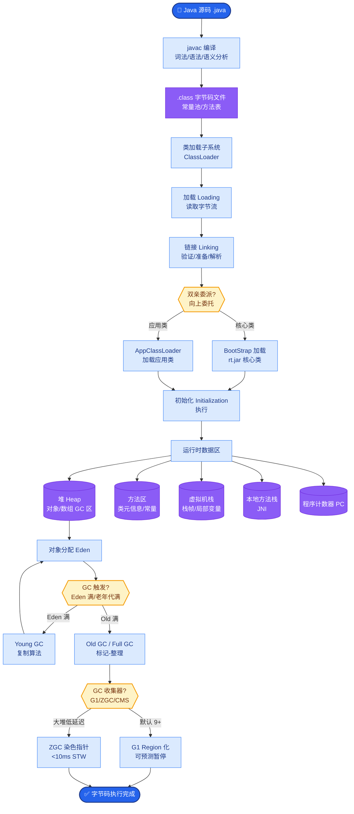

# Phoenix(Arize)如何实现LLM可观测性?它和LangSmith有什么区别

- **Phoenix核心:开源LLM可观测性**

- **功能:**
1. **Tracing** - 基于 OpenTelemetry 标准，自动或手动注入
2. **Evaluations** - LLM自动评估，包括幻觉率、相关性、毒性检测
3. **Datasets** - 从 trace 创建数据集，用于离线评估
4. **Embedding分析** - 向量空间可视化，聚类识别异常

- **Phoenix 架构 (基于 OTEL):**

```text
Client App (LlamaIndex / LangChain)
   │ (OpenTelemetry Protocol / OTEL Collector)
   ▼
┌──────────────────────┐
│   Phoenix Server     │
│  (Docker / Localhost)│
│  ┌────────────────┐  │
│  │  Span Store    │  │
│  │  (In-Memory/DB)│  │
│  └────────────────┘  │
└──────────────────────┘
   │
   ▼
 Phoenix UI (localhost:6006)
```

- **vs LangSmith:**

| | LangSmith | Phoenix |
|--|-----------|---------|
| 开源 | 否 | **是** |
| 部署 | SaaS | **自托管** |
| 框架依赖 | LangChain优先 | **框架无关** |
| 价格 | 免费5K/月 | **完全免费** |
| OpenTelemetry | 否 | **是** |
| 数据隐私 | 上传到SaaS | **数据不出本地** |

- **适用场景:**
- 数据敏感(医疗/金融)→ Phoenix自托管
- LangChain生态 → LangSmith集成更深
- 多框架混用 → Phoenix框架无关

- **实战案例：** 在处理包含用户PII（身份证号）的RAG场景中，企业无法将数据上传至 LangSmith SaaS。通过部署本地 Phoenix，并在 OTEL Collector 中配置红理规则，实现了既保留调用链上下文用于调试，又实时脱敏敏感数据的合规方案。

- **关键代码示例 (自定义评估器):**
```python
from phoenix.evals import llm_evaluate, OpenAIModel

# 定义自定义的合规性评估模板
QACORRECTNESS_PROMPT_TEMPLATE = """
你是一个合规专家。请评估以下问答是否包含偏见。
Question: {input}
Answer: {output}
返回 'pass' 或 'fail'。
"""

eval_result = llm_evaluate(
    dataframe=trace_df,
    model=OpenAIModel(model="gpt-4o"),
    template=QACORRECTNESS_PROMPT_TEMPLATE,
    provide_explanation=True
)
```

- **边界情况**：
1. **内存泄漏风险**：Phoenix 默认使用 In-Memory 存储数据，如果长时间运行且流量巨大，可能导致 OOM（Out of Memory）。生产环境必须配置外部数据库（如 Postgres 或 ClickHouse）作为后端存储。
2. **OTEL 数据丢失**：在处理突发流量时，如果 Phoenix Server 消费速度慢于生产速度，OTEL Exporter 可能会丢包。需配置批处理策略和本地缓冲队列。
3. **Embedding 计算延迟**：开启 Embedding 分析需要对 Trace 中的文本进行向量化计算。当数据量达到百万级时，实时计算会导致 UI 响应变慢，建议对历史数据进行离线预处理。

- **## 面试追问**
1. Phoenix 的 `arize_phoenix` 和 `openinference` 标准有什么关系？为什么要推动 LLM Tracing 的标准化？
2. 如何在 Phoenix 中实现“根因分析”？当检测到幻觉率飙升时，如何通过数据钻取定位是特定的 RAG 文档块还是模型参数问题？
3. 如果应用使用了非主流的 LLM（如本地部署的 Llama 3），Phoenix 的 Tracer 能否自动捕获 Token 计数？如果不能，如何手动上报？

- **## 易错点**
1. **混淆评估时机**：认为 Phoenix 会在 Trace 产生时实时计算评估指标。实际上默认情况下，Trace 和 Evaluation 是分开的，通常需要手动触发评估任务或在代码中启动后台评估作业。
2. **忽视 Span 属性命名**：在手动上报 Trace 时，如果使用了非 OpenInference 标准的属性名（例如用 `prompt` 代替 `input.value`），Phoenix UI 将无法正确解析显示这些关键信息，导致看板数据缺失。


## 核心流程图



## 记忆要点

- Phoenix：基于OpenTelemetry标准的开源方案，支持自托管，数据不出本地。
- 对比LangSmith：Phoenix免费且框架无关，LangSmith集成深但为SaaS。
- 适用场景：数据敏感/金融医疗选Phoenix；LangChain生态选LangSmith。


## 结构化回答

**30 秒电梯演讲：** 基于OpenTelemetry的开源LLM观测工具——打个比方，自己搭建监控室，不把录像传给别人

**展开框架：**
1. **Phoenix** — 基于OpenTelemetry标准的开源方案，支持自托管，数据不出本地。
2. **对比LangSm** — 对比LangSmith：Phoenix免费且框架无关，LangSmith集成深但为SaaS。
3. **适用场景** — 数据敏感/金融医疗选Phoenix；LangChain生态选LangSmith。

**收尾：** 以上三点都能配合实战聊。我可以展开任一要点，比如「Phoenix如何做LLM评估」这类追问您感兴趣吗？

## 视频脚本

> 预计时长：2 分钟 | 由浅入深

| 时间 | 画面/字幕 | 口播台词 | 讲解要点 |
|------|----------|----------|----------|
| 0:00 | 标题卡 | "Phoenix(Arize)如何实现LLM可观测性，30 秒讲清楚。" | 开场钩子 |
| 0:30 | 概念定义动画 | "一句话：基于OpenTelemetry的开源LLM观测工具" | 核心定义 |
| 1:00 | Phoenix图解 | "基于OpenTelemetry标准的开源方案，支持自托管，数据不出本地。" | Phoenix |
| 1:30 | 总结卡 | "记好这几条，面试不慌。下期见。" | 收尾 |
