# LLM应用如何做CI/CD和灰度发布?LLMOps和传统MLOps有什么区别

- **LLMOps vs MLOps:**

| | MLOps | LLMOps |
|---|-------|--------|
| 部署对象 | 模型权重 | **Prompt+配置** |
| 测试方法 | 精确率/F1 | **LLM-as-judge/人工** |
| 回滚 | 模型版本 | **Prompt版本** |
| 监控 | 数据漂移 | **质量漂移/幻觉** |
| 成本 | 推理算力 | **Token计费** |

- **LLM CI/CD Pipeline:**

```text
Git Push
   │
   ├─> Lint / Unit Test (代码逻辑)
   │
   ▼
Prompt Evaluation (离线) <─────┐
   │ (LLM-as-Judge 检查回归)     │
   │                            │
   ▼                            │
Build Artifact (包含 Prompt v2) │
   │                            │
   ▼                            │
Staging Deploy (5% 流量)       │
   │                            │
   ▼                            │
Canary Analysis (延迟/成本/质量)│
   │ (异常则自动回滚)           │
   ▼                            │
Prod Deploy (100%) ────────────┘
```

- **灰度发布策略:**
  按用户ID hash分流,5%流量走新prompt,监控金丝雀指标,异常则回滚。

- **关键测试:**
1. **Prompt回归测试** - 评估集上对比新旧prompt
2. **安全测试** - 越狱/注入测试 (使用 Llama Guard 等)
3. **成本测试** - Token消耗在预算内
4. **延迟测试** - P99延迟达标

- **实战案例**：
某客服机器人上线新Prompt后，虽然意图识别率提升，但平均回答长度增加了30%，导致Token成本暴涨。在灰度阶段监控到“成本/Tok”指标异常，触发了自动回滚机制。

- **关键代码**：
```python
# 使用 Promptfoo 进行自动化回归测试示例
from promptfoo import evaluate

def run_regression_test():
  # 对比旧版 prompt_v1 与新版 prompt_v2 在同一测试集上的表现
  result = evaluate(
    prompts=['./prompts/v1.txt', './prompts/v2.txt'],
    providers=['openai:gpt-4'],
    tests='./test_suite.json',  # 包含 100 个标准问答对
    # 使用 GPT-4 作为裁判判断回答质量
    assertions=[{"type": "llm-rubric", "value": "回答准确且没有幻觉"}] 
  )
  # 如果 v2 的通过率低于 v1，CI 流程直接失败
  assert result.results[0].passRate <= result.results[1].passRate
```

- **## 常见考点**
1. 在 CI/CD 中如何自动检测“Prompt 注入”？（集成 LlamaGuard 或 regex 规则作为测试用例）
2. 如何实施“渐进式提示发布”？（利用 Feature Flag 工具如 LaunchDarkly 或网关路由）
3. LLM 应用中的“数据漂移”具体指什么？（指 Input 数据的分布变化，如用户提问长度、话题的改变导致 Prompt 表现下降）

- **## 易错点**
1. **LLM-as-Judge 的偏见风险**：使用 LLM 作为裁判进行自动化测试时，如果 Judge 模型与被测模型同源或参数量相差过大，评价结果往往存在系统性偏差（如 Judge 倾向于喜欢长回答），必须引入黄金数据集进行校准。
2. **灰度发布中的 Session 粘性缺失**：简单的按请求 Hash 分流会导致同一个用户在对话中一会儿用旧 Prompt 一会儿用新 Prompt，体验割裂且容易破坏对话上下文。必须基于 UserID 或 SessionID 进行流量粘性路由。

- **## 面试追问**
1. 如果新版 Prompt 在离线评估中表现更好，但上线后用户满意度（CSAT）下降，你会从哪些维度排查问题？
2. 在自动化回归测试中，如何设计测试集才能避免“过拟合”到特定 Prompt 的写法，从而保证模型的泛化能力？
3. 当需要紧急回滚 Prompt 时，如何保证正在进行的流式对话不会因为上下文突变而出现逻辑混乱？

## 核心流程图

```mermaid
flowchart TD
    Start([🚀 服务端启动]):::start
    BossGroup[BossGroup<br/>Accept 线程]:::process
    WorkerGroup[WorkerGroup<br/>IO 处理线程]:::process
    Bind[绑定端口<br/>ServerSocketChannel]:::process
    EventLoop[EventLoop<br/>单线程 Selector 轮询]:::process
    Selector[(Selector<br/>多路复用器)]:::store
    IOModelQ{{IO 模型?<br/>select/poll/epoll}}:::decision
    Epoll[epoll 边缘触发<br/>事件驱动 高性能]:::process
    SelectIO[select 水平触发<br/>跨平台]:::process
    AcceptEvent[OP_ACCEPT 事件<br/>新连接到达]:::process
    Register[注册到 Worker<br/>SocketChannel]:::process
    ReadEvent[OP_READ 事件<br/>数据可读]:::process
    Pipeline[Pipeline 处理链<br/>责任链模式]:::process
    Decoder[Decoder 解码器<br/>解决粘包/半包]:::process
    Handler[业务 Handler<br/>处理业务逻辑]:::process
    Encoder[Encoder 编码器<br/>序列化响应]:::process
    ZeroCopyQ{{是否零拷贝?<br/>FileRegion}}:::decision
    ZeroCopy[sendfile/mmap<br/>减少内核态拷贝]:::process
    WriteBack[写回 Channel]:::process
    BackPressureQ{{背压?<br/>写缓冲区高水位}}:::decision
    BackPressure[isWritable=false<br/>自动降级]:::warn
    Final([✅ 响应返回客户端]):::start

    Start --> BossGroup --> Bind --> EventLoop
    EventLoop --> Selector --> IOModelQ
    IOModelQ -->|Linux| Epoll --> AcceptEvent
    IOModelQ -->|通用| SelectIO --> AcceptEvent
    AcceptEvent --> Register --> WorkerGroup
    WorkerGroup --> ReadEvent --> Pipeline
    Pipeline --> Decoder --> Handler --> Encoder
    Encoder --> ZeroCopyQ
    ZeroCopyQ -->|大文件| ZeroCopy --> WriteBack
    ZeroCopyQ -->|否| WriteBack
    WriteBack --> BackPressureQ
    BackPressureQ -->|高水位| BackPressure --> Final
    BackPressureQ -->|正常| Final

    classDef start fill:#2563eb,stroke:#1e3a8a,color:#fff,stroke-width:2px;
    classDef process fill:#dbeafe,stroke:#3b82f6,color:#1e3a8a;
    classDef decision fill:#fef3c7,stroke:#f59e0b,color:#78350f,stroke-width:2px;
    classDef store fill:#8b5cf6,stroke:#6d28d9,color:#fff;
    classDef warn fill:#fee2e2,stroke:#ef4444,color:#7f1d1d;

```



## 记忆要点

- LLMOps核心差异：部署Prompt而非权重，监控幻觉与Token成本，回滚Prompt版本。
- CI/CD流程：代码Lint → Prompt离线评估(LLM-as-Judge) → 灰度发布(5%流量) → 全量。
- 灰度策略：基于UserID/SessionID分流保粘性，监控成本/质量/延迟异常自动回滚。
- 关键测试：回归测试防效果下降，安全测试防注入，成本测试控Token消耗。
- 易错点：LLM裁判需校准防偏见，避免同一会话混用新旧Prompt导致上下文断裂。

## 结构化回答

**30 秒电梯演讲：** 针对非确定性Prompt的评估、发布与监控体系——打个比方，管理的是剧本变化而非演员本身，需防演出事故

**展开框架：**
1. **LLMOps核心** — LLMOps核心差异：部署Prompt而非权重，监控幻觉与Token成本，回滚Prompt版本。
2. **CI/CD流程** — 代码Lint → Prompt离线评估(LLM-as-Judge) → 灰度发布(5%流量) → 全量。
3. **灰度策略** — 基于UserID/SessionID分流保粘性，监控成本/质量/延迟异常自动回滚。

**收尾：** 以上三点都能配合实战聊。我可以展开任一要点，比如「LLM-as-judge的评估如何保证质量」这类追问您感兴趣吗？

## 视频脚本

> 预计时长：2 分钟 | 由浅入深

| 时间 | 画面/字幕 | 口播台词 | 讲解要点 |
|------|----------|----------|----------|
| 0:00 | 标题卡 | "LLM应用如何做CI/CD和灰度发布，30 秒讲清楚。" | 开场钩子 |
| 0:30 | 概念定义动画 | "一句话：针对非确定性Prompt的评估、发布与监控体系" | 核心定义 |
| 1:00 | LLMOps核心差异图解 | "部署Prompt而非权重，监控幻觉与Token成本，回滚Prompt版本。" | LLMOps核心差异 |
| 1:30 | 总结卡 | "记好这几条，面试不慌。下期见。" | 收尾 |

### 视频流程图


