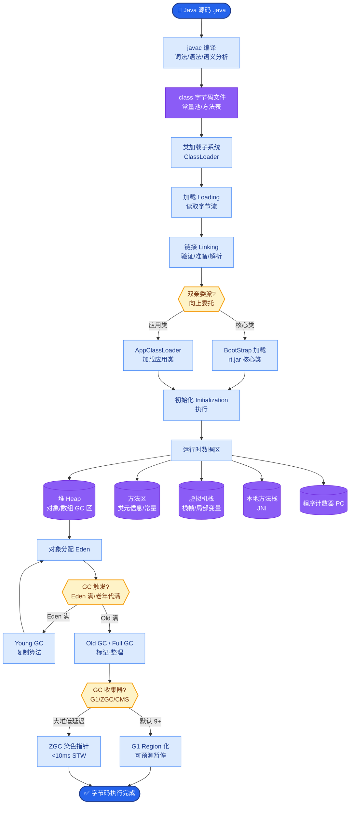

# Self-RAG和Corrective-RAG(CRAG)是什么?它们如何让RAG系统更智能

- **Self-RAG:** 模型自己决定何时检索、检索什么。模型需要通过训练微调才能学会生成“检索标记”。

- **Self-RAG 流程:**
```text
Input Query
   │
   ▼ (生成 Retrieve Token?)
Generator ──Yes──> Retriever ──> Docs
   │               │            │
   └────<─────────┘            │
   │ (生成 IsRel Token?)       │
   └───No─> (Hallucinate?)     │
   │ Yes                       │
   ▼                           ▼
Final Answer (Ground/NoRel)  Regenerate (with Web?)
```

- **Corrective-RAG (CRAG):**

**在标准RAG上增加「纠正」机制：**
检索 → 评估检索质量 → 相关(confidence>0.7)直接使用 / 部分相关提取信息+网络搜索 / 不相关完全依赖网络搜索

- **CRAG 流程架构:**
```text
Query
  │
  ▼
Retriever (Knowledge Base)
  │
  ▼
┌───────────────────┐
│  Evaluator (T/G)  │ (评估器判断相关度: T=Correct, D=Incorrect, U=Ambiguous)
└─────────┬─────────┘
 │
 ├─ T (Correct) ──────────────────> Generate (基于原文)
 │
 ├─ U (Ambiguous) ──> Refine (重写Query) ──> Retrieve (再次检索)
 │
 └─ D (Incorrect) ──> Web Search (实时搜索) ──> Generate (基于搜索结果)
```

- **实战案例**：
在构建金融知识库时，内部文档未更新最新税率，用户询问“2024年个人所得税”。CRAG的评估器判断检索到的旧文档置信度低，自动触发Web Search分支，从税务局官网获取最新政策并回答，避免了严重的合规风险。

- **关键代码**：
```python
# CRAG 评估与纠正逻辑伪代码 (LangChain实现)
from langchain_core.output_parsers import StrOutputParser

def grade_documents(state):
    """判断检索到的文档是否相关"""
    question = state["question"]
    documents = state["documents"]
    # 使用 GPT-4 打分，binary score
    scored_docs = [relevance_grader.invoke({"question": q, "document": d}) for d in documents]
    filtered = [d for d, s in zip(documents, scored_docs) if s.binary_score == "yes"]
    return {"documents": filtered}

def web_search_node(state):
    """当检索失败时触发网络搜索"""
    question = state["question"]
    docs = web_search_tool.invoke({"query": question})
    return {"documents": docs}
```

- **对比:**

| | 标准RAG | Self-RAG | CRAG |
|---|---------|----------|------|
| 检索触发 | 总是检索 | **模型决定** | 总是检索 |
| 结果评估 | 无 | 有 | **有** |
| 纠正机制 | 无 | 重检索 | **网络搜索** |
| 实现复杂度 | 低 | 高(需训练) | **中** (Prompt + Web API) |

- **CRAG优势:** 不需要额外训练(纯prompt工程),通过网络搜索兜底

- **## 常见考点**
1. Self-RAG 中的 Reflection Token 具体有哪些？（`Retrieve`, `IsRel`, `IsSup`, `IsUse` 等）

- **## 易错点**
1. **CRAG 的 T/U/D 阈值设定**：在 CRAG 中，Evaluator 的置信度阈值（如 0.7）至关重要。如果设置过高，会导致大量本来可用的本地检索被抛弃，转而频繁调用成本较高的 Web Search，增加延迟和成本；如果设置过低，则无法纠正错误信息。
2. **网络搜索的幻觉引入**：CRAG 虽然通过 Web Search 解决了知识库陈旧的问题，但引入互联网内容可能导致模型引用错误信息或产生幻觉。必须对搜索结果进行二次去重或可信度加权。

- **## 面试追问**
1. Self-RAG 需要对模型进行微调，如果我们的垂直领域数据量不足以支撑训练，如何在不训练模型的情况下近似实现 Self-RAG 的效果？
2. CRAG 中的 Web Search 分支会增加请求延迟，在实时性要求很高的场景（如即时客服）下，你会如何做优化？
3. 当检索到的文档部分相关（U/Ambiguous）时，如何决定是重写 Query 再次检索，还是直接基于现有片段生成？如何平衡重试次数与延迟？


## 核心流程图



## 记忆要点

- Self-RAG：模型训练生成反射Token，自主决定何时检索及是否相关，实现精细化控制。
- CRAG：检索后评估置信度，高置信度直接用，低置信度触发Web Search纠正，无需训练。
- CRAG流程：检索 → 评估(T/D/U) → 分支处理(直接生成/重写查询/网络搜索)。
- 对比：Self-RAG需微调且自省，CRAG靠Prompt+Web兜底，实现难度中等。
- 实战：内部知识陈旧时，CRAG自动触发网络搜索获取最新信息，避免合规风险。


## 结构化回答

**30 秒电梯演讲：** 增加自我反思与纠错机制的智能检索——打个比方，学生先查资料，觉得不准就上网搜或靠自己答

**展开框架：**
1. **Self-RAG** — 模型训练生成反射Token，自主决定何时检索及是否相关，实现精细化控制。
2. **CRAG** — 检索后评估置信度，高置信度直接用，低置信度触发Web Search纠正，无需训练。
3. **CRAG流程** — 检索 → 评估(T/D/U) → 分支处理(直接生成/重写查询/网络搜索)。

**收尾：** 以上三点都能配合实战聊。我可以展开任一要点，比如「CRAG的网络搜索如何选择数据源」这类追问您感兴趣吗？

## 视频脚本

> 预计时长：2 分钟 | 由浅入深

| 时间 | 画面/字幕 | 口播台词 | 讲解要点 |
|------|----------|----------|----------|
| 0:00 | 标题卡 | "Self-RAG和Corrective-RAG(CRAG)是什么，30 秒讲清楚。" | 开场钩子 |
| 0:30 | 概念定义动画 | "一句话：增加自我反思与纠错机制的智能检索" | 核心定义 |
| 1:00 | Self-RAG图解 | "模型训练生成反射Token，自主决定何时检索及是否相关，实现精细化控制。" | Self-RAG |
| 1:30 | 总结卡 | "记好这几条，面试不慌。下期见。" | 收尾 |
