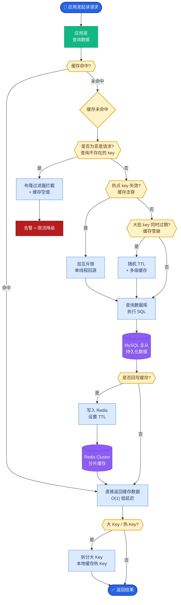

# LLM应用的流式输出如何实现?SSE vs WebSocket如何选择

- **流式输出方案:**

- **SSE (Server-Sent Events) - 最常用:**
```
HTTP响应头：Content-Type: text/event-stream
Cache-Control: no-cache
Connection: keep-alive

每个chunk格式：
data: {"token": "你好"}

data: {"token": "世界"}

data: [DONE]

```

- **优势:**
  - 基于HTTP，无需额外协议，防火墙友好
  - 浏览器原生支持EventSource API，开发简单
  - 自动重连机制（Last-Event-ID）
  - 单向推送足够(LLM → 用户)
  - 文本格式，易于调试

- **WebSocket:**
  - 双向通信（全双工）
  - 适合需要用户中途打断、修改Prompt或实时协作的场景
  - 协议开销略高（需握手帧）
  - 需额外库维护连接状态

- **实战案例**：
在将 SSE 部署到 Kubernetes 生产环境时，前端经常出现 5 秒延迟后一次性收到所有 Token 的问题。经排查是 Nginx Ingress 默认开启了 `proxy_buffering`，导致数据在 Nginx 层缓存。关闭缓冲后，首字延迟（TTFT）显著降低。

- **选择建议:**
  - 单向流式输出 → **SSE** (95%场景，如ChatGPT类应用)
  - 需要双向交互 → WebSocket

- **对比表格:**

| 维度 | SSE | WebSocket |
|---|-----|-----------|
| 协议 | HTTP (单向) | TCP (双向) |
| 连接数 | 受浏览器同域限制 (6个) | 单一复用连接 |
| 自动重连 | 浏览器原生支持 | 需手动实现 (心跳机制) |
| 穿透性 | 易穿透防火墙/代理 | 部分代理可能阻断 |
| 适用场景 | 实时通知、LLM流式 | 聊天室、协同编辑 |

- **前端实现:**
```javascript
const eventSource = new EventSource('/api/chat?prompt=...')
eventSource.onmessage = (e) => {
  if (e.data === '[DONE]') {
    eventSource.close()
    return
  }
  const data = JSON.parse(e.data)
  appendToUI(data.token)
}
eventSource.onerror = () => eventSource.close()
```

- **后端实现:**
```python
from fastapi.responses import StreamingResponse

@app.get('/api/chat')
async def chat(prompt: str):
    async def generate():
        async for chunk in llm.stream(prompt):
            # 注意：必须以 \n\n 结尾，SSE协议要求
            yield f'data: {json.dumps({"token": chunk})}\n\n'
        yield 'data: [DONE]\n\n'
    return StreamingResponse(generate(), media_type="text/event-stream")
```

- **架构数据流图:**
```
┌─────────┐       HTTP GET       ┌──────────────┐
│ Browser │ ──────────────────> │   Backend    │
└─────────┘                       └──────┬───────┘
    ^                                    │ LLM Stream
    │ 1. Establish connection            │ (Tokens)
    │ 2. Receive Chunks                  v
    │  text/event-stream  
```

- **## 易错点**
1. **SSE 连接中断时的状态恢复**：SSE 虽然有自动重连机制，但在服务端重启或网络波动后，连接会重置。如果不配合 `Last-Event-ID` 服务端保存断点进度，客户端重连后将丢失之前的生成内容或导致上下文错乱。
2. **Nginx/Gzip 缓存干扰**：除了关闭 `proxy_buffering`，还需确保 Nginx 没有对 `text/event-stream` 类型进行 Gzip 压缩。压缩算法需要等待数据块填满缓冲区才能开始压缩，这会直接破坏流式的实时性，导致“卡顿后一口气吐出”的现象。

- **## 面试追问**
1. 在移动端 App（非浏览器环境）实现流式输出时，由于没有原生 EventSource 支持，你会选择实现 SSE 客户端还是直接用 WebSocket？各自的优缺点是什么？
2. 如何在服务端实现“中途打断”功能？如果是 SSE 协议，服务端如何感知客户端的停止请求并销毁对应的 LLM 推理资源？
3. 在高并发场景下，维持大量长连接（SSE 或 WebSocket）会对服务端资源（如文件描述符、内存）造成什么压力？如何进行连接池管理和优化？


## 核心流程图



## 记忆要点

- SSE首选：基于HTTP单向推送，防火墙友好，浏览器原生支持，适合95%流式场景。
- 协议格式：响应头text/event-stream，数据块以data:前缀+\n\n结尾，结束发[DONE]。
- WebSocket：全双工通信，适合需中途打断或实时协作，协议开销略高。
- 实战避坑：生产环境Nginx须关闭proxy_buffering和Gzip，防缓存导致延迟卡顿。
- 状态恢复：SSE断线重连需配合Last-Event-ID服务端保存断点，防上下文丢失。


## 结构化回答

**30 秒电梯演讲：** 利用HTTP长连接实现服务端向客户端的实时数据推送。——打个比方，像喝水管一样，数据生成一点就吐出来一点，不用等水杯接满。

**展开框架：**
1. **SSE首选** — 基于HTTP单向推送，防火墙友好，浏览器原生支持，适合95%流式场景。
2. **协议格式** — 响应头text/event-stream，数据块以data:前缀+\n\n结尾，结束发[DONE]。
3. **WebSocke** — WebSocket：全双工通信，适合需中途打断或实时协作，协议开销略高。

**收尾：** 以上三点都能配合实战聊。我可以展开任一要点，比如「SSE如何处理断线重连」这类追问您感兴趣吗？

## 视频脚本

> 预计时长：3 分钟 | 由浅入深

| 时间 | 画面/字幕 | 口播台词 | 讲解要点 |
|------|----------|----------|----------|
| 0:00 | 标题卡 | "LLM应用的流式输出如何实现，30 秒讲清楚。" | 开场钩子 |
| 0:36 | 概念定义动画 | "一句话：利用HTTP长连接实现服务端向客户端的实时数据推送。" | 核心定义 |
| 1:12 | SSE首选图解 | "基于HTTP单向推送，防火墙友好，浏览器原生支持，适合95%流式场景。" | SSE首选 |
| 1:48 | 协议格式图解 | "响应头text/event-stream，数据块以data:前缀+\n\n结尾，结束发[DONE]。" | 协议格式 |
| 2:24 | 总结卡 | "记好这几条，面试不慌。下期见。" | 收尾 |
