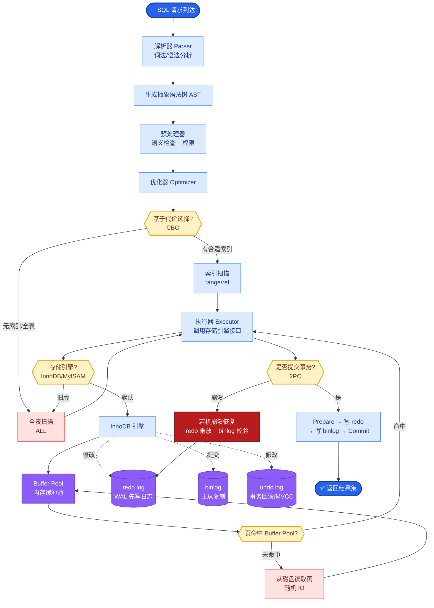

# RAG系统如何处理多轮对话?上下文中的历史如何与检索结合

- **多轮RAG的核心挑战:**

用户第二轮提问可能依赖第一轮的上下文，导致查询缺少实体指代。

例:
- 第一轮:「什么是Transformer?」
- 第二轮:「它的注意力机制怎么工作?」←「它」指什么?

- **解决方案:**

1. **查询改写**
- 用LLM将「它的注意力机制怎么工作」改写为「Transformer的注意力机制怎么工作」
- 用改写后的查询做检索
- *原理*：利用LLM的理解能力补全省略的主语和指代关系。

2. **对话摘要作为上下文**
- 将之前的对话摘要注入系统prompt
- 检索结果 + 对话摘要一起提供给LLM
- *适用场景*：长对话历史，超过上下文窗口时。

3. **LlamaIndex ChatEngine**
- 内置多轮对话RAG支持
- 自动管理上下文窗口
- 支持CondenseQuestionMode(改写查询)

4. **滑动窗口 + 检索**
- 最近3轮对话完整保留
- 更早的历史用检索获取相关片段（从向量化了的历史对话中检索）

- **实战案例**：
在一个医疗问诊系统中，用户先说了“我头痛”，接着说“吃什么药？”。如果不做查询改写，系统会检索到“头痛药”的通用文档，但实际上用户刚才提到过“孕期”的背景。系统通过查询改写，将问题补全为“孕期头痛吃什么药”，检索到了安全的医疗建议，避免了严重的医疗事故。

- **关键代码**:
```python
# 使用 LangChain 实现查询改写
from langchain.chains import ConversationalRetrievalChain
from langchain.chat_models import ChatOpenAI

llm = ChatOpenAI(model_name="gpt-4")
retriever = vector_db.as_retriever()

# condense_question_mode 会自动将新问题结合历史上下文进行改写
qa_chain = ConversationalRetrievalChain.from_llm(
    llm=llm, 
    retriever=retriever,
    condense_question_prompt=PROMPT_TEMPLATE, # 自定义改写Prompt
    return_source_documents=True
)

# follow-up question: "它怎么工作?" -> 内部改写为 "Transformer怎么工作?"
result = qa_chain({"question": "它怎么工作?", "chat_history": history})
```

- **最佳实践架构:**
```
用户问题: "它怎么工作?"
     │
     ▼
┌──────────────────┐
│ 查询改写          │ ──> "Transformer怎么工作?"
└────────┬─────────┘
         │
         ▼
┌──────────────────┐
│ 向量检索          │ ──> 检索相关文档片段
└────────┬─────────┘
         │
         ▼
┌──────────────────────────────┐
│ Prompt 构建                   │
│ [System Prompt]              │
│ [History: Q1, A1]            │
│ [Retrieved Docs]             │
│ [Current Question]           │
└────────┬─────────────────────┘
         │
         ▼
┌──────────────────┐
│ LLM 生成回复     │
└──────────────────┘
```

## 常见考点
1. **HyDE (Hypothetical Document Embeddings)**：在检索前让LLM先生成一个假设性回答，再用这个回答去检索，效果通常优于直接改写。
2. **上下文窗口管理**：当历史对话和检索文档总长度超过模型限制时，如何进行裁剪策略（如保留最近、计算重要性评分）。
3. **引用溯源**：如何在多轮对话中准确引用检索到的文档来源，防止模型混淆历史和检索内容。


## 核心流程图



## 记忆要点

- 核心挑战：后续提问常含指代(如“它”)，缺少实体导致检索不准。
- 查询改写：用LLM结合历史将“它怎么工作”补全为“Transformer怎么工作”再检索。
- 上下文管理：长对话用摘要注入Prompt，或滑动窗口保留最近几轮。
- 架构流：Query → 改写 → 检索 → 拼接[History+Docs+Question] → LLM生成。
- 实战：医疗场景补全“孕期”背景，避免检索通用头痛药导致医疗事故。


## 结构化回答

**30 秒电梯演讲：** 通过查询改写或上下文注入，将指代不明确的代词还原为具体实体。——打个比方，就像听故事时，有人问“他后来怎么了”，你心里明白“他”指代的是刚才讲的主角。

**展开框架：**
1. **核心挑战** — 后续提问常含指代(如“它”)，缺少实体导致检索不准。
2. **查询改写** — 用LLM结合历史将“它怎么工作”补全为“Transformer怎么工作”再检索。
3. **上下文管理** — 长对话用摘要注入Prompt，或滑动窗口保留最近几轮。

**收尾：** 以上三点都能配合实战聊。我可以展开任一要点，比如「CondenseQuestionMode的原理」这类追问您感兴趣吗？

## 视频脚本

> 预计时长：2 分钟 | 由浅入深

| 时间 | 画面/字幕 | 口播台词 | 讲解要点 |
|------|----------|----------|----------|
| 0:00 | 标题卡 | "RAG系统如何处理多轮对话，30 秒讲清楚。" | 开场钩子 |
| 0:30 | 概念定义动画 | "一句话：通过查询改写或上下文注入，将指代不明确的代词还原为具体实体。" | 核心定义 |
| 1:00 | 核心挑战图解 | "后续提问常含指代(如“它”)，缺少实体导致检索不准。" | 核心挑战 |
| 1:30 | 总结卡 | "记好这几条，面试不慌。下期见。" | 收尾 |
