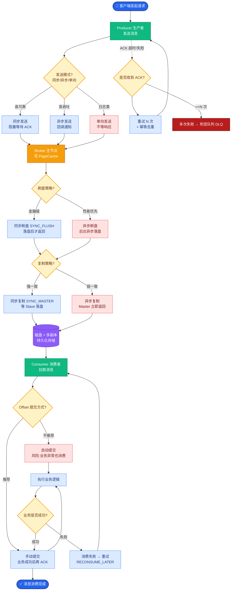
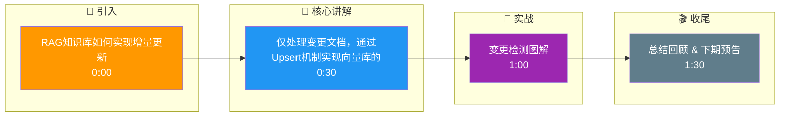

# RAG知识库如何实现增量更新?大规模文档变更时索引如何高效更新

- **增量更新策略:

1. **文档变更检测**
- 文件哈希(MD5/SHA256)对比（最准确，避免误判）
- 修改时间戳检查（效率高，但不完全可靠）
- Webhook通知(CMS/Git集成，实时性最好)

2. **增量索引**
- 只对变更文档重新分块+embedding
- 删除旧向量，插入新向量
- 大多数向量数据库支持upsert（若ID存在则更新，不存在则插入）
- *关键点*：必须维护 `doc_id` 到向量ID的映射关系，以便精准删除旧数据。

3. **批量更新Pipeline**
```
变更检测 → 增量分块 → 批量embedding → 向量库upsert → 索引刷新
```

4. **双缓冲更新**
- 新索引在后台构建（如构建新Collection）
- 构建完成后原子切换（Alias机制切换）
- 零停机更新，对用户无感知

- **大规模场景(百万文档):**
- **分区索引** - 按时间/类别分区，只更新变更分区，减少锁竞争
- **异步队列** - Kafka/SQS排队处理，削峰填谷
- **并行embedding** - 多GPU/TPU批量计算，提高吞吐
- **Qdrant/Milvus的批量upsert API** - 利用这些库的优化接口

- **删除处理:**
- 软删除(标记deleted=true，检索时过滤) - 快速，但会占用空间
- 定期硬删除(低峰期清理) - 维护存储成本

- **实战案例**：在某企业客服系统中，曾因仅通过文件修改时间更新，导致Git Revert操作触发了错误的全量重建。后改用Git Commit Hash结合文件内容的SHA256双重校验，并引入Redis Bloom Filter快速过滤未变更文件，解决了重复计算问题。

- **代码示例**：
```python
# 伪代码：基于文档ID映射的Upsert逻辑
def update_documents(docs):
    doc_ids = [doc.id for doc in docs]
    # 1. 删除旧向量 (依赖元数据或外部映射表)
    client.delete(
        collection_name="docs",
        points_selector=models.FilterSelector(
            filter=models.Filter(must=[models.FieldCondition(key="doc_id", match=models.MatchValue(value=str(did))) for did in doc_ids])
        )
    )
    # 2. 批量插入新向量
    points = [models.PointStruct(id=f"{doc.id}_{chunk_idx}", vector=vec, payload={...}) 
              for doc in docs for chunk_idx, vec in enumerate(doc.embeddings)]
    client.upsert(collection_name="docs", points=points)
```

- **架构图:**
```
┌─────────────┐    ┌──────────────┐    ┌──────────────────┐
│  数据源     │───>│  变更监测器   │───>│  处理队列       │
│ (Webhook/S3)│    │ (Hash/Diff)  │    │  (Kafka/SQS)    │
└─────────────┘    └──────────────┘    └────────┬─────────┘
                                             │
                                             ▼
                                    ┌──────────────────┐
                                    │  Embedding Worker│
                                    │  (GPU Cluster)   │
                                    └────────┬─────────┘
                                             │
                                             ▼
                                    ┌──────────────────┐
                                    │   向量数据库      │
                                    │  (Upsert/Delete) │
                                    └──────────────────┘
```

## 常见考点
1. **Upsert性能瓶颈**：大规模Upsert时，如何处理HNSW/IVF索引的重构开销？通常允许短暂的查询精度下降，后台异步重建索引。
2. **数据一致性**：在文档更新期间，如何保证用户读到的是旧数据还是新数据？取决于隔离级别和刷新策略。
3. **父子文档索引**：如果采用“父文档检索、子文档回答”策略，更新时如何同步更新父子索引？

## 核心流程图



## 记忆要点

- 变更检测：文件Hash(MD5/SHA256)最准，时间戳高效，Webhook实时性最好。
- 增量索引：只重算变更文档，利用向量库Upsert(存在则更新)机制，维护doc_id映射。
- 双缓冲更新：后台构建新索引，通过Alias原子切换，实现零停机更新。
- 大规模优化：分区索引减少锁竞争，Kafka异步队列削峰，多GPU并行Embedding。
- 实战：Git Revert误触发全量重建，改用Commit Hash双重校验+Bloom Filter过滤解决。

## 结构化回答

**30 秒电梯演讲：** 仅处理变更文档，通过Upsert机制实现向量库的局部高效更新。——打个比方，像编辑文档一样，只修改有错别字的那一页，而不是把整本书重印一遍。

**展开框架：**
1. **变更检测** — 文件Hash(MD5/SHA256)最准，时间戳高效，Webhook实时性最好。
2. **增量索引** — 只重算变更文档，利用向量库Upsert(存在则更新)机制，维护doc_id映射。
3. **双缓冲更新** — 后台构建新索引，通过Alias原子切换，实现零停机更新。

**收尾：** 以上三点都能配合实战聊。我可以展开任一要点，比如「向量库的upsert性能如何」这类追问您感兴趣吗？

## 视频脚本

> 预计时长：2 分钟 | 由浅入深

| 时间 | 画面/字幕 | 口播台词 | 讲解要点 |
|------|----------|----------|----------|
| 0:00 | 标题卡 | "RAG知识库如何实现增量更新，30 秒讲清楚。" | 开场钩子 |
| 0:30 | 概念定义动画 | "一句话：仅处理变更文档，通过Upsert机制实现向量库的局部高效更新。" | 核心定义 |
| 1:00 | 变更检测图解 | "文件Hash(MD5/SHA256)最准，时间戳高效，Webhook实时性最好。" | 变更检测 |
| 1:30 | 总结卡 | "记好这几条，面试不慌。下期见。" | 收尾 |

### 视频流程图




