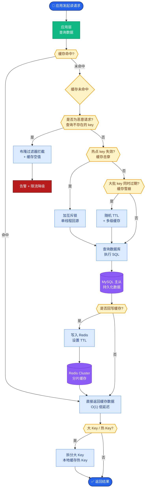

# 什么时候用RAG,什么时候微调?两者如何结合

- **量化方案对比:**

| 方案 | 类型 | 精度损失 | 推理框架 | 适用场景 |
|------|------|---------|---------|----------|
| **GGUF** | INT4/INT8 | 中 | llama.cpp/Ollama | **本地部署/边缘计算** |
| **AWQ** | INT4 | **低** | vLLM/HuggingFace | **GPU云服务推理** |
| **GPTQ** | INT4/INT8 | 中 | vLLM/HF | GPU服务，较老方案 |
| **BitsAndBytes** | INT8/NF4 | 高 | HFTransformers | **LoRA微调(QLoRA)** |
| **FP8** | FP8 | **最低** | TensorRT-LLM | **H100/L40S等最新GPU** |

- **详细分析:**

- **GGUF (llama.cpp)**
- **原理**: 将模型参数、KV Cache量化并打包成单文件，支持CPU/GPU混合推理。
- **特点**: 零门槛本地部署(Ollama)，支持Q4_K_M/Q5_K_M等多种量化级别，内存占用极低。
- **适合**: 个人电脑/Mac/边缘设备，对延迟要求不极致的场景。

- **AWQ (Activation-aware Weight Quantization)**
- **原理**: 基于激活值的分布，只量化对输出影响小的权重通道（约1%的权重保留FP16以校正误差）。
- **特点**: 精度损失最小（逼近FP16），推理速度极快。
- **适合**: 生产GPU推理，追求性价比。

- **GPTQ (GPT Quantization)**
- **原理**: 近似二阶梯度信息进行量化，运算量较大会导致校准慢。
- **特点**: 曾经的INT4 SOTA，现被AWQ在性能和精度上超越。

- **选择建议:**
```
是否需要在H100/A100上追求极致性能？
├─ 是 → FP8 (TensorRT-LLM)
└─ 否 → 是否需要在消费级显卡/本地运行？
    ├─ 是 → GGUF (Ollama)
    └─ 否 (服务器端GPU推理) → AWQ (vLLM)
```
- **成本对比:** 量化可减少显存占用50%-75%，从而允许更大的Batch Size或更长的Context。

- **实战案例**：在尝试将70B模型部署到单张A100(40G/80G)时，使用GPTQ量化后出现严重的困惑度上升，导致代码生成任务失败。切换至AWQ量化方案后，在同等显存占用下，Pass@1指标仅下降不到2%，且吞吐量提升了约40%。

- **代码示例**：
```python
# 使用 AutoAWQ 加载量化模型进行推理
from awq import AutoAWQForCausalLM
from transformers import AutoTokenizer

model_path = "lmsys/vicuna-7b-v1.5-awq"
quant_config = { "zero_point": True, "q_group_size": 128, "w_bit": 4 }

# 加载模型
model = AutoAWQForCausalLM.from_quantized(model_path, quant_config, safetensors=True)
tokenizer = AutoTokenizer.from_pretrained(model_path, trust_remote_code=True)

# 推理
prompt = "You are a helpful assistant."
inputs = tokenizer(prompt, return_tensors="pt").to("cuda")
outputs = model.generate(**inputs, max_new_tokens=32)
print(tokenizer.decode(outputs[0], skip_special_tokens=True))
```

## 常见考点
1. **INT4 vs FP8**：为什么FP8精度更高？因为INT4是对称量化，对微小权重（接近0）的截断误差大；FP8有指数位，能表示更广的动态范围。
2. **量化校准集**：GPTQ/AWQ都需要Calibration Dataset（通常100-512个样本）来计算量化参数，校准集的质量如何影响最终精度？
3. **KV Cache量化**：除了模型权重量化，推理时KV Cache也可以量化（如vLLM支持FP8 KV Cache），这对长文本推理的显存优化至关重要。


## 核心流程图



## 记忆要点

- GGUF：单文件打包，支持CPU/GPU混合，适合本地/边缘部署(Ollama)，内存占用极低。
- AWQ：激活感知量化，保留1%权重校正，INT4精度损失最小，适合GPU云推理。
- GPTQ：二阶梯度量化，较老方案，精度与速度现已被AWQ超越。
- FP8：最新GPU(H100)首选，动态范围大，精度损失最低，需TensorRT-LLM支持。
- 选择口诀：本地用GGUF，云端GPU用AWQ，极致性能H100用FP8。


## 结构化回答

**30 秒电梯演讲：** RAG负责外挂知识库，微调负责改变大脑模型，两者互补解决不同问题。——打个比方，RAG是开卷考试（看书查资料），微调是考前培训（内化知识）。

**展开框架：**
1. **GGUF** — 单文件打包，支持CPU/GPU混合，适合本地/边缘部署(Ollama)，内存占用极低。
2. **AWQ** — 激活感知量化，保留1%权重校正，INT4精度损失最小，适合GPU云推理。
3. **GPTQ** — 二阶梯度量化，较老方案，精度与速度现已被AWQ超越。

**收尾：** 以上三点都能配合实战聊。我可以展开任一要点，比如「RAG什么场景下效果不如微调」这类追问您感兴趣吗？

## 视频脚本

> 预计时长：2 分钟 | 由浅入深

| 时间 | 画面/字幕 | 口播台词 | 讲解要点 |
|------|----------|----------|----------|
| 0:00 | 标题卡 | "什么时候用RAG,什么时候微调，30 秒讲清楚。" | 开场钩子 |
| 0:30 | 概念定义动画 | "一句话：RAG负责外挂知识库，微调负责改变大脑模型，两者互补解决不同问题。" | 核心定义 |
| 1:00 | GGUF图解 | "单文件打包，支持CPU/GPU混合，适合本地/边缘部署(Ollama)，内存占用极低。" | GGUF |
| 1:30 | 总结卡 | "记好这几条，面试不慌。下期见。" | 收尾 |
