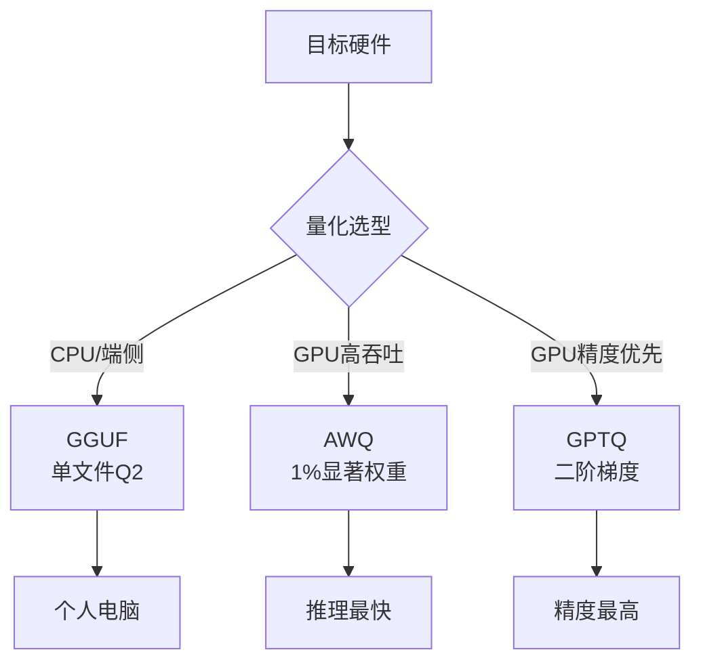

# 模型量化方案GGUF vs AWQ vs GPTQ有什么区别?如何选择

- **GGUF (GPT-Generated Unified Format):**
  - **特点**：主要用于`llama.cpp`等CPU推理环境，支持快速加载和单文件分发。它允许将模型量化到极低位宽（如Q4_K_M, Q2_K），显著降低内存占用，适合在个人电脑或移动端部署。
  - **边界情况**：极端低比特量化（如Q2）可能导致模型逻辑能力和事实性大幅下降；多模态模型支持较弱。

- **AWQ (Activation-aware Weight Quantization):**
  - **特点**：基于激活值分布的权重量化，通常仅量化权重（Activation保持FP16）。在校准过程中仅选取约1%的显著权重进行更新，速度快且精度接近FP16。
  - **优势**：推理速度极快（尤其在支持VLLM的硬件上），显存占用低，适合单卡或多卡的高吞吐推理。
  - **边界情况**：对部分架构（如某些Vision Transformer）支持有限；显存优化不如GPTQ极致（因保留部分FP16）。

- **GPTQ (Gradient-based Post-Training Quantization):**
  - **特点**：基于二阶梯度信息的量化方法，通过混合精度求解器寻找最优量化权重，是目前Int4/Int4量化精度的SOTA方案之一。
  - **优势**：通用性强，支持绝大多数LLaMA架构衍生模型，社区生态最丰富。
  - **边界情况**：校准过程计算量大，耗时较长；在生成长文本时可能出现微小的精度漂移。

**选择策略：**
- **端侧/低显存设备 (<=8GB)**：首选 **GGUF**。
- **追求极致推理速度与显存优化 (GPU)**：首选 **AWQ**。
- **追求最高精度与通用兼容性 (GPU)**：首选 **GPTQ**。

## 面试追问
1. AWQ和GPTQ在校准阶段的核心区别是什么？为什么AWQ通常更快？
2. 在使用vLLM部署时，AWQ和GPTQ在Kernel层面的优化有何不同？

## 易错点
1. **认为AWQ量化了Activation**：实际上AWQ主要是权重量化，只在校准阶段利用Activation信息，推理时Activation通常仍是高精度。
2. **忽略Block Size的影响**：在GPTQ中，group size（通常为128）越小精度越高，但计算复杂度也随之增加。

## 技术原理

量化的本质是用**更低比特的整数**近似表示原本的浮点权重，把显存占用和访存带宽需求降下来。三类方案的核心差异在于"如何选择要保留精度的高价值权重"和"在什么硬件上跑得快"：

- **GGUF（基于格式与运行时）**：llama.cpp 生态的单文件格式，把权重、词表、配置打包成一个 `.gguf` 文件。量化粒度细（Q2_K、Q4_K_M、Q8_0 等），支持混合块量化（不同层用不同比特）。专为 CPU/Apple Silicon/端侧优化，靠 SIMD 指令和 GGML kernel 加速。优势是部署门槛低（单文件、CPU 即可跑），劣势是 GPU 吞吐不如专用 kernel。
- **AWQ（激活感知量化）**：核心洞察是"并非所有权重同等重要"——那些在推理时被大激活值激活的权重（显著权重，约 1%）对精度影响最大。AWQ 用校准集找出这 1% 显著权重保持高精度（FP16），其余 99% 量化到 INT4。因为只量化权重、激活仍 FP16，所以 kernel 实现可以重度优化（vLLM 的 AWQ kernel 是 GPU 高吞吐首选）。
- **GPTQ（基于二阶梯度的后训练量化）**：用海森矩阵的逆近似逐层最小化量化误差，理论上精度最高（INT4 SOTA）。代价是校准阶段计算量大（需在 GPU 上跑校准集前向，逐层求解），校准慢；kernel 优化不如 AWQ，实际推理速度略逊。

## 代码示例

用 `transformers` + `auto-awq` 做 AWQ 量化，以及用 `llama.cpp` 转 GGUF 的最小流程：

```python
# 1. AWQ 量化（GPU 生产部署）
from awq import AutoAWQForCausalLM
from transformers import AutoTokenizer

model_path = "meta-llama/Llama-2-7b-hf"
quant_path = "Llama-2-7b-awq"

model = AutoAWQForCausalLM.from_pretrained(model_path)
tokenizer = AutoTokenizer.from_pretrained(model_path)

# 校准集：用与目标领域相近的少量文本（AWQ 只需约 128 条）
quant_config = {
    "zero_point": True,        # 零点量化，精度更高
    "q_group_size": 128,       # 分组大小，越小越准但越慢
    "w_bit": 4,                # 权重比特数
}
model.quantize(tokenizer, quant_config=quant_config,
               quant_path=quant_path,
               calib_data="pile")   # 校准数据集
model.save_quantized(quant_path)

# 2. vLLM 加载 AWQ 模型做高吞吐推理
# 命令行：python -m vllm.entrypoints.openai.api_server \
#         --model Llama-2-7b-awq --quantization awq
```

```bash
# 3. 转 GGUF（端侧部署）
# 用 llama.cpp 的 convert 脚本
python convert_hf_to_gguf.py models/Llama-2-7b-hf --outfile llama-2-7b.gguf
# 量化到 Q4_K_M（推荐的精度/体积平衡点）
./llama-quantize llama-2-7b.gguf llama-2-7b-Q4_K_M.gguf Q4_K_M

# 本地运行
./llama-cli -m llama-2-7b-Q4_K_M.gguf -p "你好" -n 128
```

## 注意事项

- **AWQ 不量化激活**：常见误解是"AWQ 量化了激活"，实际上 AWQ 只在校准阶段利用激活信息找显著权重，推理时激活仍为 FP16，这就是它精度高且 kernel 快的原因。
- **group size 影响精度和速度**：GPTQ/AWQ 的 `q_group_size`（通常 128）越小精度越高，但分组开销增加。生产环境 128 是甜点，端侧追求极致体积可降到 64。
- **极端低比特会崩**：Q2 量化虽然体积小，但模型逻辑推理和事实性能力会大幅下降，仅适合聊天兜底。Q4_K_M 是 GGUF 的推荐甜点（体积约为 FP16 的 1/4，精度损失可接受）。
- **选型口诀**：端侧/个人电脑选 GGUF（CPU 友好、单文件）；GPU 求吞吐选 AWQ（vLLM kernel 最快）；GPU 求最高精度选 GPTQ（INT4 SOTA 但校准慢）。



## 核心知识点图


## 记忆要点

- GGUF 专攻 CPU/端侧，单文件分发，支持极低比特（Q2），适合个人电脑。
- AWQ 激活感知量化，仅校准 1% 显著权重，推理速度最快，适合 GPU 高吞吐。
- GPTQ 基于二阶梯度，精度最高（SOTA），通用性强但校准慢，适合 GPU 精度优先。
- 选型口诀：端侧选 GGUF，求速选 AWQ，求准选 GPTQ。


## 结构化回答

**30 秒电梯演讲：** 通过降低模型参数精度（如FP16转为INT4）来减少显存占用并加速推理。——打个比方，把高清图片压缩成普通画质，体积变小了加载快了，但肉眼看不出大差别。

**展开框架：**
1. **GGUF 专攻** — GGUF 专攻 CPU/端侧，单文件分发，支持极低比特（Q2），适合个人电脑。
2. **AWQ 激活感知** — AWQ 激活感知量化，仅校准 1% 显著权重，推理速度最快，适合 GPU 高吞吐。
3. **GPTQ 基于二** — GPTQ 基于二阶梯度，精度最高（SOTA），通用性强但校准慢，适合 GPU 精度优先。

**收尾：** 以上三点都能配合实战聊。我可以展开任一要点，比如「AWQ为什么精度损失小」这类追问您感兴趣吗？

## 视频脚本

> 预计时长：2 分钟 | 由浅入深

| 时间 | 画面/字幕 | 口播台词 | 讲解要点 |
|------|----------|----------|----------|
| 0:00 | 标题卡 | "模型量化方案GGUF vs AWQ vs GPTQ有什么区别，30 秒讲清楚。" | 开场钩子 |
| 0:30 | 概念定义动画 | "一句话：通过降低模型参数精度（如FP16转为INT4）来减少显存占用并加速推理。" | 核心定义 |
| 1:00 | 要点图解 | "GGUF 专攻 CPU/端侧，单文件分发，支持极低比特（Q2），适合个人电脑。" | 要点 |
| 1:30 | 总结卡 | "记好这几条，面试不慌。下期见。" | 收尾 |
