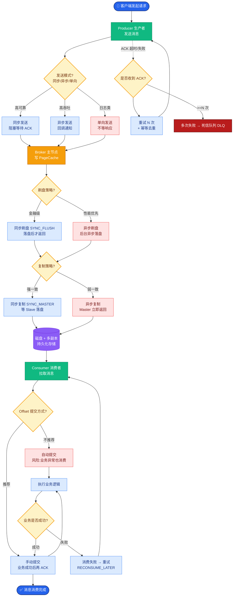

# 如何设计高性能的Embedding服务?批量embedding的优化策略

- **Embedding服务架构:**

- **核心组件:**
1. **模型加载** - BGE-M3/E5等，GPU推理，支持多卡负载均衡
2. **批量推理** - 多文档同时编码，利用GPU并行计算能力
3. **缓存层** - 相同文本直接返回，推荐使用Redis或Memcached，支持TTL设置
4. **负载均衡** - 多GPU/多实例，常用的有Nginx或Kubernetes Service

- **批量优化策略:**

1. **动态batching**
- 等待一定数量或超时后批量推理，核心参数包括`max_batch_size`和`timeout_ms`
- 平衡延迟和吞吐，通过调节`timeout`控制首字延迟（TTFT）与总吞吐的trade-off
- **边界条件:** 防止超长文本导致显存溢出（OOM），需结合`max_length`动态计算batch size

2. **文本截断**
- 超过max_length截断，对于BGE-M3等支持长文本的模型（max_length=8192），需灵活调整策略
- 长文档分段编码后平均池化，分段重叠建议设置为10%-20%以保持语义连续性

3. **ONNX/TensorRT加速**
- 导出为ONNX格式，利用算子融合减少kernel launch开销
- TensorRT引擎优化，针对特定GPU架构（如A100/V100）进行FP16或INT8量化
- 推理速度提升2-3倍，特别在高并发场景下效果显著

4. **异步Pipeline**
- 采用生产者-消费者模式，解耦接收与计算
```
客户端请求 ──→ [HTTP 接口层] ──→ [请求队列]
                                        │
                                        ▼
                            [Batch Builder (聚合/超时)]
                                        │
                                        ▼
                            [GPU Worker 池 (并行推理)]
                                        │
                                        ▼
                            [后处理/归一化] ──→ [返回结果]
```

- **性能基准(BGE-M3, A100):**
- 单条:~5ms
- 批量256条:~200ms(0.8ms/条)
- ONNX加速:~120ms(0.5ms/条)

**实战案例与代码**

**实战案例**：在某电商搜索服务中，直接使用单条 BGE-M3 推理导致 QPS 上限仅为 50。引入 TensorRT 加速后，配合动态 Batching（batch_size=32, timeout=2ms），QPS 提升至 2000+，且 P99 延迟从 100ms 降至 15ms。**踩坑**：BERT 类模型在 TensorRT 中对 `input_mask` 处理较敏感，若 Padding 过多会导致无效计算，需在预处理阶段严格截断或使用 Padding Mask 优化。

**关键代码**：
```python
import torch
from sentence_transformers import SentenceTransformer

# 模拟动态Batching逻辑
def dynamic_batch_inference(model, texts_queue, max_batch=32, timeout_ms=5):
    batch = []
    while True:
        # 聚合请求或超时触发
        if len(batch) >= max_batch or is_timeout(batch, timeout_ms):
            if batch:
                # GPU并行编码
                embeddings = model.encode(batch, batch_size=len(batch), 
                                          normalize_embeddings=True, 
                                          show_progress_bar=False)
                # 返回结果...
                batch = []
```

## 面试追问
1. 如果输入文本长度差异极大（如10 token vs 8000 token），如何在Padding效率显存占用之间做平衡？
2. 缓存层使用向量本身作为Key还是使用文本Hash？如何处理微小文本变更导致的Cache失效？

## 易错点
1. **忽视归一化操作**：余弦相似度计算前必须对向量进行L2归一化，否则会导致检索结果严重偏差。
2. **Tokenize开销被忽略**：在高并发小Batch场景下，Tokenizer的CPU处理可能成为瓶颈，需考虑多线程或加速。


## 核心流程图



## 记忆要点

- 核心架构：模型加载 + 动态 Batching + 缓存层 + 负载均衡。
- 动态 Batching：平衡延迟与吞吐，设置 max_batch_size 和 timeout_ms 防止 OOM。
- 加速手段：导出 ONNX/TensorRT，利用算子融合和 FP16/INT8 量化提速。
- 异步 Pipeline：生产者-消费者模式解耦接收与计算，提升并发处理能力。
- 注意：必须做 L2 归一化，警惕 Tokenize 的 CPU 瓶颈。


## 结构化回答

**30 秒电梯演讲：** 通过动态批处理和模型加速，最大化GPU利用率，将文本转化为向量。——打个比方，像坐公交车，等人凑满一车或时间到了才发车，比每个人打车的效率高得多。

**展开框架：**
1. **核心架构** — 模型加载 + 动态 Batching + 缓存层 + 负载均衡。
2. **动态 Batch** — 动态 Batching：平衡延迟与吞吐，设置 max_batch_size 和 timeout_ms 防止 OOM。
3. **加速手段** — 导出 ONNX/TensorRT，利用算子融合和 FP16/INT8 量化提速。

**收尾：** 以上三点都能配合实战聊。我可以展开任一要点，比如「如何选择pooling策略」这类追问您感兴趣吗？

## 视频脚本

> 预计时长：2 分钟 | 由浅入深

| 时间 | 画面/字幕 | 口播台词 | 讲解要点 |
|------|----------|----------|----------|
| 0:00 | 标题卡 | "设计高性能的Embedding服务，30 秒讲清楚。" | 开场钩子 |
| 0:30 | 概念定义动画 | "一句话：通过动态批处理和模型加速，最大化GPU利用率，将文本转化为向量。" | 核心定义 |
| 1:00 | 核心架构图解 | "模型加载 + 动态 Batching + 缓存层 + 负载均衡。" | 核心架构 |
| 1:30 | 总结卡 | "记好这几条，面试不慌。下期见。" | 收尾 |
