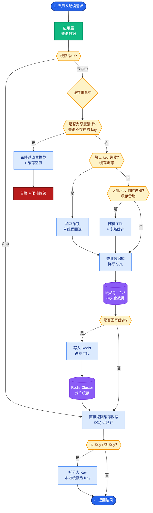

# LLM应用如何设计高可用架构?LLM API不稳定时如何保证服务

- **高可用架构设计:**

- **1. 多供应商冗余与网关层**
- 通过API网关（如Kong/APISIX）或自研Node.js/Go服务层统一管理流量
- 实现实时健康检查与熔断机制
```
用户请求
   │
   ▼
[ API 网关 / 仲裁器 ]
   ├─ [ 供应商 A (GPT-4) ] ◄─── 正常: 100% 流量 / 异常: 0%
   ├─ [ 供应商 B (Claude) ] ◄─── 正常: 0% / 异常: 100% 流量 (Failover)
   └─ [ 本地兜底 (Llama 3) ] ◄─── 极端情况: 仅限关键业务
```

- **2. 请求级容错**
- 增加重试机制：需注意接口幂等性，避免重复扣费或重复生成
- 指数退避策略：重试间隔随失败次数指数增加（如 1s, 2s, 4s），避免雪崩供应商
```python
async def call_llm_with_failover(prompt):
    providers = [
        ('openai', 'gpt-4', 0.7),      # 70%流量
        ('anthropic', 'claude-3.5', 0.2), # 20%
        ('zhipu', 'glm-4', 0.1),       # 10%
    ]
    last_error = None
    for provider, model, weight in providers:
        try:
            return await call(provider, model, prompt)
        except (Timeout, RateLimit, ServerError) as e:
            last_error = e
            continue
    # 所有供应商都失败，记录日志并降级
    log_error(last_error)
    return fallback_response
```

- **3. 缓存兜底**
- 热门查询缓存结果，推荐使用布隆过滤器快速判断缓存是否存在
- 策略：Prompt语义哈希（去除空格、标点差异）作为Key
- API全部不可用时返回缓存或静态兜底文案

- **4. 降级策略与SLA**
| 级别 | 策略 | 触发条件 |
|------|------|----------|
| L0 | 正常服务 | 全部供应商正常 |
| L1 | 切换备用供应商 | 主供应商超时率>5% |
| L2 | 使用小模型(更快/更便宜) | 队列堆积/成本超限 |
| L3 | 返回缓存结果 | 所有API不可用 |
| L4 | 返回静态回复(维护中) | 系统级故障 |

- **SLA目标:** 99.9%可用性 = 每月最多43分钟不可用，需配合监控告警

**实战案例与对比**

**实战案例**：在某次 OpenAI API 大范围故障（500 Error）期间，未配置多模型冗余的业务直接中断。配置了自动切换的业务（OpenAI -> Azure OpenAI -> DeepSeek）虽然偶发延迟增加，但保持了 100% 可用性。**踩坑**：直接 Failover 到其他模型（如 GPT-4 -> Claude 3）可能因 Prompt 格式不兼容（如 XML Tag vs JSON）导致输出异常，需在网关层做 Prompt 适配器。

**架构选型对比**：
| 特性 | 单供应商 (直连) | 多供应商网关 (自建) | Serverless (如Vercel AI) |
| :--- | :--- | :--- | :--- |
| **开发成本** | 低 | 高 (需实现路由、重试、计费) | 低 |
| **容灾能力** | 弱 (单点故障) | 强 (可自定义任意后端) | 中 (依赖平台生态) |
| **灵活性** | 弱 | 强 (可做 Prompt 翻译、结果重写) | 弱 |
| **数据隐私** | 高 (数据不经第三方) | 中 (需看网关部署位置) | 中 (通常经过供应商节点) |
| **适用场景** | 内部工具、MVP | 核心业务、企业级应用 | 快速原型、前端侧集成 |

## 面试追问
1. 多个供应商模型的输出格式不一致，如何在网关层做统一的归一化处理？
2. 在成本受限的情况下，如何设计策略优先使用便宜模型（如GPT-3.5），仅在置信度低时升级到昂贵模型（如GPT-4）？

## 易错点
1. **重试风暴**：简单的无限重试会打爆下游API，必须配合指数退避和熔断器（如Circuit Breaker）。
2. **缓存Keys设计**：如果仅使用原始Prompt作为Key，大小写或空格的微小变化会导致缓存穿透，建议使用预处理后的标准化字符串或Hash作为Key。


## 核心流程图



## 记忆要点

- 网关层冗余：统一管理多供应商（OpenAI/Claude/本地），实时健康检查与熔断。
- 请求级容错：重试机制配合指数退避，避免雪崩；确保接口幂等性。
- 缓存兜底：热门查询缓存，Prompt 语义哈希做 Key，全挂时降级返回。
- 分级降级策略：L0 正常 -> L1 切备用 -> L2 换小模型 -> L3 返回缓存 -> L4 静态回复。
- SLA 目标：99.9% 可用性（月故障 < 43 分钟），需监控告警。


## 结构化回答

**30 秒电梯演讲：** 通过多供应商冗余、自动故障转移和分级降级策略，确保服务连续性。——打个比方，给飞机装多台发动机，坏了一台其他的还能顶上，实在不行就滑翔降落。

**展开框架：**
1. **网关层冗余** — 统一管理多供应商（OpenAI/Claude/本地），实时健康检查与熔断。
2. **请求级容错** — 重试机制配合指数退避，避免雪崩；确保接口幂等性。
3. **缓存兜底** — 热门查询缓存，Prompt 语义哈希做 Key，全挂时降级返回。

**收尾：** 以上三点都能配合实战聊。我可以展开任一要点，比如「如何做多供应商的负载均衡」这类追问您感兴趣吗？

## 视频脚本

> 预计时长：4 分钟 | 由浅入深

| 时间 | 画面/字幕 | 口播台词 | 讲解要点 |
|------|----------|----------|----------|
| 0:00 | 标题卡 | "LLM应用如何设计高可用架构，30 秒讲清楚。" | 开场钩子 |
| 0:40 | 概念定义动画 | "一句话：通过多供应商冗余、自动故障转移和分级降级策略，确保服务连续性。" | 核心定义 |
| 1:20 | 网关层冗余图解 | "统一管理多供应商（OpenAI/Claude/本地），实时健康检查与熔断。" | 网关层冗余 |
| 2:00 | 请求级容错图解 | "重试机制配合指数退避，避免雪崩；确保接口幂等性。" | 请求级容错 |
| 2:40 | 缓存兜底图解 | "热门查询缓存，Prompt 语义哈希做 Key，全挂时降级返回。" | 缓存兜底 |
| 3:20 | 总结卡 | "记好这几条，面试不慌。下期见。" | 收尾 |
