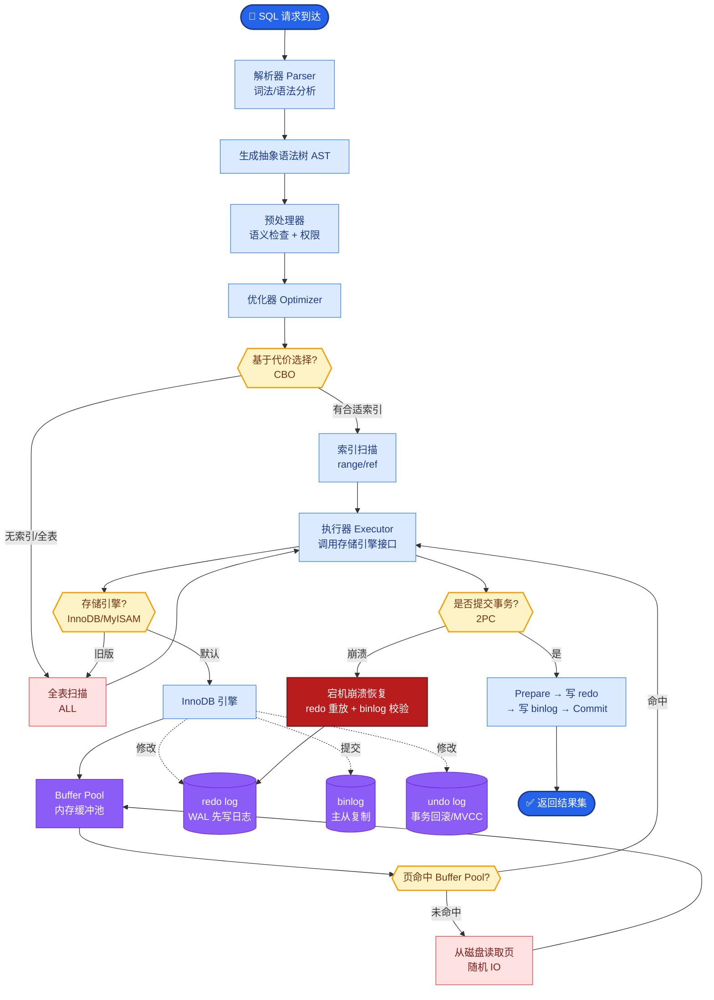

# 如何构建多模态Agent?处理图片/PDF/截图的架构如何设计

**多模态Agent架构设计**

**1. 输入处理Pipeline (增强版)**
```
多模态输入 → 网关/预处理层
├─ 文本 → [清洗] → LLM Context
├─ 图片 → [重采样/压缩] → VLM(GPT-4V/LLaVA) → 视觉特征+文本描述
├─ PDF → [解析引擎] 
│   ├─ Unstructured/Marker (版面分析) 
│   └─ PyMuPDF (底层提取)
│   → 结构化JSON(Markdown表格 + 图表描述)
├─ 截图/UI → [OCR(Paddle/SwiftOCR)] + [VLM] → 层级结构树/描述
└─ 音频 → [Whisper V3 (Large)] + [Timestamp] → 文本+说话人分离
```

**2. 核心设计原则与深度细节**

**统一文档处理**
- **版面保留**: 使用 Unstructured.io 或 Marker 识别标题层级、段落块，保留阅读顺序。
- **表格处理**: 将 HTML/Table 转为 Markdown 格式；对于复杂表格，提取 CSV 数据 + Summary 摘要。
- **图表理解**: 原位保留图片，同时在文档流中插入 VLM 生成的「图表描述」和「关键数据点」。
- **边界条件**: 处理扫描件（需 OCR 纠错）和加密 PDF（需解密前置步骤）。

**视觉理解**
- **高分辨率处理**: 对于 2K+ 图片，采用 **Crop-Slice** 策略（如 CLIP/SAM 辅助切片），将图片切分为 4x4 或更多 Patch，分别送入模型理解后再聚合，防止细节丢失。
- **场景描述**: 输入 Prompt 模板：「详细描述图片内容，包括物体、颜色、空间关系。」
- **细节提取**: 针对图表，Prompt：「读取 X 轴和 Y 轴标签，提取所有数据点的数值。」
- **对比分析**: 将两张图拼接或分两次输入，Prompt：「左右对比图 A 和图 B 的差异。」

**多模态 RAG**
- **混合索引**:
  - 文本: 使用 OpenAI/BGE Embedding 存入向量库。
  - 图片: 使用 **CLIP ViT-L/14** 生成 Image Embedding，存入同一向量库或多模态库（如 Milvus/Qdrant）。
- **检索策略**: 
  - Query 转 Text Embedding 检索文本块。
  - Query 转 CLIP Embedding 检索图片块。
  - 最终进行 **Reciprocal Rank Fusion (RRF)** 重排序，混合返回 Text 和 Image。
- **多路召回**: 支持以图搜图（用户上传截图搜文档中的相似图表）。

**3. Agent工具设计 (增强)**
```python
tools = [
    {
        "name": "analyze_image",
        "description": "深度理解图片内容，支持 OCR、图表读数、UI 分析",
        "params": {"image_url": "str", "detail_level": "high/low"}
    },
    {
        "name": "parse_pdf",
        "description": "解析 PDF 为 Markdown 结构化文本，保留表格和图片引用",
        "params": {"file_path": "str", "extract_tables": "bool"}
    },
    {
        "name": "compare_docs",
        "description": "基于向量检索对比两个文档的语义差异",
        "params": {"doc_id_1": "str", "doc_id_2": "str"}
    }
]
```

**## 常见考点**
1. **大图处理**: 如何解决 LLM 输入分辨率限制导致图表读数不准的问题？（答：切片/Crop 策略）
2. **表格解析**: 如何处理复杂的多级表头表格？（答：转为 Markdown 嵌套列表或 HTML 结构）
3. **时间同步**: 音频视频流如何对齐？（答：使用 Word-level Timestamps 和 VAD 语音活动检测）
4. **成本控制**: 多模态 VLM Token 消耗极大，如何优化？（答：在路由层先用小模型做预处理，只将关键帧送入大模型）


## 核心流程图



## 记忆要点

- 输入 Pipeline：文本清洗、图片 VLM 理解、PDF 解析（保留版面）、音频转文字。
- 视觉处理：高分辨率图片采用 Crop-Slice 切片策略，防止细节丢失。
- 多模态 RAG：文本和图片（CLIP）混合索引，检索后 RRF 重排序融合。
- 工具设计：Agent 集成 analyze_image、parse_pdf 等工具，支持图表读数和 UI 分析。
- 成本控制：路由层先用小模型预处理，仅关键帧送入大模型 VLM。


## 结构化回答

**30 秒电梯演讲：** 能理解文本、图片、PDF等多种输入格式的AI智能体。——打个比方，像人类秘书一样既能读文件也能看图说话。

**展开框架：**
1. **输入 Pipel** — 输入 Pipeline：文本清洗、图片 VLM 理解、PDF 解析（保留版面）、音频转文字。
2. **视觉处理** — 高分辨率图片采用 Crop-Slice 切片策略，防止细节丢失。
3. **多模态 RAG** — 文本和图片（CLIP）混合索引，检索后 RRF 重排序融合。

**收尾：** 以上三点都能配合实战聊。我可以展开任一要点，比如「VLM的推理延迟如何优化」这类追问您感兴趣吗？

## 视频脚本

> 预计时长：2 分钟 | 由浅入深

| 时间 | 画面/字幕 | 口播台词 | 讲解要点 |
|------|----------|----------|----------|
| 0:00 | 标题卡 | "构建多模态Agent，30 秒讲清楚。" | 开场钩子 |
| 0:30 | 概念定义动画 | "一句话：能理解文本、图片、PDF等多种输入格式的AI智能体。" | 核心定义 |
| 1:00 | 输入 Pipeline图解 | "文本清洗、图片 VLM 理解、PDF 解析（保留版面）、音频转文字。" | 输入 Pipeline |
| 1:30 | 总结卡 | "记好这几条，面试不慌。下期见。" | 收尾 |
