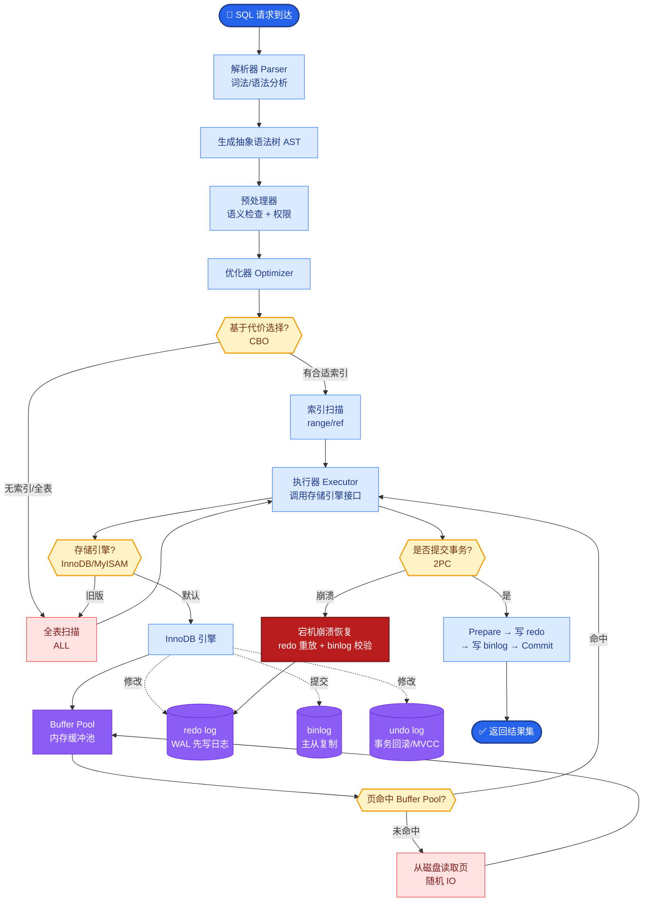

# Semantic Router(语义路由)是什么?它如何高效做意图分类

**Semantic Router (语义路由) 解析**

**核心概念：**
基于语义相似度的意图路由机制，无需训练传统的分类器。通过计算用户输入与预设“意图描述”的向量相似度来决定路由目标。

**工作原理与架构图：**
```
1. 用户输入: "如何重置密码?"
       ↓
2. Embedding层: 将输入转为向量 (Input_Vector)
       ↓
3. 相似度计算 (余弦相似度):
   ┌───────────────────────────────────────┐
   │ Route: billing (e.g. "退款流程...")   │ → 0.15
   │ Route: support (e.g. "重置密码...")  │ → 0.89 ✓
   │ Route: sales  (e.g. "产品价格...")   │ → 0.22
   └───────────────────────────────────────┘
       ↓
4. 阈值判断:
   IF Max_Score > Threshold (如 0.8) 
      THEN 执行 support_handler()
      ELSE 触发 Fallback (转人工或通用LLM)
```

**代码示例 (优化版)：**
```python
from semantic_router import Route, SemanticRouter
from semantic_router.encoders import OpenAIEncoder

# 初始化编码器
encoder = OpenAIEncoder(name="text-embedding-3-small")

# 定义路由 (增加更细致的 Utterances 提升召回)
billing = Route(
    name="billing",
    utterances=[
        "我想退款",
        "账单金额不对", 
        "收到奇怪的扣费",
        "怎么开发票",
        "续费在哪里取消"
    ],
    score_threshold=0.82 # 针对该路由动态调整阈值
)

tech = Route(
    name="tech_support",
    utterances=[
        "500 错误代码",
        "API 返回 timeout",
        "连接数据库失败",
        "如何配置环境变量"
    ]
)

# 初始化路由器
router = SemanticRouter(encoder=encoder, routes=[billing, tech])

# 执行路由
decision = router("我想取消订阅")
if decision.name == "billing":
    # 调用具体的函数逻辑
    call_billing_api()
```

**核心优势：**
1. **无需训练**: 只需提供少量示例句子，无需模型训练过程，迭代周期从周级降至分钟级。
2. **速度快**: 仅为向量计算（通常 < 50ms），比调用 LLM 进行分类（500ms+）快 10-100 倍。
3. **动态可扩展**: 新增意图只需添加配置，无需重新部署模型，支持热加载。
4. **零样本能力**: 利用语义相似度直接处理未见过的表达，泛化能力优于关键词匹配。

**应用场景与扩展：**
- **客服分流**: 精准识别意图并路由到不同子服务。
- **Agent 工具选择**: 判断是需要“搜索网络”还是“查询数据库”。
- **RAG 索引路由**: 判断用户问题属于“技术文档”还是“法律合规”，从而查不同的向量库。
- **函数调用的前置过滤器**: 在 LLM 生成 JSON 之前，先低成本判断是否需要使用工具。

**## 常见考点**
1. **阈值设定**: 如何设定 `score_threshold`？太低或太高会怎样？（答：太低导致误识别，太高导致频繁 Fallback；需根据验证集的 Precision/Recall 曲线确定）
2. **多语言支持**: 英文训练的 Embedding 能路由中文吗？（答：取决于模型，如 `text-embedding-3` 或 `bge-m3` 支持多语言混合编码）
3. **冲突处理**: 如果两个意图非常相似（如“取消订单”和“退款”），如何解决？（答：合并为一个高粒度路由，或在内部二次路由）
4. **性能瓶颈**: 当路由规则增加到 1000+ 条时，如何优化？（答：使用 Faiss/Milvus 等向量数据库进行索引加速，而非暴力计算）


## 核心流程图



## 记忆要点

- 核心原理：计算输入与预设意图描述的向量相似度，无需训练分类器。
- 执行流程：Embedding 编码 -> 相似度计算 -> 阈值判断 -> 路由或 Fallback。
- 核心优势：速度快（<50ms）、零样本泛化、动态热加载新增意图。
- 阈值设定：太低误识别，太高频繁 Fallback，需根据验证集调整。
- 性能优化：路由规则 >1000 时，使用 Faiss 等向量库加速检索。


## 结构化回答

**30 秒电梯演讲：** 基于向量相似度进行意图分类的路由机制。——打个比方，像图书管理员根据书的内容摘要直接分架，而不是读完再分。

**展开框架：**
1. **核心原理** — 计算输入与预设意图描述的向量相似度，无需训练分类器。
2. **执行流程** — Embedding 编码 -> 相似度计算 -> 阈值判断 -> 路由或 Fallback。
3. **核心优势** — 速度快（<50ms）、零样本泛化、动态热加载新增意图。

**收尾：** 以上三点都能配合实战聊。我可以展开任一要点，比如「Semantic Router如何处理多意图」这类追问您感兴趣吗？

## 视频脚本

> 预计时长：2 分钟 | 由浅入深

| 时间 | 画面/字幕 | 口播台词 | 讲解要点 |
|------|----------|----------|----------|
| 0:00 | 标题卡 | "Semantic Router(语义路由)是什么，30 秒讲清楚。" | 开场钩子 |
| 0:30 | 概念定义动画 | "一句话：基于向量相似度进行意图分类的路由机制。" | 核心定义 |
| 1:00 | 核心原理图解 | "计算输入与预设意图描述的向量相似度，无需训练分类器。" | 核心原理 |
| 1:30 | 总结卡 | "记好这几条，面试不慌。下期见。" | 收尾 |
