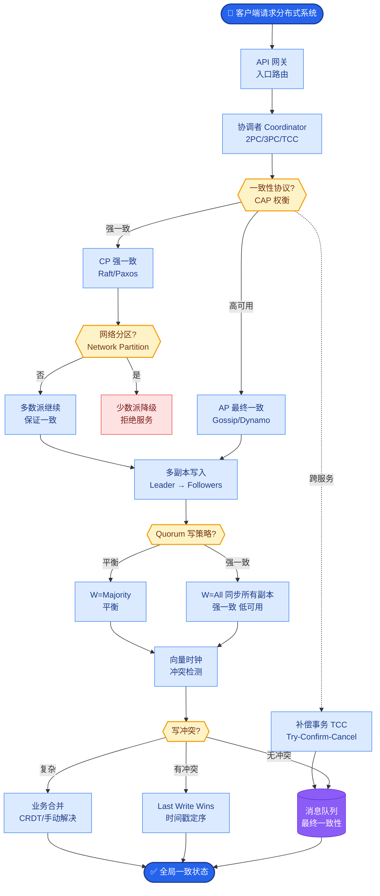

# 什么时候值得微调模型?微调 vs Prompt工程的ROI分析

**微调 vs Prompt 工程 ROI 分析**

**1. 决策框架 (增强版)**

**优先用 Prompt Engineering (90% 场景)**
- **知识注入**: 使用 RAG 外挂知识库（成本低、更新快）。
- **格式调整**: 使用结构化 Prompt (如 JSON Mode, XML tags) 或 Function Calling。
- **角色设定**: 使用 System Prompt 设定 Persona。
- **简单分类**: 使用 Few-shot 示例（提供 3-5 个样本通常足够）。
- **思维链**: 对于复杂推理，显式要求“Let's think step by step”。

**需要微调的情况 (10% 场景)**

| 场景 | 原因 | 微调收益 |
|------|------|----------|
| **特定输出格式** | Prompt 无法稳定约束复杂格式(如严格的代码) | 格式准确率从 80% → 99% |
| **领域术语理解** | 通用模型不懂专业黑话/缩写/新词 | 降低 Token 解释成本，理解更准 |
| **Function Calling** | 工具调用参数 JSON 格式经常出错 | 参数提取成功率大幅提升 |
| **推理速度优化** | 将 7B 模型蒸馏为特定任务的小模型 | 成本降低 90%，延迟降低 80% |
| **风格一致性** | 必须符合品牌声音、特定说话语气 | 用户体验一致性 |
| **安全合规** | 特定行业的敏感词过滤/拒答风格 | 降低人工审核风险 |
| **操作指令跟随** | 如“提取所有邮箱”，Prompt 总是漏 | 结构化提取能力增强 |

**2. ROI 成本分析 (细化)**
```
【微调成本 - 7B/13B 模型为例】
- 数据准备:
  - 清洗 & 标注: $2K - $10K (如果是复杂任务需专家标注)
- 训练成本:
  - GPU 租赁 (A100 80G * 4): $1 - $5/小时
  - 单次 LoRA 微调 (7B, 100 epochs, 10k data): ~$200 - $500
  - 全量微调 (可能需要多次实验): $2K+
- 评估测试: $1K - $3K (包括构建评估集和 GPT-4 打分)
- 部署运维: 托管 GPU 费用 (通常比推理大 1-2 倍) + 版本管理

【Prompt 工程成本】
- 开发时间: 1-2 周迭代 (试错成本低)
- 推理成本: $200 - $5,000/月 (Prompt 越长，Input Token 越贵)
- 维护: 低，修改 Prompt 即时生效
```

**3. 决策流程图**
```
需求: 模型能力不足
    ↓
尝试优化 Prompt (CoT, Few-shot)?
    ├─ 成功 → 结束
    └─ 失败
        ↓
尝试优化 RAG (增加数据、改检索策略)?
    ├─ 成功 → 结束
    └─ 失败
        ↓
检查是否满足以下微调先决条件：
    1. 有 500+ 条高质量、多样化的标注数据？
    2. 问题主要在“风格/格式/指令跟随”，而非“知识缺失”？
    3. 成本预算允许持续训练和部署？
        ├─ 否 → 继续优化 Prompt/RAG 或接受现状
        └─ 是
            ↓
        启动微调 (推荐从 LoRA / QLoRA 开始)
```

**## 常见考点**
1. **数据量阈值**: 微调到底需要多少数据？（答：LoRA 全参微调通常 100-500 条即可见效果，但领域适配建议 1K+，数据质量 > 数量）
2. **灾难性遗忘**: 微调会不会让模型忘记通用能力？（答：会。解决办法：混合通用数据训练、使用 RLHF 对齐、或使用增量学习）
3. **SFT vs RLHF**: 什么是 SFT？（答：有监督微调，教模型“怎么做”；RLHF 是基于人类反馈的强化学习，教模型“什么是好”）
4. **LoRA 原理**: 为什么 LoRA 可以低资源训练？（答：冻结原模型权重，只训练旁路矩阵，参数量减少 100-1000 倍，大幅降低显存需求）


## 核心流程图



## 记忆要点

- 决策口诀：先Prompt后RAG，最后才微调；微调只解决格式/风格/指令跟随问题。
- 微调ROI：成本高(数据+训练+运维)，收益在格式稳定(80%→99%)和推理降本(小模型)。
- 数据门槛：LoRA百条可见效，领域适配需千条，数据质量远大于数量。
- 核心区别：知识缺失用RAG补，行为偏差用微调改；微调会导致灾难性遗忘。


## 结构化回答

**30 秒电梯演讲：** 在通过指令低成本调整与微调高成本改造之间做权衡。——打个比方，提示词是给员工作业指导书，微调是送员工去进修。

**展开框架：**
1. **决策口诀** — 先Prompt后RAG，最后才微调；微调只解决格式/风格/指令跟随问题。
2. **微调ROI** — 成本高(数据+训练+运维)，收益在格式稳定(80%→99%)和推理降本(小模型)。
3. **数据门槛** — LoRA百条可见效，领域适配需千条，数据质量远大于数量。

**收尾：** 以上三点都能配合实战聊。我可以展开任一要点，比如「LoRA微调的成本」这类追问您感兴趣吗？

## 视频脚本

> 预计时长：3 分钟 | 由浅入深

| 时间 | 画面/字幕 | 口播台词 | 讲解要点 |
|------|----------|----------|----------|
| 0:00 | 标题卡 | "什么时候值得微调模型，30 秒讲清楚。" | 开场钩子 |
| 0:36 | 概念定义动画 | "一句话：在通过指令低成本调整与微调高成本改造之间做权衡。" | 核心定义 |
| 1:12 | 决策口诀图解 | "先Prompt后RAG，最后才微调；微调只解决格式/风格/指令跟随问题。" | 决策口诀 |
| 1:48 | 微调ROI图解 | "成本高(数据+训练+运维)，收益在格式稳定(80%→99%)和推理降本(小模型)。" | 微调ROI |
| 2:24 | 总结卡 | "记好这几条，面试不慌。下期见。" | 收尾 |
