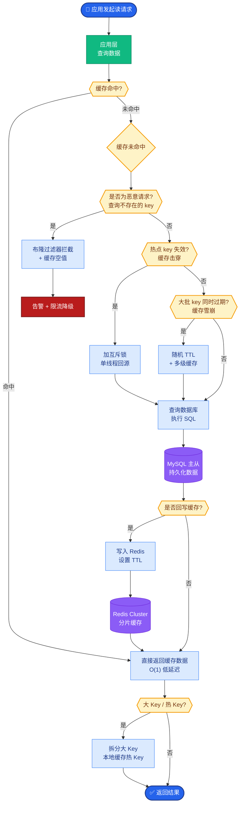
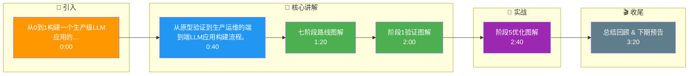

# 从0到1构建一个生产级LLM应用的完整路线图是什么

**生产级 LLM 应用构建路线图 (7 阶段)**

**阶段 1: 验证 (1-2 周)**
- 明确业务场景和成功指标（如准确率、响应时间）。
- 使用 Prompt + 原生 API 快速构建原型。
- 使用 10-50 个测试样本验证可行性。

**阶段 2: 架构设计 (1-2 周)**
- 选择技术栈 (框架/向量库/模型)。
- 设计系统整体架构。
- 确定 API 接口设计。

**阶段 3: 核心开发 (2-4 周)**
- 开发 RAG/Agent 核心逻辑。
- 深度 Prompt 工程。
- 集成外部工具/API。
- 实现流式输出。

**阶段 4: 评估体系 (1-2 周)**
- 构建黄金评估数据集 (100+ 样本)。
- 搭建自动评估 Pipeline (Ragas/LLM-as-judge)。
- 进行人工评估打标。

**阶段 5: 优化迭代 (2-4 周)**
- 检索优化 (Reranker/查询改写/HyDE)。
- 成本优化 (模型路由/缓存)。
- 延迟优化。
- 安全与护栏加固。

**阶段 6: 生产部署 (1-2 周)**
- 搭建 CI/CD Pipeline。
- 接入可观测性工具。
- 配置限流/灰度发布/监控告警。
- 构建高可用架构。

**阶段 7: 持续运营**
- 收集用户反馈。
- 进行 A/B 测试。
- 定期评估回归。
- 知识库更新维护。

**关键原则：**
1. 先用最简方案验证价值。
2. 评估先行，不要等做完才测。
3. 持续监控成本和质量。
4. 安全和权限从一开始就设计。

---

### 实战案例
在构建企业知识库助手时，初期直接使用 GPT-4o 效果虽好但成本极高（约 $0.05/次）。我们在**阶段 5**引入了**语义缓存**：对用户 Query 计算向量，命中相似度>0.95 的缓存直接返回旧答案，将重复常见问题的成本降至接近 0，整体 API 成本降低了 60%。

### 核心代码示例
这里展示一个带有 Rerank 优化的 RAG 检索代码片段，这通常是**阶段 3**到**阶段 5**的核心实现：

```python
# 伪代码：RAG 检索 + Rerank 优化
from langchain.vectorstores import Chroma
from cohere import Client

def retrieve_with_rerank(query, vector_store, top_k=5):
    # 1. 宽泛检索 (召回)
    docs = vector_store.similarity_search(query, k=20)
    
    # 2. 精排 - 提升精准度
    cohere_client = Client("API_KEY")
    rerank_results = cohere_client.rerank(
        model="rerank-english-v2.0",
        query=query,
        documents=[{"text": d.page_content} for d in docs],
        top_n=top_k
    )
    
    # 返回重排后的结果
    return [docs[result.index] for result in rerank_results.results]
```

---

### 生产级架构示意

```text
┌─────────────────────────────────────────────────────────────┐
│                         客户端层                              │
│  (Web / Mobile / API)                                       │
└───────────────────────────┬─────────────────────────────────┘
                            │
                            ▼
┌─────────────────────────────────────────────────────────────┐
│                     网关/应用层                              │
│  ┌───────────┐  ┌──────────┐  ┌───────────┐                  │
│  │ 负载均衡   │─▶│ 限流/鉴权 │─▶│ 路由分发   │                  │
│  └───────────┘  └──────────┘  └───────────┘                  │
└───────────────────────────┬─────────────────────────────────┘
                            │
        ┌───────────────────┼───────────────────┐
        │                   │                   │
        ▼                   ▼                   ▼
┌───────────────┐   ┌───────────────┐   ┌───────────────┐
│  SaaS 编排层   │   │  RAG 管道层    │   │  评估/监控层   │
│ (LangChain/Li │   │ (Retrieval)   │   │ (Truval/Grafana)│
│  gramIndex)   │   │               │   │               │
│ ┌───────────┐ │   │ ┌───────────┐ │   │ ┌───────────┐ │
│ │ Agent编排 │ │   │ │ 向量库    │ │   │ │ 指标收集   │ │
│ │ Tool调用  │ │   │ │ (PG/Milvus)│ │   │ │ 日志分析   │ │
│ └───────────┘ │   │ └───────────┘ │   │ └───────────┘ │
└───────────────┘   └───────────────┘   └───────────────┘
```

## 核心流程图



## 记忆要点

- 七阶段路线：验证→设计→开发→评估→优化→部署→运营，评估先行是关键。
- 阶段1验证：用GPT-4+Prompt快速试错，10-50样本确认可行性。
- 阶段5优化：核心是Rerank、缓存、模型路由，成本优化能降60%。
- 生产三要素：可观测性、灰度发布、安全护栏，从一开始就设计。

## 结构化回答

**30 秒电梯演讲：** 从原型验证到生产运维的端到端LLM应用构建流程。——打个比方，像盖房子，先画图纸打地基，再精装修，最后交付验收。

**展开框架：**
1. **七阶段路线** — 验证→设计→开发→评估→优化→部署→运营，评估先行是关键。
2. **阶段1验证** — 用GPT-4+Prompt快速试错，10-50样本确认可行性。
3. **阶段5优化** — 核心是Rerank、缓存、模型路由，成本优化能降60%。

**收尾：** 以上三点都能配合实战聊。我可以展开任一要点，比如「如何估算LLM应用的运营成本」这类追问您感兴趣吗？

## 视频脚本

> 预计时长：4 分钟 | 由浅入深

| 时间 | 画面/字幕 | 口播台词 | 讲解要点 |
|------|----------|----------|----------|
| 0:00 | 标题卡 | "从0到1构建一个生产级LLM应用的完整路线图是什么，30 秒讲清楚。" | 开场钩子 |
| 0:40 | 概念定义动画 | "一句话：从原型验证到生产运维的端到端LLM应用构建流程。" | 核心定义 |
| 1:20 | 七阶段路线图解 | "验证→设计→开发→评估→优化→部署→运营，评估先行是关键。" | 七阶段路线 |
| 2:00 | 阶段1验证图解 | "用GPT-4+Prompt快速试错，10-50样本确认可行性。" | 阶段1验证 |
| 2:40 | 阶段5优化图解 | "核心是Rerank、缓存、模型路由，成本优化能降60%。" | 阶段5优化 |
| 3:20 | 总结卡 | "记好这几条，面试不慌。下期见。" | 收尾 |

### 视频流程图




