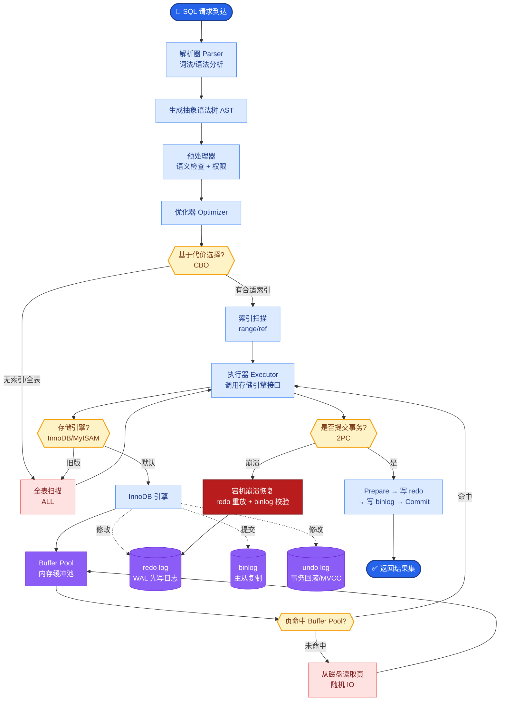

# Vibe Coding 是什么?它与传统编程范式有什么本质区别

**Vibe Coding 解析**

**概念起源：**
由 Andrej Karpathy 于 2025 年提出，指用自然语言描述意图、由 AI 生成代码的编程范式。

**核心理念：**
- 开发者不再逐行编写代码，而是描述想要的效果。
- AI 工具 (Cursor、Claude Code、Windsurf) 负责具体的代码实现。
- 开发者角色从“代码编写者”转变为“代码审查者”和“架构师”。

**与传统编程的区别：**

- **传统编程：** 思考算法 -> 手写代码 -> 调试 -> 测试

- **Vibe Coding：** 描述意图 -> AI 生成代码 -> 审查/调整 -> AI 修复 -> 测试

**关键能力要求：**
1. **Prompt 工程**：如何精确描述需求和上下文。
2. **代码审查**：快速判断 AI 生成的代码逻辑是否正确。
3. **架构思维**：清楚系统应该如何组织和模块化。
4. **调试能力**：定位 AI 生成代码中的隐蔽 bug。

**面临的挑战：**
- AI 生成的代码可能有隐藏 bug 或安全漏洞。
- 开发者对全栈代码细节的理解可能变浅。
- 大项目的上下文管理困难 (受限于 Token 限制)。

---

### 实战案例
在开发一个复杂的 FastAPI 后端时，我尝试用 Cursor 一次性生成整个鉴权模块。AI 生成的代码表面完美，但忽略了**异步上下文管理器**的正确使用，导致在高并发下出现数据库连接泄露。这提醒我们在 Vibe Coding 中，必须严格审查资源释放类的逻辑。

### 编程范式对比

| 维度 | 传统编程 | Vibe Coding |
| :--- | :--- | :--- |
| **核心驱动力** | 逻辑实现、语法细节 | 意图描述、结果导向 |
| **交互方式** | 键盘逐字输入 | 自然语言对话 (Prompt) |
| **试错成本** | 编译时错误/运行时崩溃 | 幻觉导致的逻辑错误/安全漏洞 |
| **上下文负载** | 依赖 IDE 跳转和脑力记忆 | 依赖 RAG 和 LLM 的长窗口能力 |
| **产出物** | 源代码文件 | 源代码 + 迭代历史 (对话) |

---

### 编程范式对比流程图

```text
传统编程范式:
┌─────────────┐    ┌─────────────┐    ┌─────────────┐    ┌─────────────┐
│  需求分析    │───▶│ 算法设计    │───▶│ 手写代码    │───▶│ 编译/调试   │
└─────────────┘    └─────────────┘    └─────────────┘    └─────────────┘
       │                  │                  │                  │
       ▼                  ▼                  ▼                  ▼
   人类主导          人类主导          人类主导          人类主导
   (Heavy Lifting)  (Mental Load)    (Heavy Lifting)  (Detailed Work)

Vibe Coding 范式:
┌─────────────┐    ┌─────────────┐    ┌─────────────┐    ┌─────────────┐
│ 意图描述    │───▶│ AI 推理/生成 │───▶│ 代码审查    │───▶│ AI 修复/迭代 │
│ (Prompt)    │    │ (LLM Agent) │    │ (人类 Review)│    │ (Auto Fix)  │
└─────────────┘    └─────────────┘    └─────────────┘    └─────────────┘
       │                  │                  │                  │
       ▼                  ▼                  ▼                  ▼
   人类高层          AI 执行          人类决策          AI 执行
   (Vibe/Intent)     (Implementation)  (Quality Gate)   (Refinement)
```

**## 常见考点**
1. **上下文窗口限制**：面试官会问如何在超大项目中进行 Vibe Coding，考察对 Codebase Indexing（代码库索引）和 RAG（检索增强生成）技术的理解。
2. **代码安全与合规**：AI 生成的代码可能包含 License 风险或安全漏洞，询问如何设置“护栏”或自动化扫描流程。
3. **调试与排错**：当 AI 生成的代码跑不通时，如何高效地定位问题？（考察是否懂得将错误日志喂回给 AI 并引导其修复）。
4. **团队协作模式**：Vibe Coding 改变了代码归属权，如何进行 Code Review？如何处理 Git Commit 历史的混乱？


## 核心流程图



## 记忆要点

- 定义：Karpathy提出，用自然语言描述意图，AI生成代码，人做架构师和审查者。
- 范式转变：从“思考算法→手写代码”变为“描述意图→审查修复”，结果导向。
- 核心挑战：AI代码有隐藏Bug(如资源泄露)，需严格审查逻辑和安全漏洞。
- 能力要求：Prompt工程、代码审查、架构思维、调试能力比语法更重要。


## 结构化回答

**30 秒电梯演讲：** 基于自然语言意图描述驱动AI生成代码的编程范式。——打个比方，像指挥家告诉乐队想听什么声音，而不是自己拉小提琴。

**展开框架：**
1. **定义** — Karpathy提出，用自然语言描述意图，AI生成代码，人做架构师和审查者。
2. **范式转变** — 从“思考算法→手写代码”变为“描述意图→审查修复”，结果导向。
3. **核心挑战** — AI代码有隐藏Bug(如资源泄露)，需严格审查逻辑和安全漏洞。

**收尾：** 以上三点都能配合实战聊。我可以展开任一要点，比如「Vibe Coding 适合什么类型的项目」这类追问您感兴趣吗？

## 视频脚本

> 预计时长：2 分钟 | 由浅入深

| 时间 | 画面/字幕 | 口播台词 | 讲解要点 |
|------|----------|----------|----------|
| 0:00 | 标题卡 | "Vibe Coding 是什么，30 秒讲清楚。" | 开场钩子 |
| 0:30 | 概念定义动画 | "一句话：基于自然语言意图描述驱动AI生成代码的编程范式。" | 核心定义 |
| 1:00 | 定义图解 | "Karpathy提出，用自然语言描述意图，AI生成代码，人做架构师和审查者。" | 定义 |
| 1:30 | 总结卡 | "记好这几条，面试不慌。下期见。" | 收尾 |
