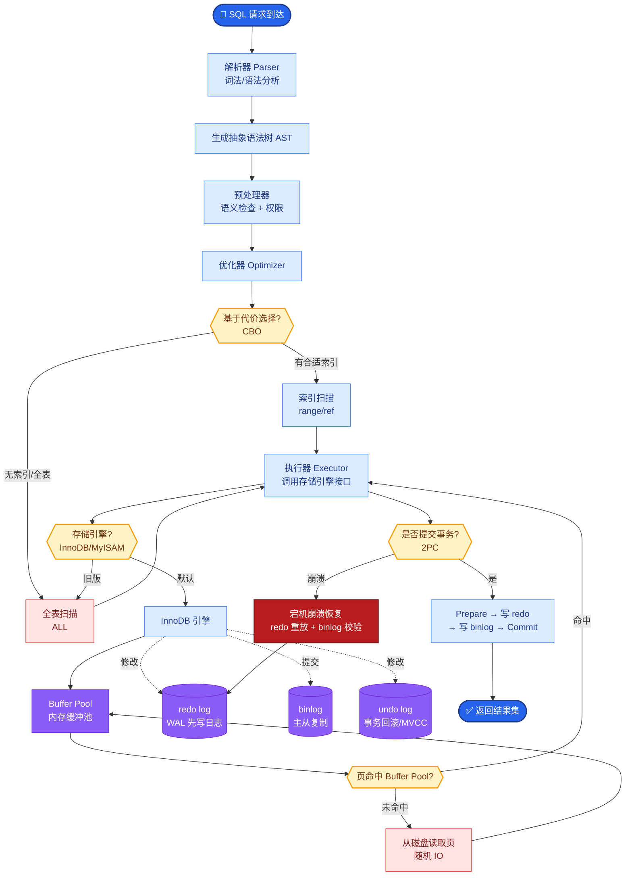

# 什么是 Code World Model(CWM)?它为什么是代码智能的突破

- **Code World Model(CWM)** 是代码智能领域的概念模型，指能理解代码执行过程而不仅仅是代码文本的模型。

- **核心突破:**

传统代码模型(如 Codex、StarCoder)主要关注代码的文本语法和统计规律，往往不理解代码执行后的具体行为。CWM 则致力于理解代码的执行轨迹。

- **工作原理:**
1. 训练时引入代码执行轨迹数据
2. 模型不仅学习代码文本，还学习代码运行后的状态变化
3. 能预测代码执行结果，而不仅仅是生成代码文本

- **关键能力:**
1. 执行结果预测:给定代码和输入，预测输出
2. Bug 检测:通过对比预期执行轨迹和实际执行轨迹发现 bug
3. 代码修复:基于执行理解生成修复方案
4. 测试生成:自动生成覆盖关键执行路径的测试

- **Benchmark 表现:** SOTA 模型在 SWE-bench 等基准上通过率显著提升。

- **意义:** 从理解代码文本 -> 理解代码行为，是代码智能从语言模型走向世界模型的关键一步。

---

### 实战案例
在 LeetCode 竞赛题“两数之和”的变种中，传统的 Code LLM 可能会因为训练数据中存在类似模板而直接生成正确的代码，但无法处理输入 `[2,2]` 目标 `4` 返回两个不同索引的边界情况。CWM 通过内部模拟执行，能够预判到输出 `[0,0]` 是无效的，从而主动调整逻辑来生成不同的索引组合，真正体现了“懂执行”而非“背代码”。

### CWM 与传统 LLM 区别

| 特性 | 传统代码 LLM | Code World Model (CWM) |
| :--- | :--- | :--- |
| **输入数据** | 仅代码文本 | 代码文本 + **执行轨迹** + 状态快照 |
| **理解深度** | 语法层级、统计共现 | 语义层级、**因果逻辑**、状态机 |
| **调试方式** | 基于模式匹配猜测错误 | **回溯执行栈**，定位状态异常点 |
| **幻觉表现** | 生成不存在的 API 或变量 | 预测错误的执行路径，但逻辑自洽 |
| **典型应用** | 代码补全、翻译 | **自动化修复**、逻辑验证、生成测试用例 |

---

### CWM 训练与推理流程图

```text
训练阶段:
┌──────────────┐     ┌──────────────┐     ┌──────────────┐
│  代码+输入     │ ──▶│  沙箱执行环境   │ ──▶│  执行轨迹数据   │
│ (Source Code)│     │  │     │     │
│              │     │  ▼     ▼     │     │ - 变量状态快照  │
│              │     │ 运行   监控   │     │ - 内存变化图   │
│              │     │      Step    │     │ - 函数调用栈   │
└──────────────┘     └──────────────┘     └───────┬───────┘
                                                │
                                                ▼
                                     ┌───────────────────────┐
                                     │  Code World Model     │
                                     │  (联合训练: 文本+轨迹) │
                                     │   (e.g., AlphaCodium) │
                                     └───────────────────────┘

推理阶段:
┌──────────────┐
│  代码/Bug     │
└──────┬───────┘
       │
       ▼
┌───────────────────────────────────────┐
│          CWM 内部模拟推理                │
│  (不实际运行，而是通过权重“运行”代码)     │
│  1. 模拟状态变化                        │
│  2. 预测分支走向                        │
│  3. 识别异常状态                       │
└───────┬───────────────────────┬───────┘
        │                       │
        ▼                       ▼
┌──────────────┐        ┌──────────────┐
│ 预测输出/补丁 │        │  解释执行过程  │
└──────────────┘        └──────────────┘
```

**## 常见考点**
1. **训练数据来源**：CWM 需要海量的执行轨迹数据，这些数据是如何生成的？（考察对 Execution Tracing、Python Tracer 或 Eager Execution 的理解）。
2. **与 Interpreter 的区别**：Cursor/Windsurf 里的“Agent 执行代码”和 CWM 的“理解代码执行”有什么本质不同？（前者是实际运行，耗时且不安全；后者是模拟推理，快速且可用于规划）。


## 核心流程图



## 记忆要点

- 定义：不仅理解代码文本，更理解代码执行轨迹和状态变化的模型。
- 核心突破：从“背语法统计”到“懂因果逻辑”，能预测执行结果而非补全文本。
- 关键能力：执行预测、Bug检测(对比轨迹)、自动修复、生成测试用例。
- 训练方式：代码+输入→沙箱执行→收集轨迹(状态/栈)→联合训练文本与轨迹。


## 结构化回答

**30 秒电梯演讲：** 能理解代码执行过程和状态变化的模型——打个比方，不仅能读懂菜谱（代码），还能模拟炒菜过程（执行轨迹）

**展开框架：**
1. **定义** — 不仅理解代码文本，更理解代码执行轨迹和状态变化的模型。
2. **核心突破** — 从“背语法统计”到“懂因果逻辑”，能预测执行结果而非补全文本。
3. **关键能力** — 执行预测、Bug检测(对比轨迹)、自动修复、生成测试用例。

**收尾：** 以上三点都能配合实战聊。我可以展开任一要点，比如「CWM 如何获取执行轨迹数据」这类追问您感兴趣吗？

## 视频脚本

> 预计时长：2 分钟 | 由浅入深

| 时间 | 画面/字幕 | 口播台词 | 讲解要点 |
|------|----------|----------|----------|
| 0:00 | 标题卡 | "Code World Model(CWM)，30 秒讲清楚。" | 开场钩子 |
| 0:30 | 概念定义动画 | "一句话：能理解代码执行过程和状态变化的模型" | 核心定义 |
| 1:00 | 定义图解 | "不仅理解代码文本，更理解代码执行轨迹和状态变化的模型。" | 定义 |
| 1:30 | 总结卡 | "记好这几条，面试不慌。下期见。" | 收尾 |
